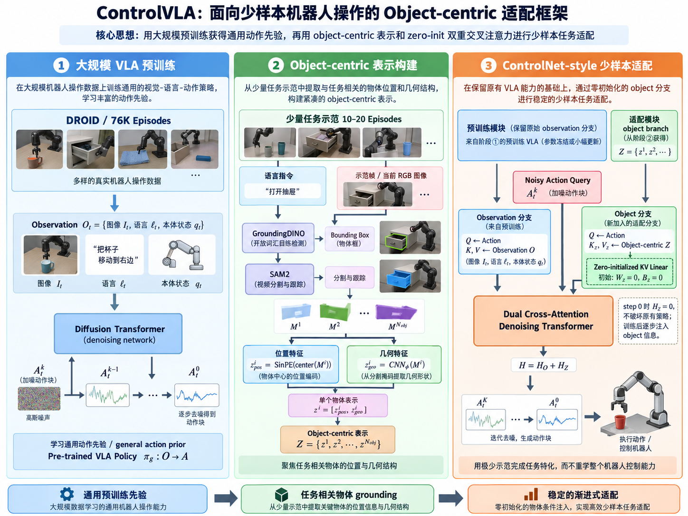

# ControlVLA

## 1. 论文对应的 Task 是什么？

ControlVLA 对应的任务不是“生成 object-centric representation”，也不是“给图像预测 Action Chunk”本身，而是更上层的 **真实世界、语言条件的机器人操作任务（language-conditioned real-world robotic manipulation）**。给机器人一个自然语言目标和一个具有若干物体的真实物理场景，机器人需要连续执行控制动作，使环境从初始状态转移到满足语言目标的目标状态。论文形式上将其描述为一个部分可观测的闭环控制问题：真实状态 $s_t$ 包含机器人和环境的完整物理状态，机器人只能通过传感器获得 observation，并根据这些信息不断输出 motor commands。

这里需要严格区分“**任务输入/输出**”和“**模型输入/输出**”。任务层面的输入是 **初始物理场景 + 语言任务目标 + 可执行该任务的机器人**，例如“桌上有绿色杯子和蓝色盒子，要求把杯中的方块倒入盒子”；任务真正要求的输出不是一个向量，而是 **满足任务要求的最终物理状态**，例如“方块已经从绿色杯子进入蓝色盒子”。机器人产生的连续动作序列只是达到这个目标状态的手段。RGB、proprioception、Action Chunk 则属于策略实现层面的输入输出，而不是任务本身的定义。

论文一共构造了 **8 个真实机器人任务**，其中 6 个 short-horizon task 和 2 个 long-horizon task，覆盖刚性物体、柔软物体、精细抓放、关节物体、可变形物体、倾倒以及多阶段操作。

| Task               | 实际场景输入                       | 实际目标                                           |
| ------------------ | ---------------------------------- | -------------------------------------------------- |
| RearrangeCup       | 场景中存在杯子和浅色盘子           | 将杯子重新摆放到浅色盘子上                         |
| OrganizeToy        | 绿色玩具、蓝色碗                   | 抓起绿色玩具并放进蓝色碗                           |
| OrganizeScissors   | 剪刀位于笔筒中，旁边有蓝色篮子     | 从笔筒取出剪刀并放进蓝色篮子                       |
| OpenCabinet        | 带黑色把手的柜门                   | 抓住把手并打开柜门                                 |
| FoldClothes        | 桌面上的粉色衣物                   | 将衣服袖子折起                                     |
| PourCubes          | 方块位于绿色杯子中，旁边有蓝色盒子 | 将方块倒进蓝色盒子                                 |
| OrganizeMultiObjs  | 茄子、草莓、胡萝卜和篮子           | 依次将三个物体放入编织篮，是一个三阶段任务         |
| ReplaceObjInDrawer | 抽屉中有面包，外部有胡萝卜         | 打开抽屉 → 取出面包 → 放入胡萝卜，是一个三阶段任务 |

所以，这篇论文真正研究的问题可以压缩为：

**已有一个具备通用操作能力的 VLA，面对一个新的真实机器人任务时，能不能只提供 10–20 条左右的新任务 demonstration，就让机器人可靠完成该任务，而不是重新收集上百条任务数据？**

其中 short-horizon 任务使用 11–20 条 demonstration，两个 long-horizon 任务分别使用 25 条。论文的重点不是 zero-shot，而是 **few-shot task adaptation**。

------

## 2. 这个任务有哪些数据集，以及本文采用了什么数据集？

### 2.1 数据来源、构造过程与数据统计

这篇论文不是在一个标准 benchmark dataset 上完成全部实验，而是存在两层完全不同的数据：**大规模通用预训练数据 $D_g$** 和 **少量下游任务数据 $D_e$**。需要特别注意，GroundingDINO/SAM2 生成的 mask 和后面的 $Z$ 都不是原始数据集，而是由原始 demonstration 在线或离线加工出来的中间条件。

第一层是 **DROID**。ControlVLA 的通用策略 $\pi_g$ 使用 **完整 DROID 数据集**进行预训练，论文 Fig. 2 标记约为 **76K episodes**。对于每条 episode，ControlVLA 实际使用 wrist-camera RGB 图像 $I_t$、机器人 end-effector pose 与 gripper width 构成的 proprioceptive state $q_t$，以及 episode-level language description $\ell$。论文没有重新详细介绍 DROID 原始论文中的全部采集人员、场景数量等统计，因此这里不额外补入原论文之外的数字。

第二层是作者为 8 个下游任务**自行采集的 few-shot demonstration dataset**。这里的 UMI 不是一个现成的训练数据集，而是 short-horizon 数据的采集系统：操作者使用手持 UMI gripper 完成任务，wrist-mounted GoPro 记录 RGB，同时通过 visual SLAM + IMU 获得 6DoF end-effector trajectory。两个 long-horizon task 则不是 UMI，而是通过 Meta Quest VR 对 AstriBot-S1 进行 6DoF teleoperation，直接记录机器人执行长时序任务的 demonstration。

具体的数据量为：

| Task               | Demonstrations |
| ------------------ | -------------- |
| RearrangeCup       | 14             |
| OrganizeToy        | 20             |
| OrganizeScissors   | 15             |
| OpenCabinet        | 11             |
| FoldClothes        | 16             |
| PourCubes          | 19             |
| OrganizeMultiObjs  | 25             |
| ReplaceObjInDrawer | 25             |

因此 6 个 short-horizon task 一共只有 **95 episodes**，两个 long-horizon task 一共 **50 episodes**，8 个任务总计 **145 条 task-specific demonstrations**。这里不是把 145 条混起来学习一个统一的新任务，而是每个任务分别利用自己的少量 demonstration 做 adaptation。

实际部署时，6 个 short-horizon task 使用 **Franka Emika FR3 + Panda gripper + 与采集阶段相同的 GoPro**；两个 long-horizon task 使用 **AstriBot-S1 + wrist-mounted RealSense**。测试环境与采集环境相同，但会随机改变机器人和物体初始状态。

### 2.2 一条原始数据到底是什么

可以把一条机器人 demonstration 写成一个 episode：

$\tau^{(i)}={(I_t,\ell,q_t,a_t)}_{t=1}^{T_i}$。

其中 $I_t$ 是时刻 $t$ 的 wrist RGB image，$\ell$ 是整条 episode 对应的 language instruction，$q_t$ 是机器人当前状态，而 $a_t$ 是时刻 $t$ 的动作。论文没有进一步明确给出 $a_t$ 最终编码成多少维，因此不能从本文直接断言它具体是某个固定维数的 delta-pose action。

模型训练时不会只取一个 timestep，而是把 episode 切成 observation history 和 future action chunk。论文设置 observation horizon $T_o=2$、action horizon $T_a=16$，所以可以把一条训练样本写成 $O_t=(o_{t-1},o_t)$，其中 $o_t=[I_t,\ell,q_t]$，监督目标则是 $A_t=(a_t,a_{t+1},\ldots,a_{t+15})$。

对于 task-specific dataset，ControlVLA 又会在原始数据上增加一层加工。原来的一条数据是 $(o_t,a_t)$，经过 object extraction 后变成 $(o_t,Z_t,a_t)$，因此整个 few-shot dataset 可以写成 $D_e={(o_t,z_t,a_t)}$。这里的 $Z_t$ **不是人工标注数据**，而是根据 RGB、language instruction 和 demonstration frame 通过 GroundingDINO、SAM2 和 object encoder 自动产生的。

因此这篇论文的数据关系最好记成：

**DROID 76K episodes → 学通用 action prior；每个新任务 11–25 条 raw demonstration → 自动生成 object-centric condition → few-shot fine-tuning。**

------

## 3. 技术详述

### 3.1 用一条数据完整走一遍 ControlVLA

ControlVLA 的核心并不是重新构造一个机器人策略，而是先利用大量机器人数据学习“**机器人一般应该怎么动**”，然后在新任务中利用 object-centric representation 告诉已有策略“**这次真正应该关注什么物体、物体在哪里、形状如何**”。因此完整流程可以理解成 **General Action Prior → Object Grounding → Controlled Adaptation** 三部分。

首先在大规模预训练阶段，从 DROID 中取一条 episode $\tau_g={(I_t,\ell,q_t,a_t)}*{t=1}^T$，在时刻 $t$ 形成 observation window $O_t=(o*{t-1},o_t)$ 和 16 步未来动作 $A_t^0=(a_t,\ldots,a_{t+15})$。模型并不是直接回归 $A_t^0$，而是在 diffusion training 中随机选择噪声等级 $k$，把干净动作变为 noisy action chunk $A_t^k$，让 Diffusion Transformer 根据 $(A_t^k,O_t,k)$ 预测如何去噪。大量这样的训练最终得到通用策略 $\pi_g$，它学习的是 $p(A_t\mid O_t)$，即看到场景和语言后，一个合理的机器人操作轨迹应该是什么样。论文预训练模型为约 **29M 参数的 Diffusion Transformer**，视觉编码器使用 CLIP ViT-B/16，文本使用 Transformer encoder；text encoder 冻结。

现在来了一个新任务，例如符号化写成 language instruction $\ell_e$，并只有 $N_e$ 条 demonstration：$D_e={\tau_e^{(1)},\ldots,\tau_e^{(N_e)}}$。ControlVLA 不直接拿这十几条数据把 $\pi_g$ 普通 fine-tune 一遍，而是首先分析：**这个任务里真正决定动作的 object 是哪些？**

它从 demonstration 中抽取 $N_{\text{img}}$ 个 RGB frame，并结合 language instruction 作为 grounding prompt。GroundingDINO 首先定位语言中涉及的任务相关 object，SAM2 随后得到精细 mask，并持续进行视频跟踪。因此对于时刻 $t$ 的第 $i$ 个任务相关物体，会得到 $M_t^i\in{0,1}^{H\times W}$。论文明确要求这一套 segmentation/tracking 同时用于训练数据和实时 inference，从而训练和测试阶段具有一致的 object representation。

接下来 mask 还不能直接用。ControlVLA 将 $M_t^i$ 分成两个角度编码：先求 mask 的平均图像坐标 $\mu_t^i=(\bar x_t^i,\bar y_t^i)$，再通过 sinusoidal positional encoding 得到 $z_{\text{pos},t}^i=\operatorname{SinPE}(\mu_t^i)$；同时用从头训练的 CNN 处理整个 mask，得到 $z_{\text{geo},t}^i=CNN_\phi(M_t^i)$。最终第 $i$ 个 object 是 $z_t^i=[z_{\text{pos},t}^i,z_{\text{geo},t}^i]$，所有任务相关物体组合成 $Z_t={z_t^1,\ldots,z_t^{N_{\text{obj}}}}$。

这里很值得注意：**ControlVLA 的 $z^i$ 并不是 CLIP 中“这是一个杯子”的语义 embedding。** 真正进入 policy 的 object representation 重点表达的是 **where + geometry**：这个任务相关物体位于哪里，它的 mask 空间形状是什么。物体“到底是不是任务相关”的语义判断主要已经在前面的 language grounding 阶段完成了。因此其思想是把复杂像素空间中的搜索问题提前收缩成几个与任务直接相关的实体。

于是原来的 few-shot 数据从 $(O_t,A_t)$ 变为 $(O_t,Z_t,A_t)$。后面的关键问题变成：**怎么把一个预训练时完全没有出现过的 $Z_t$ 塞进已经训练好的 diffusion policy，同时不要毁掉原来的 action prior？**

### 3.2 Object-centric representation 为什么能帮助 few-shot learning

假设图像里有桌子、机械臂、背景、杯子、盒子、玩具以及各种杂物。普通 VLA fine-tuning 接收到的是整张 image feature，因此只有 10 条 demonstration 时，它必须自己从大量视觉 feature 中重新学会“哪些视觉区域真正决定当前动作”。

ControlVLA 相当于提前把这个学习问题简化成：

$\text{complex image}\rightarrow{M^1,M^2,\ldots,M^{N_{\text{obj}}}}\rightarrow{z^1,z^2,\ldots,z^{N_{\text{obj}}}}$。

例如若任务需要将物体 $A$ 放进容器 $B$，策略真正关心的是 $A$ 在哪里、$A$ 的轮廓和尺度，以及 $B$ 在哪里、$B$ 的形状和空间关系，而不是重新从整幅图像的所有 patch 中发现这些关系。论文因此认为 object-centric representation 能降低 observation space 的复杂性，并提高对 object pose、object instance 和背景变化的鲁棒性。

这里还有一个重要设计：几何 CNN **不是使用 ImageNet/CLIP 等预训练模型，而是从头训练**。作者的理由是，他们需要的不是通用视觉识别特征，而是针对 continuous control 有用的 **actionable spatial feature**。也就是说，CNN 不是为了回答“这是什么”，而是为了提取“这个 mask 的形状、尺寸和空间结构对机器人应该怎么动有什么帮助”。

可以因此把 $Z$ 理解成：

$Z=\text{task-specific spatial control hints}$，

而不是：

$Z=\text{general semantic image features}$。

### 3.3 Dual Cross-Attention：如何让 Action 同时读取原始 Observation 和 Object

原始预训练 policy 中，Diffusion Transformer 当前处理的是 noisy action representation $A^k$。Cross-Attention 中 action 产生 Query：$Q=W_aA+B_a$，observation 产生 $K,V=W_oO+B_o$，因此原始输出为 $H_O=\operatorname{softmax}(QK^\top/\sqrt d)V$。它的物理语义是：**当前 noisy action token 根据自己正在生成的动作内容，去视觉、语言和机器人状态中读取需要的信息。**

最直接的方法是将 object token 拼进 observation：$O'=[O;Z]$。但 $O$ 是预训练模型熟悉的 feature，而 $Z$ 是从未出现过的新条件。只有十几条 demonstration 时，如果把随机初始化的新 object projection 直接混进原 attention，很容易在训练一开始就改变 pretrained policy 的 feature distribution，破坏已有的动作能力。

ControlVLA 因此不修改原始 $A\rightarrow O$ 路径，而是额外增加一条 $A\rightarrow Z$ 路径。对于 object representations，有 $K_z,V_z=W_zZ+B_z$，于是 attention 变成 $H=H_O+H_Z$，其中 $H_Z=\operatorname{softmax}(QK_z^\top/\sqrt d)V_z$。也就是说，同一个 action query 同时问两个问题：第一条分支是“根据原来的图像、语言、机器人状态，我应该怎么动？”；第二条分支是“根据这个任务明确涉及的几个 object，它们的位置和几何结构应该怎样修正我的动作？”这就是论文的 **dual-attention structure**。

这也是为什么 ControlVLA 更准确的理解不是“object-centric policy 替代 VLA”，而是：

**pre-trained VLA 负责提供动作能力，object branch 负责提供 task-specific control guidance。**

### 3.4 Zero-initialized KV Projection：为什么新增分支一开始不会破坏 pretrained policy

如果 $W_z,B_z$ 随机初始化，那么 fine-tuning 第一个 step 时 $H_Z$ 就会产生一个随机信号，最终输出变成 $H=H_O+\text{random noise}$。对于几百、几千条 demonstration 也许可以重新纠正，但对于 10–20 条数据，这个扰动非常危险。

ControlVLA 因此初始化 $W_z=0,B_z=0$。于是训练开始前 $K_z=W_zZ+B_z=0$，同时 $V_z=0$。虽然此时 attention score 满足 $QK_z^\top=0$，因而 $\operatorname{softmax}(0)$ 是均匀权重而不是零，但由于 $V_z=0$，整个 object branch 仍严格满足 $H_Z=0$。因此 $H=H_O$，新增 object condition 在第一次 forward 时**完全不会改变原策略行为**。论文明确把这描述为 preserving the pre-trained policy's behavior at the first fine-tuning step。

但 zero initialization 并不会导致它永远学不动。若 $V_z=W_zZ+B_z$，上游存在动作预测误差时 $\partial L/\partial V_z\neq0$，则 $\partial L/\partial W_z=\sum_{p,i}(\partial L/\partial V_{z,p,i})Z_{p,i}$。由于 $Z\neq0$，所以即使 $W_z=0$，$\partial L/\partial W_z$ 仍然可以非零。一次 optimizer update 后 $W_z^*\neq0$，于是 $K_z^*,V_z^*$ 开始非零，object branch 才逐渐获得影响动作的能力。随后由于 $\partial L/\partial Z=W_z^\top(\partial L/\partial V_z)$，object-centric encoder 也可以开始得到梯度并联合学习。

所以所谓 **progressively integrating object-centric representations** 可以非常直观地理解为：

**Step 0：100% 相信 pretrained action prior → 训练过程中逐渐学习什么时候以及多大程度需要依赖 object guidance。**

这和直接加一个随机初始化 object branch 的最大区别不是模型最终有没有能力使用 $Z$，而是**训练路径不同**。ControlVLA 从一个已经可用的 policy 出发，再逐渐偏离它，而不是 fine-tuning 一开始就破坏已有 policy。

严格来说，论文为了记号简化，将 object-side KV projection 统一写作 $K_z,V_z=W_zZ+B_z$，并没有在公式中明确说明 K/V 是否在实现中共享同一个 projection matrix。因此如果进一步假设实现使用独立的 $W_K^Z$、$W_V^Z$，那么初始 $V_z=0$ 时第一步主要是 value projection 先获得有效梯度，而 key projection 要在 $V_z$ 脱离零点之后才真正开始学习“应该 attend 哪个 object”；这是对 attention 梯度的进一步数学分析，而不是论文正文明确给出的实现细节。

### 3.5 完整训练与推理流程

**预训练阶段**只负责建立通用 action prior。对于 DROID 样本，形成 $O_t=(o_{t-1},o_t)$ 和 $A_t^0=(a_t,\ldots,a_{t+15})$，向 $A_t^0$ 注入 diffusion noise 得到 $A_t^k$，Diffusion Transformer 根据 observation $O_t$ 和 diffusion step $k$ 预测噪声/去噪方向，使用 conditional denoising loss 训练。最终得到 $\pi_g:O\rightarrow A$。模型约 29M 参数，使用 CLIP ViT-B/16 vision encoder 和 Transformer text encoder；AdamW 中 denoising model learning rate 为 $10^{-4}$，vision learning rate 为 $3\times10^{-5}$，text encoder frozen，使用 4 张 NVIDIA A800 训练 3 天。

**Few-shot adaptation 阶段**对于每个新任务先拿十几条 demonstration，从 RGB + instruction 中生成每帧 object masks，再转换为 $Z_t$，从而得到增强后的数据 $(O_t,Z_t,A_t^0)$。模型在原 diffusion Transformer 中加入 object-centric adaptation modules 和 zero-initialized KV projection，然后仍然使用与原策略一致的 conditional denoising objective 训练。论文指出新增约 **5M 参数**，fine-tuning 使用单张 A800 约 12 小时。这里需要注意：论文明确说新增 KV projection 和 object-centric representation 是可学习的，但**没有明确写出整个 29M pretrained policy 是否全部 frozen**，因此不能像 π0 的 Action Expert 那样直接断言“base VLA 完全冻结”。

**推理阶段**在时刻 $t$ 首先获得最近两步 observation $O_t$。与此同时，根据 task object prompt，GroundingDINO + SAM2 从实时 RGB 中定位并跟踪任务相关物体，得到 ${M_t^i}$，object encoder 将其变成 $Z_t$。然后初始化一个 16-step Gaussian action chunk $A_t^K\sim\mathcal N(0,I)$。每个 diffusion denoising step 中，action representation 一方面通过原始 cross-attention 查询 $O_t$，另一方面通过新增 cross-attention 查询 $Z_t$；两个结果相加后继续经过 Diffusion Transformer，逐步得到 $A_t^{K-1},A_t^{K-2},\ldots,A_t^0$。论文实际使用 DDIM 加速这个 iterative denoising process，以满足实时机器人控制。

最终完整的数据流可以压缩成：

**训练通用能力：** DROID ${I_t,\ell,q_t,a_t}$ → $O_t,A_t$ → diffusion pre-training → $\pi_g$

**学习新任务：** Few-shot demonstrations ${I_t,\ell,q_t,a_t}$ → GroundingDINO/SAM2 → ${M_t^i}$ → position + geometry encoder → $Z_t$ → $(O_t,Z_t,A_t)$ → zero-init dual-attention fine-tuning → $\pi_e$

**实际部署：** 当前 RGB + language + proprioception → $O_t$；实时 object masks → $Z_t$；Gaussian Action Chunk → $\pi_e$ 多步 DDIM denoising → 16-step Action Chunk → 执行动作 → 新 observation → 再次闭环决策。

因此，如果只保留一个对 ControlVLA 的核心理解，可以记成：

**它不是试图用 10–20 条 demonstration 重新教会机器人“怎么做动作”，而是先用 DROID 学会一个强 action prior，再利用少量 demonstration 学会“当前任务应该关注哪些 object，以及这些 object 的位置和几何信息应该如何调制已有动作能力”；zero-initialized dual-attention 则保证这种新的 task-specific guidance 是从 0 开始逐渐注入，而不是一开始就破坏 pretrained policy。**