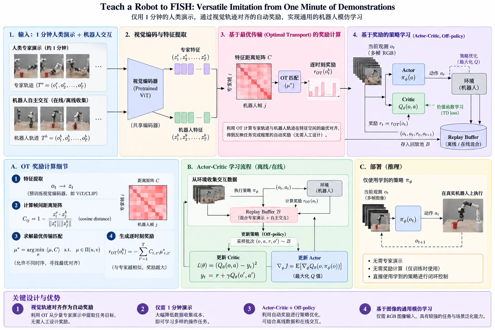

---

title: "Teach a Robot to FISH: Versatile Imitation from One Minute of Demonstrations"
description: "FISH 解决少量示范下机器人策略不够鲁棒、又难以人工设计奖励的问题。核心理解：先从约一分钟示范得到一个固定 Base Policy，再通过专家轨迹与机器人 Rollout 的 Optimal Transport 自动产生奖励，用 Off-policy Actor-Critic 只学习 Residual Correction。"
date: "2026-09-05"
venue: "Robotics: Science and Systems (RSS) 2023"
authors: "Siddhant Haldar, Jyothish Pari, Anant Rai, Lerrel Pinto"
paper: ""
code: ""
--------

# FISH



## 1. 一句话理解

FISH 的核心不是重新训练一个完整 Policy，而是：

$$
\boxed{
\text{固定一个还不错的 Base Policy}
+
\text{RL 学一个 Residual Correction}
}
$$

机器人最终动作：

$$
\boxed{
a_t=a_t^b+a_t^r
}
$$

其中：

* \(a_t^b\)：Base Policy 给出的专家经验动作
* \(a_t^r\)：Residual Policy 学到的修正量

Residual 的训练不需要人工 Reward，而是：

$$
\boxed{
\text{Robot Rollout}
\xleftrightarrow{\text{Optimal Transport}}
\text{Expert Demonstration}
\rightarrow
r_t^{OT}
}
$$

再用 Actor-Critic 学习如何修正 Base Policy。

---

# 2. FISH 的整个系统只记两个阶段

```text
          Expert Demonstrations
                  │
                  ▼
════════════════════════════════════
 Phase 1：Offline Imitation
════════════════════════════════════
                  │
        学视觉表征 / Base Policy
                  │
                  ▼
        Fixed Base Policy π_b
                  │
                  ▼
════════════════════════════════════
 Phase 2：Online Residual RL
════════════════════════════════════
                  │
 Observation → Base Action a_b
                  │
                  ▼
          Residual Policy π_r
                  │
                  ▼
              a_b + a_r
                  │
                  ▼
                Robot
                  │
                  ▼
               Rollout
                  │
                  ▼
        OT 与专家轨迹匹配
                  │
                  ▼
             OT Reward
                  │
                  ▼
        Off-policy Actor-Critic
                  │
                  └──────────────↺
```

整个 FISH 的核心就是这条循环。

---

# 3. Phase 1：先得到 Base Policy

FISH 只有很少的人类示范：

$$
\boxed{\text{约 1 分钟 Demonstrations}}
$$

专家数据：

$$
T^e=
\{(o_1^e,a_1^e),\ldots,(o_T^e,a_T^e)\}
$$

其中主要使用 RGB Observation。

FISH 倾向使用 **Non-parametric Base Policy**：

$$
\boxed{
\text{当前视觉状态}
\rightarrow
\text{在专家 Demonstration 中匹配}
\rightarrow
\text{取对应专家动作}
}
$$

而不是完全依赖一个小数据训练出来的神经网络直接预测动作。

---

# 4. BC 在 FISH 中主要负责什么

这是一个容易混淆的点。

虽然 FISH 的 Base Policy 可以是 Non-parametric Policy，但仍会训练一个：

$$
\boxed{\text{Behavior Cloning Policy}}
$$

真正重要的是拿它的：

$$
\boxed{\text{Visual Encoder}}
$$

把高维 RGB：

$$
o_t
$$

映射成低维视觉表示：

$$
\boxed{
o_t
\xrightarrow{\text{BC Encoder}}
z_t
}
$$

后面的：

* Base Policy
* Residual Policy
* OT Reward

都建立在视觉 Representation 上。

所以可以记：

> **BC Policy 本身不是 FISH 最终的核心 Policy，BC Encoder 才是整个系统共享的视觉表征基础。**

---

# 5. Base Policy：先给一个“基本正确”的动作

当前 Observation：

$$
o_t
$$

经过固定 Encoder：

$$
o_t\rightarrow z_t
$$

Base Policy：

$$
\boxed{
a_t^b=\pi_b(z_t)
}
$$

可以把它理解成：

> “根据一分钟专家 Demonstration，目前最像专家哪个状态？专家当时是怎么做的？”

例如 Closed-loop VINN：

```text
Current RGB
    ↓
BC Encoder
    ↓
z_t
    ↓
kNN 搜索专家视觉特征
    ↓
找到最相似 Demonstration States
    ↓
对应 Expert Actions
    ↓
Base Action a_b
```

执行下一步以后重新观察，因此仍然可以形成视觉闭环。

---

# 6. 为什么不直接 RL 微调 Base Policy

这是 FISH 最重要的设计动机之一。

假设已经有一个虽然不够鲁棒、但基本会完成任务的：

$$
\pi_b
$$

如果直接：

$$
\pi_b
\xrightarrow{\text{Online RL}}
\pi'
$$

RL 初期：

* Critic 不准确
* 数据量少
* exploration 有噪声

很可能破坏原来的模仿能力。

也就是：

$$
\boxed{
\text{Learning from Scratch / Direct Fine-tuning}
\rightarrow
\text{容易忘掉原本会做的东西}
}
$$

所以 FISH：

$$
\boxed{
\pi_b\ \text{固定}
}
$$

只学习：

$$
\boxed{
\pi_r
}
$$

---

# 7. Residual Policy

Residual Policy 输入当前视觉状态，以及 Base Policy 建议的动作：

$$
\boxed{
a_t^r
=
\pi_r(z_t,a_t^b)
}
$$

最终：

$$
\boxed{
a_t=a_t^b+a_t^r
}
$$

因此它不是重新回答：

> “这个任务到底应该怎么完成？”

而更多是在学习：

> “Base Policy 已经告诉我大致怎么做了，我现在需要向哪个方向修一点？”

例如：

```text
Base:
夹爪向左移动 4 cm

Residual:
再向右修正 0.8 cm

Final:
向左移动 3.2 cm
```

这就是 **Residual Reinforcement Learning** 的核心思想。

---

# 8. FISH 没有人工 Reward

机器人执行：

$$
a_t
$$

以后得到一整条 Rollout：

$$
T^b=
(o_1^b,o_2^b,\ldots,o_T^b)
$$

但是没有：

```text
抓到物体 +10
距离目标 -1
碰撞 -5
```

这种人工 Reward。

FISH 的想法是：

$$
\boxed{
\text{机器人行为越像专家 Demonstration}
\Rightarrow
\text{Reward 越高}
}
$$

而这个“像不像”通过：

$$
\boxed{\text{Optimal Transport}}
$$

计算。

---

# 9. OT Reward：FISH 的第二个核心

专家轨迹：

$$
T^e
=
(o_1^e,\dots,o_T^e)
$$

机器人 Rollout：

$$
T^b
=
(o_1^b,\dots,o_T^b)
$$

都通过视觉 Encoder：

$$
o\rightarrow z
$$

得到：

$$
Z^e=(z_1^e,\dots,z_T^e)
$$

$$
Z^b=(z_1^b,\dots,z_T^b)
$$

计算任意两帧的 Cosine Distance：

$$
\boxed{
C_{t,t'}
=
1-
\frac{
z_t^b\cdot z_{t'}^e
}{
\|z_t^b\|\|z_{t'}^e\|
}
}
$$

形成：

$$
\boxed{\text{Trajectory Cost Matrix }C}
$$

---

# 10. 为什么不能直接逐帧比较

不能简单要求：

$$
o_1^b\leftrightarrow o_1^e
$$

$$
o_2^b\leftrightarrow o_2^e
$$

因为机器人和人类执行速度不同。

例如专家：

```text
Reach → Reach → Grasp → Lift
```

机器人：

```text
Reach → Reach → Reach → Grasp → Lift
```

时间并不严格对齐。

Optimal Transport 学一个：

$$
\boxed{
\mu^*_{t,t'}
}
$$

表示：

> Robot 第 \(t\) 帧应该以多大权重匹配 Expert 第 \(t'\) 帧。

因此它比较的是：

$$
\boxed{
\text{两条完整视觉轨迹是否完成了相似的行为过程}
}
$$

而不是死板地逐 timestep 对齐。

---

# 11. OT 怎么变成 Reward

OT 得到最优匹配：

$$
\mu^*
$$

每个机器人 timestep 的 Reward：

$$
\boxed{
r_t^{OT}
=
-\sum_{t'}
C_{t,t'}\mu^*_{t,t'}
}
$$

所以：

$$
\text{与专家更相似}
\Rightarrow
C\downarrow
\Rightarrow
r^{OT}\uparrow
$$

记住：

$$
\boxed{
\text{OT 在 FISH 里就是自动 Reward Function}
}
$$

这是整个系统成立的关键。

---

# 12. Reward 什么时候得到

OT Reward 和普通一步 Reward 不一样。

不是：

$$
o_t,a_t
\rightarrow
r_t
$$

立即得到。

而通常需要：

```text
完整执行一条 Rollout
        ↓
得到 Robot Trajectory
        ↓
和 Expert Trajectory 做 OT
        ↓
求出 μ*
        ↓
回过头给每个 timestep 分配 Reward
```

即：

$$
T^b
\rightarrow
OT(T^b,T^e)
\rightarrow
[r_1^{OT},\ldots,r_T^{OT}]
$$

然后再构造：

$$
\boxed{
(o_t,a_t,r_t^{OT},o_{t+1})
}
$$

供 RL 使用。

---

# 13. Replay Buffer + Off-policy RL

每次真实机器人 Rollout 都很昂贵。

所以得到：

$$
(o_t,a_t,r_t,o_{t+1})
$$

后全部存入：

$$
\boxed{\text{Replay Buffer }\mathcal D}
$$

之后即使 Policy 已经更新：

$$
\pi_1\rightarrow\pi_2\rightarrow\cdots
$$

以前的数据仍然可以反复训练。

因此：

$$
\boxed{
\text{一次真实机器人交互}
\rightarrow
\text{很多次 Gradient Updates}
}
$$

这就是为什么 FISH 使用 **Off-policy RL**：

> 最大化少量真实机器人交互数据的利用率。

---

# 14. Actor-Critic 到底各学什么

## Actor

Actor 就是 Residual Policy：

$$
\boxed{
\pi_r(z,a_b)\rightarrow a_r
}
$$

它希望找到：

$$
\boxed{
\text{让长期 OT Reward 更高的 Residual}
}
$$

---

## Critic

Critic：

$$
\boxed{
Q(o,a)
}
$$

回答：

> 在当前 Observation 下执行这个动作，未来累计 OT Reward 有多高？

然后 Actor 根据 Critic：

$$
\boxed{
\max Q(o,\pi(o))
}
$$

不断调整 Residual Policy。

所以：

```text
OT Reward
   ↓
Critic 学会评价 Action
   ↓
Critic 指导 Actor
   ↓
Residual 越修越好
```

---

# 15. FISH 使用 3-step Return

Critic 不只是：

$$
r_t+\gamma Q(o_{t+1},a_{t+1})
$$

而使用：

$$
\boxed{
3\text{-step return}
}
$$

即：

$$
y_t=
r_t
+
\gamma r_{t+1}
+
\gamma^2r_{t+2}
+
\gamma^3
Q(o_{t+3},\pi(o_{t+3}))
$$

然后：

$$
\boxed{
L_Q=
(Q(o_t,a_t)-y_t)^2
}
$$

核心作用：

> Reward 可以更快传播给较早的动作。

不用把 Bellman 公式全背下来，只需要记：

$$
\boxed{
\text{FISH = Off-policy Actor-Critic + 3-step TD}
}
$$

---

# 16. 整个训练闭环

这是最值得记的一条：

```text
                Expert Demonstrations
                         │
                         ▼
                   Fixed BC Encoder
                         │
                         │
Current RGB ─────────────┘
     │
     ▼
    z_t
     │
     ├───────────────► Base Policy π_b
     │                       │
     │                       ▼
     │                      a_b
     │                       │
     └───────────────► Residual Policy π_r
                             │
                             ▼
                            a_r
                             │
                             ▼
                    a_t = a_b + a_r
                             │
                             ▼
                           Robot
                             │
                             ▼
                       New Observation
                             │
                             ▼
                      Robot Rollout
                             │
                 ┌───────────┴───────────┐
                 │                       │
                 ▼                       ▼
          Expert Trajectory        Robot Trajectory
                 │                       │
                 └────────► OT ◄─────────┘
                             │
                             ▼
                        OT Rewards
                             │
                             ▼
                       Replay Buffer
                             │
                             ▼
                Off-policy Actor-Critic
                             │
                             ▼
                  Update Residual π_r
                             │
                             └────────────↺
```

如果这张图能在脑子里跑出来，FISH 基本就理解了。

---

# 17. 推理 / 部署时反而非常简单

训练完成之后：

$$
\boxed{\text{不再需要 OT}}
$$

也不需要 Expert Demonstration 每一步参与决策。

部署就是：

```text
Current RGB
    ↓
Fixed Encoder
    ↓
z_t
    │
    ├→ Base Policy → a_b
    │
    └→ Residual Policy(z_t, a_b) → a_r
                     │
                     ▼
              a_t = a_b + a_r
                     │
                     ▼
                   Robot
                     │
                     ▼
              New Observation
                     │
                     └──────↺
```

OT 只是：

$$
\boxed{\text{训练期 Reward Generator}}
$$

不是 Policy 的在线组成部分。

---

# 18. FISH 与直接 BC / RL 的区别

### Behavior Cloning

$$
o_t\rightarrow\pi_{BC}\rightarrow a_t
$$

问题：

> 一分钟数据覆盖不了所有偏差状态，出了 Demonstration Distribution 就容易失败。

---

### 直接 Online RL

$$
o_t\rightarrow\pi_{RL}\rightarrow a_t
$$

问题：

> 从零探索太贵，而且需要 Reward。

---

### FISH

$$
\boxed{
\text{Imitation 提供“基本会做”}
+
\text{Residual RL 提供“会纠错”}
}
$$

并用：

$$
\boxed{\text{OT 替代人工 Reward}}
$$

所以它实际上把：

$$
\text{Offline Imitation}
+
\text{Online RL}
+
\text{Trajectory Matching}
$$

连接起来了。

---

# 19. FISH vs ROT

这个对比非常适合理解为什么要 Residual。

### ROT

$$
\boxed{
\text{直接用 RL 微调 BC Policy}
}
$$

也就是说原来的 Policy 本身不断被修改。

风险：

$$
\text{RL Update}
\rightarrow
\text{破坏已有模仿能力}
$$

---

### FISH

$$
\boxed{
\pi_b\text{ 固定}
+
\pi_r\text{ 学 Correction}
}
$$

Base Policy 始终提供一个稳定 Anchor。

所以 FISH 的核心思想可以理解成：

> **不要让 RL 重新学习怎么做任务，而只让 RL 学 Base Policy 哪里需要修。**

---

# 20. 最后只记这 5 个点

## ① Fixed Base Policy

先用少量 Demonstrations 得到一个基本能工作的 Policy。

$$
\boxed{\pi_b\text{ 不动}}
$$

---

## ② Residual Correction

$$
\boxed{
a=a_b+a_r
}
$$

RL 只负责纠错，不重学整个任务。

---

## ③ OT = Reward Function

$$
\boxed{
Robot\ Trajectory
\xleftrightarrow{OT}
Expert\ Trajectory
}
$$

越像专家，Reward 越高。

---

## ④ Replay Buffer + Off-policy

旧 Rollout 可以反复使用：

$$
\boxed{
\text{提高真实机器人数据利用率}
}
$$

---

## ⑤ Actor-Critic

Critic：

$$
Q(o,a)
$$

学习哪个动作长期 OT Reward 高；

Actor：

$$
\pi_r
$$

学习如何修正 Base Action。

---

# 21. 脑内最终模型

```text
        ~1 min Expert Demonstrations
                   │
                   ▼
            Offline Imitation
                   │
                   ▼
        ┌────────────────────┐
        │ Fixed Base Policy  │
        └─────────┬──────────┘
                  │ a_b
Current RGB ──────┼───────────────┐
      │           │               │
      ▼           │               ▼
 BC Encoder       │        Residual Actor
      │           │         π_r(z_t,a_b)
      ▼           │               │
     z_t          │               ▼
                  │              a_r
                  └──────┬────────┘
                         ▼
                  a_t = a_b + a_r
                         │
                         ▼
                       Robot
                         │
                         ▼
                      Rollout
                         │
           Expert ──► OT ◄── Robot
                         │
                         ▼
                    OT Reward
                         │
                         ▼
                  Replay Buffer
                         │
                         ▼
                 Actor-Critic
                         │
                         └────► Update π_r
```

> **FISH = 用一分钟 Demonstration 提供一个固定的 Base Policy，用 OT 把“像不像专家”转换成 Reward，再通过 Off-policy Actor-Critic 学习 Residual Correction，使机器人从“基本会做”提升到“偏离示范后也能自己纠正”。**

最值得记住的一条公式就是：

$$
\boxed{
o_t
\rightarrow
z_t
\rightarrow
\begin{cases}
\pi_b(z_t)\rightarrow a_b\\
\pi_r(z_t,a_b)\rightarrow a_r
\end{cases}
\rightarrow
a_t=a_b+a_r
}
$$

看到它，就应该能把 FISH 的整个系统架构重新展开出来。
