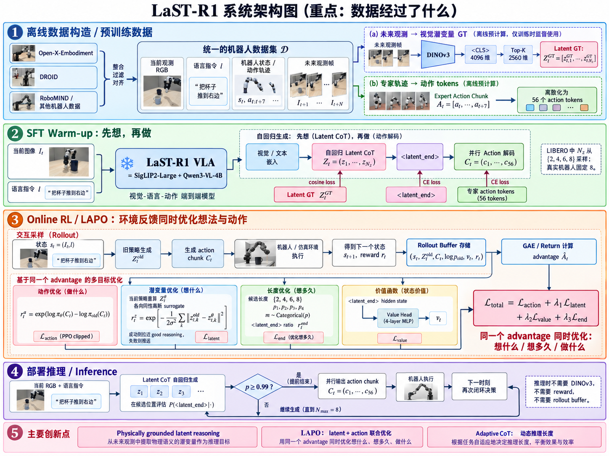

---
title: "LaST-R1: Reinforcing Robotic Manipulation via Adaptive Physical Latent Reasoning"
description: "LaST-R1 解决 latent reasoning VLA 主要依赖静态模仿学习、而现有 VLA-RL 又只优化动作的问题。核心理解：先用 DINOv3 未来视觉特征监督 Physical Latent CoT，再通过 LAPO 将连续 latent reasoning 视为隐式决策变量，与 Action 一起接受环境 Advantage 优化，同时学习 <latent_end> 动态决定“想多久”，实现对“想什么、想多久、怎么做”的联合强化学习。"
date: "2026-09-11"
venue: "arXiv / 2026"
authors: "Hao Chen, Jiaming Liu, Zhonghao Yan, Nuowei Han, Renrui Zhang, Chenyang Gu, Jialin Gao, Ziyu Guo, Siyuan Qian, Yinxi Wang, Peng Jia, Shanghang Zhang, Pheng-Ann Heng"
paper: ""
code: ""
--------

# LaST-R1

## 1. 论文对应的 Task 是什么？

### （1）明确任务：Language-conditioned Robotic Manipulation

LaST-R1 对应的核心任务是**语言条件下的机器人操作（language-conditioned robotic manipulation）**。任务本身可以理解为：给机器人一个自然语言目标，并让机器人基于当前环境持续感知、决策和执行动作，最终把现实环境从初始状态改变为满足语言目标的目标状态。

从任务层面看，输入主要包含三部分。第一是**自然语言任务目标**，语言描述的是“希望机器人最终完成什么”，而不是直接提供低层控制指令。第二是**当前物理环境状态**，包括目标物体的位置、外观、空间关系、机器人与物体之间的相对位置，以及此前动作已经造成的环境变化。第三是**执行过程中不断变化的环境反馈**，因此这个任务本质上是一个闭环 sequential decision-making problem，而不是单次的 image-to-action 映射。论文也将其形式化为机器人在状态 $s_t$ 下执行动作后进入 $s_{t+1}$，并不断重复这一过程。

任务的目标输出是**成功完成语言指定的物理操作，并达到目标环境状态**。因此可以把整个任务抽象为：**Language Goal + Physical Environment → Closed-loop Manipulation → Goal-satisfying Physical State**。

### （2）研究意义与应用价值

解决一个更具体的问题：**已有 reasoning-based VLA 虽然能够在动作生成之前形成 latent reasoning，但这些 reasoning 基本依赖静态示范数据学习，部署时产生的内部“思考过程”无法直接接受环境反馈优化。** 与此同时，现有 VLA-RL 又主要只在 action space 中做强化学习，因此形成了一个明显断层：模型已经具备“先 reasoning、再 action”的结构，但 RL 仍然只优化“怎么做”，没有优化“怎么想”。论文将这一缺口作为 LaST-R1 的主要研究出发点。

因此，本文最重要的研究价值是**把 latent reasoning 真正纳入机器人 RL post-training 的优化对象**。LaST-R1 不再把 latent embedding 仅仅看成 action decoder 前面的中间 hidden state，而是将其视为影响最终行为的 **implicit decision variable**。LAPO 分别为 action sequence 和 continuous latent reasoning 构造 step-level likelihood ratio，并让同一个环境 advantage 同时作用于两者。这样，机器人成功或失败后，reward 不仅可以改变“以后应该输出什么动作”，还可以改变“以后在类似状态下应该形成什么内部 reasoning”。 这实际上把机器人强化学习的优化范围从单纯的 **behavior optimization** 扩展到了 **reasoning + behavior joint optimization**，是本文相对于普通 PPO/GRPO VLA-RL 最核心的价值。

第二个价值是**让 latent physical reasoning 从静态模仿得到的表示，进一步变成由真实交互结果校正的任务有效表示**。论文首先用 DINOv3 的全局视觉 representation 为 latent CoT 提供 semantic/spatial grounding，使模型学习的 latent 不至于退化成任意 hidden states；随后再通过 LAPO 用环境 reward 调整这个 reasoning space。可以把这一过程理解为：DINOv3 提供“合理的物理状态应该如何表示”的视觉先验，而 RL 进一步回答“什么样的内部状态预测实际上有利于成功完成任务”。论文因此尝试把 **representation grounding** 和 **interaction-driven optimization** 连接起来。

第三个研究价值是**提高少量示范条件下的在线适应能力和 sample efficiency**。论文不是先用完整下游专家数据把任务几乎学会，再用 RL 做小幅修正；在 LIBERO 中，它只使用每个任务 **1 条专家轨迹进行 warm-up**，然后依靠在线交互继续学习。

第四个价值是**让 reasoning computation 本身成为可学习的决策变量**。本文并不只是问“应该产生什么 latent”，还进一步问“当前状态究竟需要思考多久”。通过 `<latent_end>`，reasoning horizon 可以参与 RL optimization，使简单状态较早退出，而困难状态保留更多 reasoning steps。

从实际应用角度看，这种设计尤其适用于**示范昂贵、环境变化明显、又需要高精度物理交互的下游机器人任务**。本文更具体的应用价值可以概括为：**当已有 VLA 具备一定基础操作能力，但下游任务 demonstration 有限、直接 SFT 泛化不足时，可以通过交互式 RL 同时修正其内部 physical reasoning 和外部动作策略，从而以更少的人工数据获得更强的适应与泛化能力。**

## 2. 本文采用了什么数据集？

LaST-R1 的数据实际上分成三层：**大规模机器人数据用于 foundation pre-training、LIBERO 用于仿真下游 SFT + online RL、作者自己采集的真实机器人数据用于 real-world SFT + online RL**。

### 2.1 Large-scale Pre-training Dataset

论文从 **Open-X-Embodiment、DROID 和 RoboMIND** 等机器人数据仓库中筛选并混合数据，最终得到约 **400K trajectories、28M frames**。数据清洗除了沿用已有 VLA 工作的质量过滤外，还特别检查 robot-state annotations 是否准确、物理上是否一致。

这一步最重要的数据加工发生在 **latent supervision** 上。原始机器人 trajectory 本来包含连续的视觉 observation 和机器人轨迹信息，作者对所有预训练 frame 离线运行 DINOv3，提取其 `<CLS>` feature，再通过 magnitude Top-K 从 4096 维中选择 2560 维，得到未来状态对应的 latent target。这样训练时并不在线运行 DINOv3，而是直接读取预计算好的 latent supervision，与视觉、文本等标准训练输入一起使用。

### 2.2 LIBERO：仿真下游数据

仿真实验使用 **LIBERO-Spatial、LIBERO-Object、LIBERO-Goal、LIBERO-Long** 四个 suite，每个 suite 有 10 个任务，因此总计 **40 个 manipulation tasks**。机器人是 simulated Franka Panda，模型只使用一个 **256×256 front-view RGB observation**。

LIBERO 原始训练集对每个 task 有 **50 条 expert trajectories**，论文中的 full-data SFT baseline 使用完整数据；但 LaST-R1 为了研究 low-data RL，只从**每个任务随机选 1 条 expert trajectory** 做 SFT warm-up。因此 LaST-R1 下游初始化实际只使用 $40\times1=40$ 条 expert trajectories，而不是完整的约 $40\times50=2000$ 条。之后的数据不再来自离线数据集，而是模型在 simulator 中进行 online rollout 自己产生。

warm-up 时，LIBERO 每个训练样本的 latent reasoning length 从 $\{2,4,6,8\}$ 中均匀采样，最大长度为 8；action chunk 固定为未来 **8 个 action steps**。在后续 online RL 中，每个 chunk 对应 56 个 action tokens，也就是 $8\text{ steps}\times7\text{ DoF}=56$。

因此 LIBERO 在本文中的数据流不是简单的“LIBERO → SFT”，而是：**1 expert trajectory/task → one-shot SFT warm-up → policy 在 simulator 中不断 rollout → 产生新的 state/action/reward trajectory → LAPO 更新模型**。RL 阶段每次 iteration 收集 512 条 sampled trajectories，reward 是任务成功/失败的 sparse binary reward。

### 2.3 Real-world Dataset

真实环境的数据是作者自己采集的，不是现成 benchmark。硬件包括 Franka Research 3，双臂实验使用两个 Franka，并配备 3D-printed UMI gripper；视觉由一个 RealSense D455 第三人称相机和两个 D435 wrist cameras 提供，人工遥操作使用 3D SpaceMouse。

一共设计了四个真实任务：**Insert hexagon block、Open bag zipper、Wipe vase with sponge、Open bottle cap**，其中一个是单臂任务，三个是双臂任务。LaST-R1 每个 task 收集 **30 条 expert trajectories** 用于 warm-up，因此原始监督数据总量为 **120 条 trajectories**；作为比较，π0.5 baseline 每个任务使用 100 条 expert trajectories。

真实环境 RL 后续还会继续产生 rollout transitions，并把人工 intervention 单独放进 intervention buffer，与 demonstration / rollout stream 混合训练。因此这里也要区分：**30 trajectories/task 是原始人工示范数据；后续 replay buffer 中的数据是在线交互新产生的，不属于原始静态数据集。**

## 3. 已有工作的情况

### （1）High-level：领域现状与技术分类

围绕 LaST-R1 所关心的核心问题——**VLA 如何在行动前形成有效 physical reasoning，并进一步利用环境交互优化这种 reasoning**——已有工作实际上沿着两条相对独立的路线发展：一条解决“**如何让 VLA reasoning-before-acting**”，另一条解决“**如何通过 RL 让 VLA 在部署环境中继续学习**”。LaST-R1 的位置正好是把这两条路线接起来。论文自己也明确指出，已有 latent-reasoning VLA 主要停留在 imitation learning，而已有 VLA-RL 又主要只优化 action space。

#### 路线 A：Reasoning-before-Acting VLA

第一类是 **Language / Embodied CoT**，即先生成显式语言 reasoning，再生成机器人动作。代表工作是 **ECoT**：它不是只生成抽象的 task plan，而是依次 reasoning task、subtask、motion、object bounding box、end-effector position 等 physically grounded information，再预测 action。**RAD** 则进一步把这种 language reasoning 当作跨 embodiment 的中介变量：robot demonstration 同时提供 reasoning + action，而 human video 没有 robot action，只提供 reasoning supervision，从而利用大量 action-free human video 提升泛化能力。

第二类是 **Visual / Future-State CoT**，不要求把物理过程全部翻译成语言，而是让模型先“想象未来应该看到什么”。代表工作 **CoT-VLA** 将直接的 $(I_t,l)\rightarrow A_t$ 改成 $(I_t,l)\rightarrow\hat I_{t+k}\rightarrow A_t$：先自回归预测 future visual goal，再根据当前图像、语言和预测的未来状态生成 short action sequence。这类方法比纯语言 reasoning 更直接地表达物体位置、姿态和场景变化，同时 future-state prediction 还可以利用没有 robot action label 的视频。

第三类是 **Latent Physical Reasoning**，即不显式生成文字或完整 RGB future frame，而是在连续 hidden space 中表达未来物理状态。LaST-R1 的直接前身 **LaST$_0$** 将 future visual dynamics、3D point-cloud structure 和 robot proprioception 压缩成 latent spatio-temporal CoT，再用 acting expert 条件于这些 latent 生成高频动作，其目标就是避免 explicit CoT 的推理延迟和语言表达瓶颈。**InternVLA-A1** 也属于相近路线，但更接近 latent world model：用 Understanding Expert 理解当前状态，Generation Expert 预测未来视觉 dynamics 的 latent representation，再让 Action Expert 根据这些 future features 产生动作。

因此 reasoning 这一条线可以概括成：**Language CoT → Visual Future-State CoT → Latent Physical CoT**。随着发展，中间 reasoning variable 从“可语言描述但较慢”，逐渐转向“更接近连续物理世界、计算更紧凑的 latent representation”。

#### 路线 B：VLA Reinforcement Learning / Interactive Post-training

另一条发展路线并不重点研究“中间怎么想”，而是研究**如何突破静态 SFT 数据分布，通过 online interaction 继续提升 VLA**。

最直接的是 **outcome-driven action-space RL**。例如 **RIPT-VLA** 只使用 sparse binary success reward，通过多次 rollout、动态采样和 relative advantage estimation 对已有 VLA 做 interactive post-training；**SimpleVLA-RL** 则建立可扩展的 VLA RL pipeline，通过环境 rollout 和 RL 优化缓解 demonstration scarcity，并提升 long-horizon planning 和 OOD generalization。这些工作的基本思想都是：SFT 给一个可工作的初始化，然后通过 trial-and-error 让成功动作概率增加、失败动作概率下降。

第二类针对 **sparse reward / credit assignment**。代表工作 **VLA-RL** 不满足于 trajectory 最后只有一个 success/failure reward，而是将机器人 trajectory 建模成 multimodal multi-turn conversation，并引入 **Robotic Process Reward Model（RPRM）**，为过程中的不同阶段产生更稠密的 reward signal，再使用 PPO 优化 autoregressive VLA。

第三类针对 **真实机器人探索安全和 sample efficiency**，典型是 **ConRFT**。它采用 offline-to-online pipeline：离线阶段结合 BC 和 Q-learning，从少量 demonstrations 中得到较稳定的 policy/value initialization；在线阶段再结合 human intervention 做安全探索和 reinforced fine-tuning。这样避免真实机械臂完全依赖随机 trial-and-error。

所以 RL 这一条路线又可以概括成：**Sparse outcome RL → Process/Dense Reward RL → Offline-to-Online + Human-in-the-loop RL**。它们解决了 SFT 无法从部署失败中继续学习的问题，但主要优化对象仍然是最终 action policy。LaST-R1 论文在 related work 中对此总结得很明确：已有 RL-VLA 会优化 discrete action-token probabilities 或 continuous action sequence，但基本仍然停留在 action-space supervision，没有解决 reasoning-based VLA 的 RL post-training。

### （2）High-level：这些技术目前有哪些不足？

**Language / Embodied CoT 的主要问题是“表达得出来，但太慢，而且物理信息未必适合语言化”。** ECoT 的 reasoning chain 往往需要自回归生成多个 language tokens，每一步 action 前都先输出 task、plan、subtask、movement 等 reasoning，因此 inference latency 会明显增加；更关键的是摩擦、微小位置变化、接触状态、高频 dynamics 等物理信息本身很难被自然语言精确表达。后续大规模研究也观察到，将 explicit CoT 作为必须生成的 autoregressive action prefix 容易产生 compounding reasoning errors 和 reasoning-action coupling instability。

**Visual Future-State CoT 比语言更接近物理世界，但成本仍然较高，而且存在 prediction-error propagation。** CoT-VLA 必须先生成 future visual tokens，再生成 action，相比直接动作预测仍增加了额外生成阶段；如果未来图像预测偏差较大，action policy 又依赖这个预测，错误便可能继续传到控制阶段。InternVLA-A1 也明确指出传统 video-prediction-style world models 容易缺少 semantic grounding，并且对 prediction error 较敏感，这也是其将 understanding、generation、action 联合起来的原因。

**Latent reasoning 解决了速度和表示瓶颈，却没有解决“这些 latent 到底应该如何通过实际任务结果学习”。** LaST$_0$ 等方法通过 expert trajectories 中的未来视觉、3D structure、proprioception 去监督 latent，使 $Z_t$ 具有 future dynamics 含义，但训练本质仍然主要是 supervised imitation：模型学习的是“模仿数据中未来 latent 应该长什么样”。一旦部署进入 dataset 外的状态，如果 latent reasoning 导致错误动作，环境 success/failure 并不能直接告诉模型“刚才这条 reasoning trajectory 哪里不好”。这正是 LaST-R1 所认为的最重要缺口：**reasoning exists，但 reasoning itself is not interaction-optimized**。

**Action-space RL 恰好有 environment feedback，但优化对象过于靠后。** 对 SimpleVLA-RL、RIPT-VLA、VLA-RL 等方法而言，一次决策的核心随机变量仍然是 action 或 action tokens，因此 reward 最终主要改变 $\pi_\theta(A_t|s_t)$。如果模型内部其实已经存在“先 reasoning 再 acting”的结构，那么 reward 只告诉模型“这个动作应该增加还是降低概率”，并没有显式回答“导致这个动作的内部 reasoning 是否合理”。

因此，在 LaST-R1 出现之前，领域里存在一个非常清晰的“**两边都差一步**”状态：**Reasoning VLA 会“想”，但基本靠静态 imitation learning，环境不能直接优化它怎么想；RL-VLA 会通过环境反馈“学”，但主要只优化怎么做，没有显式优化模型内部的 reasoning process。** LaST-R1 的切入点正是两者的交叉区域，即把决策从传统的 $s_t\rightarrow A_t$ 扩展为 $s_t\rightarrow Z_t\rightarrow A_t$，再让同一个 environment advantage 同时对 latent reasoning 与 physical action 做 credit assignment。这也是 LAPO 相对于上述两类已有工作的核心定位。

## 4. 本文工作提出的解决方案

### 4.1 一句话理解整体方案

LaST-R1 解决的核心问题是：**已有 reasoning-based VLA 已经能够“先想再做”，但 reasoning 主要靠离线 imitation learning 学出来；已有 VLA-RL 虽然能利用环境 reward 在线学习，却基本只优化 action。LaST-R1 希望让环境 reward 同时优化“怎么想、想多久、怎么做”。** 因此它把普通的 $s_t\rightarrow A_t$ 改造成 $s_t\rightarrow Z_t\rightarrow \texttt{}\rightarrow A_t$，其中 $Z_t$ 是连续 latent physical reasoning；再提出 LAPO，让 environment reward 同时更新 latent reasoning 和 action；最后把 `<latent_end>` 也变成一个 RL decision，使 reasoning length 可以根据状态动态变化。论文将三项核心贡献明确概括为 latent reasoning-before-acting VLA、LAPO 和 adaptive latent CoT。 项目公开代码也对应实现了 rollout、reward/advantage、action tokenizer、value head 和 LAPO actor update，而不是只停留在算法描述。

可以把完整流程压缩成：

$\boxed{\text{Offline physical prior}} \rightarrow \boxed{\text{Few-hot SFT warm-up}} \rightarrow \boxed{\text{Online rollout}} \rightarrow \boxed{\text{LAPO: reasoning + action RL}} \rightarrow \boxed{\text{Adaptive reasoning}}$

其中最重要的思想变化是：普通 VLA-RL 把一次决策看成“选一个 action”；LaST-R1 则认为一次真正的决策是“**形成什么内部物理判断 $Z_t$ → 什么时候停止思考 $m_t$ → 最后执行什么动作 $C_t$**”。

### 4.2 用一条数据完整走一遍 LaST-R1

先假设我们取 LIBERO 中的一条训练轨迹，在 timestep $t$，原始 demonstration 中有当前 RGB observation $I_t$、语言指令 $l$、后续视觉帧 $I_{t+1},I_{t+2},\ldots$，以及 expert actions。单臂 Franka 每一步动作是 7-DoF。LaST-R1 的 action chunk 为未来 8 步，所以一个 chunk 有 $8\times7=56$ 个 action scalar，RL 实现中对应 56 个离散 action tokens。

#### 4.2.1 第一步：先为这条轨迹构造“未来应该是什么样”的 latent supervision

普通 VLA 的监督基本是 $I_t,l\rightarrow A_t$。LaST-R1 首先希望在中间插入一条 physical latent CoT，即 $I_t,l\rightarrow z_{t,1}\rightarrow z_{t,2}\rightarrow\cdots\rightarrow A_t$。问题是，如果这些 $z$ 只是 Transformer 随便产生的 hidden states，并没有理由认为它真的代表未来 physical dynamics，因此作者需要先给 latent reasoning 一个 **physical grounding**。

做法是对 demonstration 中的 future observations 离线运行 DINOv3。对于一个未来 frame，DINOv3 得到 `<CLS>` global representation $f_d\in\mathbb R^{4096}$，然后按照 feature magnitude 选择最大的 2560 个 channel，使其维度恰好和 Qwen3-VL hidden size 2560 对齐。于是得到一个 latent target $z^{GT}\in\mathbb R^{2560}$。对多个未来状态重复这个过程，就形成 $Z_t^{GT}=[z_{t,1}^{GT},\ldots,z_{t,N_z}^{GT}]$。论文强调这些 target 都提前离线计算，因此部署和正常 forward 时完全不需要运行 DINOv3。

这里的核心理解不是“DINOv3 就是 world model”，而是：**DINOv3 提供一个视觉、语义和空间上已经比较有结构的 representation manifold，让 latent reasoning 一开始至少有物理意义。** 你的笔记里总结得很准确：SFT 阶段是让 $\hat z_\theta\approx z_{\text{DINO}}$，而后面的 RL 再进一步回答“这种 latent reasoning 是否真的导致了成功操作”。

#### 4.2.2 第二步：SFT warm-up 学会“先想，再做”

当前图像先经过 SigLIP2-Large，得到 $f_v\in\mathbb R^{N_v\times2560}$；语言经过 tokenizer 得到 $f_l\in\mathbb R^{N_l\times2560}$，二者进入 Qwen3-VL-4B LLM backbone。LaST-R1 不立刻输出 action，而是先 autoregressive 地生成 continuous latent embeddings $z_1,z_2,\ldots,z_{N_z}$，然后输出 `<latent_end>`，再进入 action generation。

对于刚才的 butter 样本，概念上的训练序列可以写成：

$[I_t,l]\rightarrow[z_1,z_2,z_3,z_4]\rightarrow\texttt{}\rightarrow[c_1,\ldots,c_{56}]$

这里假设这次 warm-up 随机选择 reasoning length $N_z=4$。LIBERO warm-up 实际从 $\{2,4,6,8\}$ 中采样 reasoning length。latent 部分不是普通 vocabulary token，而是连续 hidden embeddings，因此用 cosine similarity 对齐 DINOv3 latent GT；`<latent_end>` 用 CE；action tokens 也用 CE，三者 warm-up 权重为 $1:0.1:1$。

所以这一步真正学的是两件事：一方面学习 $I_t,l\rightarrow Z_t^{GT}$，即“看到现在之后，未来物理状态应该怎样发展”；另一方面学习 $I_t,l,Z_t\rightarrow A_t$，即“为了实现这种未来状态，现在应该如何行动”。

### 4.3 技术一：Physically Grounded Latent Reasoning——为什么不是直接让 hidden state 自己学

这是 LaST-R1 的第一个关键设计。过去 latent-reasoning VLA 已经证明可以在 continuous hidden space 中“思考”，但问题是 latent representation 如何定义。LaST-R1 认为 global pooling 会丢失信息，可学习 Q-Former 或额外 projection 又会引入新的 inductive bias，因此直接借用强视觉 foundation model DINOv3 的全局表示作为 latent anchor。论文具体使用 `<CLS>` 的 4096 维 representation，再做 Top-K magnitude selection 得到 2560 维，而不是额外训练一个 $4096\rightarrow2560$ projection。

它背后的逻辑是：

$\text{Future RGB} \xrightarrow{\text{DINOv3}} \text{semantic/spatial representation} \xrightarrow{\text{Top-K}} z^{GT}$

然后让 LaST-R1 学习：

$(I_t,l,z_{\lt k}) \rightarrow \hat z_k ≈ z^{GT}_k$

因此 latent CoT 的“chain”不是一句一句文本，而是一串**未来物理状态 representation 的内部演化**，只保留足以帮助动作生成的 compact representation，所以避免了完整 visual generation 的计算开销和 pixel-level prediction burden。

### 4.4 技术二：Autoregressive Reasoning + Parallel Action Decoding——“思考需要顺序，动作需要速度”

LaST-R1 的模型内部用了一个很有针对性的 hybrid decoding design。latent reasoning 是 autoregressive 的，因为作者希望 $z_1\rightarrow z_2\rightarrow\cdots$ 真正形成 sequential reasoning；但如果 56 个 action token 也逐个 autoregressive 地生成，机器人控制延迟就会很高。因此 action 部分改成 parallel decoding。

具体来说，latent 阶段使用 causal attention，模型逐步产生 $z_1,z_2,\ldots,z_{N_z}$。当 `<latent_end>` 出现以后，模型复用 latent generation 已经得到的 KV cache，并放入 $N_a$ 个 action placeholder；这些 action positions 之间采用 bidirectional attention，于是所有 action token 可以在**一次 forward** 中同时预测。论文的 hybrid attention mask 也是这个结构：vision/text/latent 用 causal mask，而 `<latent_end>` 之后的 action chunk 可以互相 attention。

action 本身先将连续机器人 control 归一化、离散化成 vocabulary 中的 action tokens。论文的 vocabulary 新增 $<action_i>,i\in[0,255]$，也就是说每个连续 action dimension 被映射到 256 个离散 bin 中，再由 LLM 分类输出。这个 tokenizer 是 parameter-free 的，不另外训练 action encoder。

### 4.5 技术三：LAPO——真正的核心创新是让 Reward 优化“怎么想”

这一部分是本文最核心的创新。普通 PPO/VLA-RL 只处理 action：在状态 $s_t$ 下旧策略执行了 $C_t$，如果这个 decision 最终 advantage 为正，就提高当前策略再次选择 $C_t$ 的概率。但 LaST-R1 的 action 实际上是由 $Z_t$ 条件出来的：

$s_t\rightarrow Z_t\rightarrow C_t$

因此作者认为只更新 $C_t$ 不够，因为导致这个动作的 reasoning trajectory $Z_t$ 同样属于 decision process。LAPO 因而把 latent embedding 称为 **implicit decision variables**。 项目主页也将 LAPO 明确定位为把 latent CoT 与 physical execution 一起放进 RL loop，而不是 action-only post-training。

#### 4.5.1 Rollout 阶段：旧策略实际经历一次“想 → 做 → 得结果”

继续使用 butter 样本。当前状态为 $s_t=(I_t,l)$，旧策略首先 autoregressive 产生 $Z_t^{old}=[z_{t,1}^{old},\ldots,z_{t,N_z}^{old}]$，然后产生 action chunk $C_t=[c_{t,1},\ldots,c_{t,56}]$。`<latent_end>` 的 final hidden state 同时送给一个 4-layer MLP value head，得到 $v_t=V(s_t)$。随后机器人执行动作、进入 $s_{t+1}$，最终得到 environment reward。rollout buffer 保存 $Z_t^{old}$、$C_t$、old action log-probability、value 等；整条 trajectory 完成以后用 GAE 得到 $\hat A_t$。

因此 reward 到这里已经被压缩为一个 decision-step-level scalar $\hat A_t$。直觉上，$\hat A_t>0$ 表示“刚才在这个状态下的整套决策比 critic 原本预期得更好”，$\hat A_t<0$ 则相反。

#### 4.5.2 Action 分支：标准 PPO 如何把 Advantage 变成梯度

对于 rollout 时实际执行的 action chunk $C_t=[c_{t,1},\ldots,c_{t,N_a}]$，每个 action token 都由 softmax 给出概率，因此整个 chunk 的 log-probability 是

$\log \pi_\theta(C_t|\cdot)=\sum_{j=1}^{N_a}\log \pi_\theta(c_{t,j}|\cdot).$

rollout 是由旧策略 $\pi_{\theta_{\rm old}}$ 采集的，因此 PPO 比较当前策略与旧策略对**同一个已执行 action chunk** 的概率：

$r_t^a(\theta)= \frac{\pi_\theta(C_t|\cdot)} {\pi_{\theta_{\rm old}}(C_t|\cdot)} = \exp\!\left[ \log\pi_\theta(C_t|\cdot) -\log\pi_{\theta_{\rm old}}(C_t|\cdot) \right].$

然后定义 clipped PPO loss：

$\boxed{ L_{\rm action} = -\mathbb E_t \left[ \min \left( r_t^a\hat A_t,\; \operatorname{clip}(r_t^a,1-\epsilon_{\min},1+\epsilon_{\max})\hat A_t \right) \right] }$

其中 $\hat A_t$ 由 reward、value function 和 GAE 算出，在 actor 更新时视为一个固定标量。若 $\hat A_t>0$，说明这次 action chunk 比预期更好，loss 会推动 $\log\pi_\theta(C_t)$ 增大，也就是以后更容易再次生成这组 action；若 $\hat A_t<0$，则推动它的概率下降。`clip` 的作用是限制 $r_t^a$ 不要偏离 1 太多，防止同一批 rollout 上一次更新幅度过大。

因此 action 分支真正的数学信号链是：

$\boxed{ r_{\rm env} \rightarrow \hat A_t \rightarrow L_{\rm action} \rightarrow r_t^a \rightarrow \log\pi_\theta(C_t) \rightarrow \text{action logits} \rightarrow \theta }$

关键点是：**reward 不直接反向传播；advantage 只是决定“刚才这组 action 应该被强化还是抑制”，真正参与反向传播的是当前策略的 action log-probability。**

#### 4.5.3 Latent 分支：为什么要构造 isotropic Gaussian，以及损失如何定义

Latent 分支真正的困难是：$z_{t,k}\in\mathbb R^{2560}$ 只是 Transformer 输出的连续 hidden embedding，并不像 action token 那样天然有一个 softmax probability。因此标准 PPO 所需要的 likelihood ratio $\pi_\theta(z)/\pi_{\theta_{\rm old}}(z)$ 无法直接计算。LAPO 的做法不是声称 latent 本来就服从 Gaussian，而是**人为构造一个局部概率密度 surrogate**：把当前模型预测的 latent $z_{t,k}^{\theta}$ 当作均值，并假设固定方差的各向同性高斯分布

$\pi_\theta(x)=\frac{1}{(2\pi\sigma^2)^{D/2}} \exp\left(-\frac{\|x-z_{t,k}^{\theta}\|_2^2}{2\sigma^2}\right).$

这里 “isotropic” 的含义是 covariance 为 $\sigma^2I$：2560 个维度使用相同方差，而且不建模维度之间的 covariance。这样做的合理性主要在于三点：**第一，不需要额外学习一个概率头或协方差矩阵；第二，latent 越接近就被定义为 likelihood 越高，提供了一个平滑、可微的相似性度量；第三，新旧策略的 density ratio 可以得到非常简单的闭式表达式。** 因此它应理解为为了把 continuous hidden representation 接入 PPO 而设计的 surrogate distribution，而不是对真实 latent distribution 的严格统计建模。论文明确说明这里是在 policy optimization 中用固定方差 isotropic Gaussian 来近似 latent distribution。

rollout 时旧策略已经产生了 $z_{t,k}^{old}$。更新时，我们需要问：“当前策略现在有多愿意产生 rollout 时这一个 latent？”因此把 $x=z_{t,k}^{old}$ 代入当前策略的 Gaussian：

$\pi_\theta(z_{t,k}^{old}) = \frac{1}{(2\pi\sigma^2)^{D/2}} \exp\left( -\frac{\|z_{t,k}^{old}-z_{t,k}^{\theta}\|^2}{2\sigma^2} \right).$

而在旧策略下，其 Gaussian center 本身就是 rollout 时的 $z_{t,k}^{old}$，因此距离为 0：

$\pi_{\theta_{\rm old}}(z_{t,k}^{old}) = \frac{1}{(2\pi\sigma^2)^{D/2}}.$

两者相除以后，Gaussian normalization constant 完全抵消，于是单个 latent 的 ratio 变成

$r_{t,k}^{z}(\theta) = \frac{\pi_\theta(z_{t,k}^{old})} {\pi_{\theta_{\rm old}}(z_{t,k}^{old})} = \exp\left( -\frac{\|z_{t,k}^{old}-z_{t,k}^{\theta}\|^2}{2\sigma^2} \right).$

整条 reasoning chain 有 $N_z$ 个 latent，论文进一步假设这些 latent 在给定 rollout context 下条件独立，因此 sequence density 是各项乘积，最终得到

$\boxed{ r_t^{z}(\theta) = \exp\left[ -\frac{1}{2\sigma^2} \sum_{k=1}^{N_z} \|z_{t,k}^{old}-z_{t,k}^{\theta}\|_2^2 \right] }.$

这就是 LAPO 的 latent likelihood-ratio surrogate。它本质上把“新策略是否仍然倾向于产生 rollout 时那种 reasoning”转换为了**新旧 latent 的平方距离**：距离越小，$r_t^z$ 越接近 1；距离越大，$r_t^z$ 越接近 0。

接下来和 action PPO 一样，用同一个 step-level advantage $\hat A_t$ 定义 clipped surrogate loss：

$\boxed{ L_{\rm latent} = -\mathbb E_t \left[ \min\left( r_t^z\hat A_t,\; \operatorname{clip} (r_t^z,1-\epsilon_{\min},1+\epsilon_{\max}) \hat A_t \right) \right] }$

并最终以权重 $\lambda_1$ 加入总目标：$L_{\rm total}=L_{\rm action}+\lambda_1L_{\rm latent}+\lambda_2L_{\rm value}$，Adaptive CoT 时再加入 $\lambda_3L_{\rm end}$。

为了看清它到底怎样优化 latent，暂时忽略 clipping，令 $L_{\rm latent}=-\hat A_t r_t^z$。对当前 latent $z_{t,k}^{\theta}$ 求梯度，可以得到

$\frac{\partial L_{\rm latent}} {\partial z_{t,k}^{\theta}} = \frac{\hat A_t r_t^z}{\sigma^2} \left( z_{t,k}^{\theta}-z_{t,k}^{old} \right).$

因此如果 $\hat A_t>0$，gradient descent 会产生

$\boxed{z_{t,k}^{\theta}\rightarrow z_{t,k}^{old}},$

也就是说：**这次 rollout 的结果比预期更好，那么当前策略以后遇到类似状态时，就应该更接近当时产生成功行为的 latent reasoning。** 反过来，如果 $\hat A_t<0$，梯度方向翻转，当前 latent 会被推离这条失败 rollout 的 reasoning，直到 PPO clipping 阻止进一步过大的变化。论文也将正 advantage 的情况解释为把当前 latent 拉向产生 successful trajectory 的 “good-reasoning manifold”。

所以 latent 分支完整的数学信号链是：

$\boxed{ r_{\rm env} \rightarrow \hat A_t \rightarrow L_{\rm latent} \rightarrow r_t^z \rightarrow \|Z_t^\theta-Z_t^{old}\|^2 \rightarrow Z_t^\theta \rightarrow \theta }$

这里 **reward 不直接对 latent 反向传播**；$\hat A_t$ 是 detached scalar，只负责告诉 loss “这条 reasoning 应该强化还是抑制”，真正把梯度传回 Transformer 参数的是 $\partial Z_t^\theta/\partial\theta$。

还有一个容易忽略但很重要的性质：因为 $r_t^z=\exp(-D^2/2\sigma^2)$，所以始终有 $0 \lt r^z_t \le 1$。第一次 PPO update 时如果当前模型还与 rollout policy 完全相同，即 $Z_t^\theta=Z_t^{old}$，那么 $r_t^z=1$，同时 $\partial L_{\rm latent}/\partial Z_t^\theta=0$。因此 latent loss 在这一瞬间没有一阶梯度；通常 action/value 等其他 loss 先改变参数后，再次用这批 rollout 做 PPO epoch 时 $Z_t^\theta\neq Z_t^{old}$，latent loss 才开始发挥“成功就拉近、失败就推远”的作用。这个性质是直接由论文定义的 Gaussian ratio 推出来的。

#### 4.5.4 LAPO 不是把 action ratio 和 latent ratio 相乘

这一点很容易理解错。如果真的建模联合概率，可能自然想到 $r_t^{joint}=r_t^zr_t^a$，但论文实际上不是这么做。它为 latent 和 action **分别构造 PPO clipped surrogate，然后使用同一个 step-level advantage，再将两项相加**。因此更准确地写是 $L_{\rm policy}=L_{\rm action}+\lambda_1L_{\rm latent}$，再加 value loss：$L_{\rm total}=L_{\rm action}+\lambda_1L_{\rm latent}+\lambda_2L_{\rm value}$。

这个设计的意义是：**一次环境 step 仍然只有一个 credit $\hat A_t$，但它同时评价这一 step 的 reasoning content 和 physical execution。** 所谓 “unified step-level” 不是把所有随机变量强行乘成一个概率，而是在同一个 environment decision level 下统一 credit assignment。

### 4.6 技术四：Adaptive Latent CoT——不仅学“想什么”，还学“想多久”

固定 latent length 有一个明显矛盾：简单的 free-space approaching 可能 2 个 latent 已经足够，而精细 insertion、双臂协作等状态可能需要更多 reasoning。如果所有状态都强制 8 个 latent，会浪费推理时间；如果全部只给 2 个，又限制复杂任务的 reasoning capacity。因此作者把 `<latent_end>` 从固定 separator 改成了一个**可学习的 stopping decision**。

在 LIBERO 中 $N_{\max}=8$，并不是允许模型在任意位置停止，而是设置 $M=4$ 个候选点，对应 reasoning length $\{2,4,6,8\}$。这是一个重要的稳定化约束，而不是 fully dynamic halting。

**RL rollout 时不使用 0.99 threshold，而是主动探索不同 reasoning length。** 在四个 candidate position 上读取 `<latent_end>` 的 pre-softmax logits $l_1,\ldots,l_M$，通过 temperature $\beta$ 得到 $p_m=\exp(l_m/\beta)/\sum_i\exp(l_i/\beta)$，再采样 $m\sim\operatorname{Categorical}(p_1,\ldots,p_M)$。例如当前状态得到 $p=[0.1,0.2,0.5,0.2]$，这一次可能采到 $m=4$，即 reasoning 8 个 latent 后再执行 action。

这个 stopping decision 本身也是一个离散 policy action，所以 rollout 时记录它的 old log-probability，update 时再计算 $r_t^{end}=\exp[\log\pi_\theta(m_t)-\log\pi_{\theta_{old}}(m_t)]$，并用同一个 $\hat A_t$ 建立 PPO loss $L_{\rm end}$。最终目标变成 $L_{\rm total}=L_{\rm action}+\lambda_1L_{\rm latent}+\lambda_2L_{\rm value}+\lambda_3L_{\rm end}$。

这里的原理可以用一句话理解：**如果“在这个状态想 4 步就停止”最后经常获得正 advantage，那么以后类似状态在第 4 步输出 `<latent_end>` 的概率就会上升；如果这种过早停止导致失败，其概率就下降。**

需要注意，它并不是简单地在 loss 中加一个“每多想一个 token 就罚多少钱”的固定 length penalty。论文主公式里，reasoning length 主要是通过 environment advantage 学出来的：哪种长度在某类状态下更容易产生高回报，哪种 stopping decision 就会被强化。因此它学习的是 **state-conditioned reasoning budget**，而不是统一压缩 reasoning 长度。

**推理阶段**则不再随机 sampling。模型到 candidate position 时计算 $P(\texttt{}|\cdot)$，如果 confidence $p\ge0.99$ 就立刻停止 latent generation，切换到 parallel action decoding；否则继续生成，直到最大长度。也就是训练时“探索应该想多久”，部署时“有把握已经想够就退出”。

### 4.7 Value Head 和 GAE 在整个系统里到底起什么作用

为了让 environment reward 能变成上述三个 policy loss 的统一 credit，LaST-R1 还需要 critic。作者把 `<latent_end>` 最后的 hidden representation 接到一个 **4-layer MLP value head**，输出 $V(s_t)$。选择 `<latent_end>` 很自然，因为这个位置已经看过 vision、language 和整条 latent reasoning，因此可以把它理解成“模型完成思考之后对当前决策前景的总结表示”。论文明确说明 value head 与 VLA 共用 backbone。

环境 rollout 后使用 $r_t$、$V(s_t)$、$V(s_{t+1})$ 计算 TD residual，再通过 GAE 得到 $\hat A_t$。

### 4.8 把训练和推理完整串起来

**Pre-training / warm-up 时**，一条 demonstration 提供当前 RGB、语言、未来 frame 和 expert action。future frame 经 DINOv3 离线变成 latent GT，模型学习 `vision+language → latent CoT → latent_end → action`。因此它先获得一个“有物理意义、而且会执行动作”的初始化 policy。

**Online RL 时**，当前 policy 真正进入 simulator：$s_t\rightarrow Z_t^{old}\rightarrow m_t\rightarrow C_t\rightarrow s_{t+1},r_t$。buffer 保存 reasoning、stopping decision、actions、old log-probability、value；整条 rollout 通过 GAE 得到 $\hat A_t$，然后同时训练 $L_{\rm action}$、$L_{\rm latent}$、$L_{\rm end}$ 和 $L_{\rm value}$。这正是项目代码中的 `rob_rollout.py → reward/advantage → dp_rob.py policy update` 主链路。

**部署时**则不需要 DINOv3、不需要 reward、不需要 value head 来控制机器人，只执行：当前 observation + language → autoregressive latent reasoning → 在 candidate position 判断 `<latent_end>` → parallel action chunk → 环境 → 获得下一帧 → 再做一次 closed-loop decision。

因此 DINOv3 与 LAPO 的作用其实处在不同阶段：**DINOv3 负责把 latent reasoning“扶上正轨”，RL reward 负责把它从“视觉上合理”继续塑造成“任务上真正有效”。**
