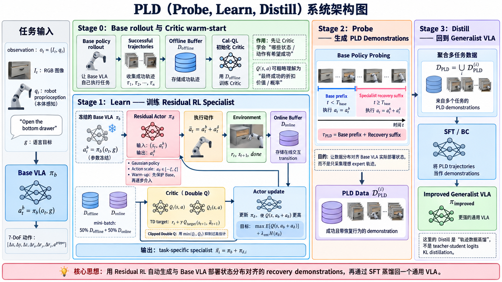

---

title: "Self-Improving Vision-Language-Action Models with Data Generation via Residual RL"
description: "PLD 的核心问题是如何减少 VLA 后训练对昂贵人工示范的依赖，并生成真正覆盖 Base VLA 部署状态分布的数据。核心理解：冻结 Base VLA，用 Residual RL 训练 task-specific Specialist，通过 Base Policy Probing 让 Specialist 从 Base 常见状态和失败状态中恢复成功，再将 Base Prefix + Specialist Recovery 组成的成功轨迹通过 SFT 蒸馏回 Generalist VLA，实现策略自我改进。"
date: "2026-09-08"
venue: "International Conference on Learning Representations (ICLR) 2026"
authors: "Wenli Xiao, Haotian Lin, Andy Peng, Haoru Xue, Tairan He, Yuqi Xie, Fengyuan Hu, Jimmy Wu, Zhengyi Luo, Linxi "Jim" Fan, Guanya Shi, Yuke Zhu"
paper: ""
code: ""
--------

# PLD



## 论文要解决的任务是什么

### 任务输入

机器人在一个桌面/厨房/工业装配场景中，已经处在某个初始状态。它获得的信息包括：$I = \{ \text{当前物理场景}, \text{机器人自身状态}, \text{语言任务指令} \}$，论文用 $o_t$ 表示机器人能够观测到的场景信息，包括 RGB 图像以及 proprioception，例如关节状态；用语言 $g$ 指定目标。

### 任务目标输出

任务并不是要求机器人“输出一个动作向量”。真正期望的是：$\boxed{\text{环境达到符合语言指令的目标状态}}$，机器人为了实现这个最终状态，会产生 $a_0,a_1,\ldots,a_T$ 这样一串控制动作。因此：$\underbrace{a_t}_{\text{模型/控制器输出}} \neq \underbrace{\text{task output}}_{\text{目标物理状态}}$，真正的 task output 应该理解成：$s_T\in \mathcal G(g)$，也就是最终状态 $s_T$ 满足语言目标 $g$。

论文进一步把成功写成一个二值条件：$r(s,a,g) = \mathbf 1[d(\phi(s),g)\leq\epsilon]$，本质就是：当前世界状态是否已经满足任务目标。也因此它属于 sparse binary reward：任务没完成就是 0，达到目标才是 1。

### 论文真正覆盖了哪些具体任务场景？

1. **LIBERO——桌面语言条件操作**
   仿真实验，核心研究的是机器人对物体知识、空间关系和操作技能的迁移。同一种操作技能+不同空间位置、新物体 + 熟悉的操作语义、物体和场景非常相似，但是希望最终实现的 world state 不同。
2. **SimplerEnv——更接近真实机器人分布的 manipulation**
   仿真实验，包括 Google Robot 与 WidowX/Bridge 系列真实机器人对应的仿真环境
3. **真实 Franka——精密抓取与插孔**
   真实机器人 cube pick-up；peg insertion。
4. **YAM 双臂 GPU 插拔——真正的长时序工业任务**
   在 motherboard 上完成 micro graphics card 的连续插拔操作。

## 技术详述

### 1. 一句话理解 PLD：它真正解决的是“后训练数据从哪里来”

传统 VLA 的后训练通常是 $\text{Human Demo}\rightarrow\text{SFT}\rightarrow\text{VLA}$：人工遥操作机器人完成任务，然后把这些成功轨迹作为 demonstration 微调 VLA。问题在于，人类示范昂贵，而且人类操作员通常从一个正常的初始状态开始，把任务比较顺利地完成，因此这些数据不一定覆盖 **VLA 自己部署时真正会进入的失败状态**。

PLD 的思路可以概括为：

$\boxed{\text{Base VLA 自己尝试}\rightarrow\text{RL Specialist 学会修正 Base}\rightarrow\text{从 Base 实际访问的状态恢复成功}\rightarrow\text{把这些轨迹重新 SFT 回 VLA}}$

因此 PLD 最核心的东西并不是 Residual RL 这个算法本身，而是利用 RL 自动构造一种特殊的训练数据：

$\boxed{\text{既是成功 demonstration，又与 Base VLA 的实际部署状态分布对齐}}$

换句话说，普通 expert demonstration 更像：

$\text{正常初始状态}\rightarrow\text{专家一路正确操作}\rightarrow\text{成功}$

而 PLD 希望得到：

$\text{正常初始状态}\rightarrow\text{Base VLA 自己操作}\rightarrow\text{进入 Base 常见状态甚至失败边缘}\rightarrow\text{Specialist 接管并恢复}\rightarrow\text{成功}$

最终重新训练 VLA 时，它不仅能够学习“任务正常情况下应该怎么做”，还能够学习“如果我已经把任务做歪了一点，下一步应该怎样把它救回来”。

------

### 2. 整个 PLD 流程中到底有哪些模型和数据

首先有一个已经训练好的 Base VLA，记作 $\pi_b$。机器人在时刻 $t$ 看到 observation $o_t={I_t,q_t}$，其中 $I_t$ 是 RGB 图像，$q_t$ 是 proprioception；同时收到语言目标 $g$，例如 `"Open the bottom drawer"`。

Base VLA 输出动作 $a_t^b=\pi_b(o_t,g)$。动作是 7-DoF，例如 $a_t^b=[\Delta x,\Delta y,\Delta z,\Delta r_x,\Delta r_y,\Delta r_z,a^{gripper}]$。

PLD 不直接用强化学习修改这个大 VLA，而是 **冻结 $\pi_b$**，在它旁边训练一个很小的 task-specific residual policy $\pi_\delta$。Residual policy 根据当前状态以及 Base 想执行的动作，输出一个修正量 $a_t^\delta$，最终真正发送给机器人的动作是：

$\bar a_t=a_t^b+a_t^\delta$

所以整个系统中同时存在两个层级：

* Generalist：原始 VLA $\pi_b$，会很多任务，但是某个具体任务可能只有部分成功率。
* Specialist：针对某一个任务训练的 residual policy $\pi_{\delta,i}$，只负责把这个任务做到很高成功率。

训练完一个任务以后得到的并不是新 VLA，而是一个组合策略 $\bar\pi_i=\pi_b+\pi_{\delta,i}$。

等所有任务的 specialist 都训练好以后，PLD 再让这些 specialist 帮忙生成成功轨迹，然后把所有轨迹放在一起做普通 SFT，最终才得到真正更新后的 Generalist VLA。

因此整个流程可以理解成：

```
Base VLA → 训练若干 RL Specialists → Specialists 生成数据 → 用数据重新 SFT Base VLA → Improved VLA
```

------

### 3. Specialist 训练前：先让 Base VLA 提供一个“成功经验起点”

Residual RL 虽然比从头强化学习简单，但如果 Critic 和 Actor 都完全随机初始化，在 sparse reward 环境中仍然很难训练。

例如 LIBERO 中任务奖励基本是 binary sparse reward：任务没有完成时 $r_t=0$，成功时 $r_t=1$。如果机器人一开始几乎从来无法成功，那么 replay buffer 中几乎全部都是 $r=0$ 的 transition，Critic 很难知道什么动作更有价值。

所以 PLD 首先让 Base VLA $\pi_b$ 自己执行当前任务，并收集它已经能够成功完成的轨迹。LIBERO 默认使用约 50 条 successful base-policy trajectories。

一条轨迹可以写成 $\tau={(s_t,a_t,r_t,s_{t+1})}_{t=0}^{T-1}$。因为成功时最后会得到 $r=1$，所以这些轨迹至少明确告诉 Critic：“这些状态和动作最后确实能够通向成功”。

例如轨迹最后几步可能形成这样的价值关系：$Q(s_{T-1},a_{T-1})\approx1$，前一步约为 $\gamma$，再前一步约为 $\gamma^2$。因此在这个 sparse binary reward 环境里，可以粗略把 $Q(s,a)$ 理解成：

$\boxed{\text{从当前状态执行这个动作后，最终完成任务的折扣成功价值}}$

$\gamma$ 是强化学习里的 **折扣因子（discount factor）**，用来控制“未来奖励相对当前奖励有多重要”。在 Q-learning 里常见更新是 $Q(s_t,a_t)\leftarrow r_t+\gamma Q(s_{t+1},a_{t+1})$，这里 $\gamma\in(0,1]$。

* $\gamma$ 越接近 1：越重视长期结果；
* $\gamma$ 越小：越重视眼前奖励。

这批成功轨迹形成 offline replay buffer $D_{\text{offline}}$。但 PLD 并不是拿它直接做 Behavior Cloning，而是首先用它初始化 RL 的 Critic。

------

### 4. 为什么首先训练 Critic：Cal-QL warm-start

假设直接在 offline 数据上做普通 Q-learning。数据集中只包含少量真正执行过的动作，但 Critic 是一个函数逼近器，因此它仍然会对很多数据里从未出现过的动作 $a_{\text{OOD}}$ 输出 Q 值。

问题在于，这些 OOD action 没有真实监督，Critic 有可能错误地认为：

$Q(s,a_{\text{OOD}})\gg Q(s,a_{\text{good}})$。

随后 Actor 一旦根据 Critic 更新，就会专门去选择这些被错误高估的动作。结果是 Base VLA 原本已经能够完成一部分任务，但 RL 一开始反而把它带偏。

CQL 的核心思想就是对数据分布之外的动作更加保守，避免 Critic 无依据地给 OOD action 很高的 Q。但从 offline RL 切换到 online RL 时还存在一个额外问题：Critic 的整体 value scale 可能和真正在线交互时看到的 return 不一致，于是 online fine-tuning 初期仍然可能出现性能明显下降。

PLD 因此使用 Cal-QL 对 Critic 做初始化。这里不需要把 Cal-QL 理解成 PLD 的主要创新，它的作用很明确：

$\boxed{\text{利用 Base VLA 已有的成功轨迹，先得到一个比较可靠、value scale 合理的 Critic}}$

于是正式开始 online RL 之前，Critic 已经知道“Base 原来的成功行为是有价值的”，而不是让强化学习从完全随机的价值函数开始。

------

### 5. Residual RL：强化学习不是重新学习动作，而是学习“Base 动作应该改多少”

Critic 初始化以后，PLD 才正式开始训练 Residual Actor。

每一步首先冻结的 Base VLA 根据 observation 和语言指令产生原始动作 $a_t^b=\pi_b(o_t,g)$。Residual Actor 再观察当前状态以及 Base action，产生：

$a_t^\delta\sim\pi_\delta(\cdot\mid s_t,a_t^b)$。

真正执行的是 $\bar a_t=a_t^b+a_t^\delta$。

这与直接训练一个 RL policy 有很大区别。普通 RL 相当于直接学习 $s_t\rightarrow a_t$，需要在完整 action space 中寻找正确动作；Residual RL 学的是 $(s_t,a_t^b)\rightarrow\delta a_t$，也就是：

> Base 已经告诉我“它觉得大概应该往哪里走”，RL 只需要判断“这个动作还应该往哪个方向修一点”。

因此探索空间从“完整动作”变成了“Base action 附近的局部修正”。

论文中的 residual policy 本身非常小，是一个 3-layer MLP Gaussian policy，hidden dimension 和 latent dimension 都为 256。它不是另一个 VLA，也不需要重新理解图像和语言中的所有知识，而更像是一个针对当前任务训练出来的控制修正器。

------

### 6. 为什么 Residual Actor 是 Gaussian Policy

Residual Actor 并不是直接确定性地输出唯一的 $\delta a$，而是输出一个 Gaussian distribution：

$\pi_\delta(a_\delta\mid s,a_b)=\mathcal N(\mu_\psi(s,a_b),\sigma_\psi^2(s,a_b))$。

也就是说，在同一个状态下，Residual Actor 可以采样出不同的修正动作。

这个设计的原因是 online RL 必须进行 exploration。假如当前 Base action 无法打开抽屉，RL 并不知道应该向左修、向右修、向上修还是调整姿态。如果 Residual Actor 从一开始就是完全确定性的，就很容易不断重复一种错误修正。

Gaussian policy 允许它在当前 Base action 附近尝试不同的 correction，例如：

$a_b+\delta a^{(1)}$、$a_b+\delta a^{(2)}$、$a_b+\delta a^{(3)}$。

Critic 再根据这些尝试最终是否更容易成功，逐渐告诉 Actor 哪一类 residual 更好。

因此 Gaussian policy 和后面的 SAC entropy objective 是配套的：一个提供 stochastic exploration，一个通过 entropy regularization 防止策略过早坍缩到单一行为。

------

### 7. Action Scale：Residual 只能“修正”，不能一开始就把 Base 推翻

如果完全不限制 residual magnitude，那么即使公式写成 $\bar a=a_b+a_\delta$，Actor 仍然可能产生特别大的 $a_\delta$。

当 $|a_\delta|\gg|a_b|$ 时，实际执行动作几乎已经与 Base action 无关，这就退化成了重新从头训练一个 RL policy。

所以 PLD 把 residual action 限制在一个范围内，例如 $a_\delta\in[-\xi,\xi]$。

$\xi$ 实际控制了系统对 Base VLA 的信任程度：

$\xi$ 小，意味着“Base 基本是对的，我只允许 RL 做小修正”；$\xi$ 大，意味着“允许 RL 明显覆盖 Base 的动作”。

因此这里存在一个很直观的 trade-off：

$\boxed{\text{小 }\xi:\text{稳定但探索能力弱}\qquad\text{大 }\xi:\text{探索强但容易破坏 Base}}$

论文的 ablation 也体现出这一点：过大的 action scale 会导致训练早期明显偏离 Base policy，使训练不稳定；过小则限制了 specialist 能够纠正的错误范围。LIBERO 中采用 $\xi=0.5$，SimplerEnv 中推荐更小的 $\xi=0.1$。

------

### 8. 一个完整的 RL 训练 step：Base、Actor、Environment、Critic 到底怎么连接

理解 PLD 最关键的是把一轮 online RL 真正走一遍。

假设当前机器人处于状态 $s_t$。

首先，冻结的 Base VLA 产生：

$a_t^b=\pi_b(o_t,g)$。

然后 Residual Actor 根据当前状态和 Base action 采样 correction：

$a_t^\delta\sim\pi_\delta(\cdot\mid s_t,a_t^b)$。

执行组合动作：

$\bar a_t=a_t^b+a_t^\delta$。

环境执行以后返回 reward 和下一个状态：

$(r_t,s_{t+1},done_t)$。

于是得到一个新的 online transition：

$(s_t,\bar a_t,r_t,s_{t+1},done_t)$，

并把它加入 online replay buffer $D_{\text{online}}$。

到这里完成的是 **数据采集**。接下来才开始利用 replay buffer 更新 Critic 和 Actor。

------

### 9. Critic 怎么训练：判断“这个 residual 修正以后到底有没有更容易成功”

PLD 使用两个 Critic $Q_1(s,a)$ 和 $Q_2(s,a)$。

训练时不会只从刚才那一个 transition 学，而是从 replay buffer 中随机采一个 mini-batch。这个 batch 同时包含两类数据：

$50%$ 来自 $D_{\text{offline}}$，也就是 Base VLA 原本的成功轨迹；$50%$ 来自 $D_{\text{online}}$，也就是当前 Base + Residual Actor 新产生的轨迹。

对于其中一个 transition $(s_t,\bar a_t,r_t,s_{t+1})$，首先要计算 TD target。

在下一个状态 $s_{t+1}$，Base VLA 再产生 $a_{t+1}^b$，Residual Actor 再采样 $a_{t+1}^\delta$，得到下一步组合动作 $\bar a_{t+1}=a_{t+1}^b+a_{t+1}^\delta$。

然后用 target critic 估计下一状态的长期价值。直观上目标就是：

$y_t=r_t+\gamma Q_{\text{target}}(s_{t+1},\bar a_{t+1})$。

SAC 实际还会把 entropy 项纳入 target，但核心含义不变：

> 如果当前动作之后进入的状态，在未来很容易完成任务，那么当前动作也应该获得较高 Q value。

然后训练两个 Critic，使 $Q_1(s_t,\bar a_t)$ 和 $Q_2(s_t,\bar a_t)$ 都逼近这个 TD target。

因为奖励只在最终成功时出现，所以成功轨迹末尾的 $r=1$ 会通过一次次 TD bootstrap 向前传播。经过训练以后，即使当前这一刻 $r_t=0$，Critic 仍然可能知道某个动作是好的，因为它能把机器人送入一个未来高概率成功的状态。

------

### 10. 为什么有两个 Critic：Clipped Double Q

如果只训练一个 Critic，它可能因为函数逼近误差偶然把某个动作估得特别高。

例如真实情况可能是：

$Q_{\text{true}}(s,a)=0.3$，

但 Critic 错误估成：

$Q_1(s,a)=0.9$。

Actor 又恰好专门寻找高 Q 动作，于是会不断利用这种 estimation error，最终选择一些实际上很差、只是“Critic 误以为很好”的动作，这就是典型的 Q overestimation。

所以 PLD/SAC 使用两个独立 Critic：

$Q_1(s,a)$ 和 $Q_2(s,a)$，

计算 target 时使用较保守的 $\min(Q_1,Q_2)$。

只有两个 Critic 都认为这个动作有较高价值时，它才比较可能获得较高的 target value，从而降低偶然高估对 Actor 的影响。

------

### 11. Actor 怎么训练：寻找能够让 Critic 给出更高成功价值的 residual

Critic 更新以后，再更新 Residual Actor。

这里 Actor 没有 supervised label。没有任何数据直接告诉它：“正确的 residual 应该是 $[0.03,-0.01,\ldots]$。”

它的监督信号完全来自 Critic。

对于状态 $s_t$，Base action $a_t^b$ 已经固定。Residual Actor 产生 $a_t^\delta$，Critic 计算：

$Q(s_t,a_t^b+a_t^\delta)$。

如果某种 correction 让这个 Q 更高，就意味着按照当前 Critic 的判断，这种 correction 更可能最终把任务做成功。

因此 Actor 的目标本质上是：

$\max_{\pi_\delta}\mathbb E[Q(s,a_b+a_\delta)+\lambda_{\text{ent}}\mathcal H(\pi_\delta)]$。

第一项让 Actor 找到高成功价值的 correction；第二项是 entropy，避免 Actor 过早变成一个极窄的分布，从而保持一定 exploration。

所以 Critic 和 Actor 实际上形成了一个循环：

```
Actor 产生 residual → 环境验证结果 → Critic 根据结果学习哪些 residual 好 → Actor 根据 Critic 更倾向选择好的 residual → 继续与环境交互
```

随着训练进行，Actor 从最初近似随机的小 correction，逐渐变成“看到 Base 在某种状态下准备做这个动作时，我知道应该往哪个方向修”。

------

### 12. 为什么同时保留 Offline 和 Online 两个 Replay Buffer

整个 RL 训练过程中一直维护：

$D_{\text{offline}}$：Base VLA 原本成功过的轨迹。

$D_{\text{online}}$：当前 $\pi_b+\pi_\delta$ 和环境交互产生的新轨迹。

训练 Critic 时通常以 $50%+50%$ 的比例混合采样。

这么做是因为这两种数据承担完全不同的作用。

Offline buffer 相当于一个 anchor。它不断提醒 Critic：

> Base 原来那些能够成功完成任务的动作仍然是好动作，不要因为 online exploration 暂时失败很多次就把这些知识忘掉。

Online buffer 则负责扩大状态和动作 support：

> Base 原来的成功轨迹只覆盖“它已经会做”的部分，而 RL 真正需要探索的是它以前做不好、会偏离、会失败的区域。

如果只用 online data，RL 初期 Residual Actor 仍然比较随机，buffer 中会出现大量失败 transition，Critic 很容易发生 catastrophic forgetting，把 Base 原本已经正确的行为也估坏。

如果只用 offline data，那么 Critic 永远只看到 Base 已经成功过的状态，根本没有机会学习“进入一个新失败状态以后应该怎么恢复”。

所以这两个 replay buffer 可以理解成：

$\boxed{D_{\text{offline}}\text{负责守住已有能力，}\quad D_{\text{online}}\text{负责探索和扩展新能力}}$

------

### 13. Warm-up：不要让随机 Residual 一上来就控制机器人

Residual Actor 刚初始化时基本没有任何有意义的行为。

如果从 episode 第一刻起就执行 $a_b+a_\delta$，随机 residual 很可能直接破坏 Base VLA 本来还不错的控制。例如 Base 已经正确地把夹爪移动到了抽屉把手附近，一个随机 residual 可能马上把末端推离目标。

所以 PLD 在 RL 训练早期采用 warm-up，让 Base policy 先提供较稳定的行为和状态分布，同时让 replay buffer、Critic 等逐渐进入合理状态，再让 residual correction 真正承担主要探索作用。

其核心目的仍然是：

$\boxed{\text{先保护 Base 提供的 policy prior，再在它附近逐渐探索}}$

这与前面的 Cal-QL、offline buffer 和 residual action scale 实际上是一套一致的设计：PLD 不希望 RL 把已有 VLA 当成不存在，而是始终围绕“Base 已经会一部分”这个先验展开强化学习。

------

### 14. Base Policy Probing：Specialist 不应该只会从标准初始状态完成任务

到这里已经可以训练 $\pi_\delta$ 了，但还有一个重要问题。

假设每次 RL episode 都从完全标准的初始状态 $s_0$ 开始。那么 Specialist 最终很可能学会：

$\text{标准 }s_0\rightarrow\text{高质量完成任务}$。

但真正需要它解决的问题其实不是“从头替代 Base VLA”，而是：

$\text{Base VLA 已经自己执行了一段}\rightarrow\text{进入某个它容易出错的状态}\rightarrow\text{Specialist 从这里救回来}$。

因此 PLD 引入 Base Policy Probing。

训练 Specialist 时，可以先让 Base policy 自己运行随机的一段时间：

$s_0\rightarrow s_1\rightarrow\cdots\rightarrow s_k$，

然后从 Base 真正访问到的 $s_k$ 开始让 Residual Specialist 接管。

这会显著改变 RL 看到的 initial-state distribution。Specialist 不再只从人工设计的标准状态学习，而是大量接触：

* Base 已经把机械臂移动到目标附近，但位置有一点偏；
* Base 抓到了物体，但姿态不理想；
* Base 已经开始推抽屉，但方向出现偏差；
* Base 进入了自己常见的局部失败状态。

因此 Specialist 最终学到的不是“如何从头做一个完美 expert”，而是：

$\boxed{\text{如何从 Base VLA 真正容易到达的状态继续完成任务}}$

这一步实际上为后面的 PLD 数据生成提前完成了 distribution alignment。

------

### 15. Specialist 训练完成以后，到底得到了什么

对于任务 $i$，最终得到的是一个 task-specific residual policy $\pi_{\delta,i}$。

它必须和冻结的 Base VLA 一起使用：

$\bar\pi_i=\pi_b+\pi_{\delta,i}$。

所以这里 **还没有得到一个新的 VLA**。

假设有 100 个 manipulation tasks，那么此时可能有：

$\pi_{\delta,1},\pi_{\delta,2},\ldots,\pi_{\delta,100}$。

这些 specialist 各自可能达到接近饱和的任务成功率，但它们不是最终部署模型。一方面它们是 task-specific 的，另一方面每个任务都额外挂了一个 RL Actor。

PLD 接下来真正要做的是利用这些 specialist **生成训练数据**，再把这些能力统一蒸馏回一个 Generalist VLA。

------

### 16. 为什么不能直接让 RL Expert 从头 rollout 来生成 SFT 数据

现在已经拥有很强的 $\bar\pi=\pi_b+\pi_\delta$，一种最简单的做法是：

```
标准初始状态 → Specialist 从头控制 → 成功 → 保存 trajectory
```

这种 trajectory 当然质量很高，但论文发现它并不是最适合 Base VLA 后训练的数据。

原因在于 deployment distribution mismatch。

假设 specialist 几乎从不犯错误，那么它访问的状态分布是 $d^{\pi_{\text{expert}}}(s)$。但最终真正部署的是重新训练后的 Generalist VLA，它的行为仍然来源于 Base VLA，因此更接近 $d^{\pi_b}(s)$。

这两个分布可能明显不同。

例如 expert 总能第一次就准确抓住杯子，因此它的 demonstration 中几乎不存在“第一次抓偏以后怎么办”；但 Base VLA 实际部署时恰恰可能经常抓偏。

那么即使你给 Base VLA 喂了大量完美 expert demonstration，它仍然没有学到：

> 当我真正进入自己经常遇到的错误状态时，下一步应该怎么办？

所以“Expert success rate 更高”并不自动意味着“Expert data 更适合做 SFT”。

------

### 17. PLD 真正的数据生成方式：Base Prefix + Specialist Recovery Suffix

因此在最终收集 $D_{\text{PLD}}$ 时，PLD 不让 Specialist 从 episode 第一帧开始控制。

先让 Base VLA 自己运行。

假设 takeover time 是 $T_{\text{base}}$。那么在 $t<T_{\text{base}}$ 时直接执行 Base action $a_t=a_t^b$；到了 $t\ge T_{\text{base}}$，再启用 Residual Specialist，执行 $a_t=a_t^b+a_t^\delta$。

于是最终一条 trajectory 可以理解成两部分：

$\tau_{\text{PLD}} = \underbrace{\text{Base policy prefix}}_{\text{Base 实际部署状态}} + \underbrace{\text{Specialist recovery suffix}}_{\text{从这些状态成功完成任务}}$

前半段非常重要，因为它把机器人真正带到了 Base policy 自己会访问的状态。

后半段也非常重要，因为它告诉后续 VLA：“从这里开始，正确的恢复动作应该是什么”。

例如一条轨迹可能是：

```
Base 接近抽屉 → Base 抓取位置稍偏 → Base 尝试拉动但没有成功 → Specialist 修正末端位置 → 重新对准把手 → 拉开抽屉 → Success
```

这类 trajectory 和纯 expert trajectory 最大的差别在于：

纯 expert 数据主要回答：

> 正确情况下应该怎么做？

PLD 数据额外回答：

> **像你这样的 Base VLA 做到这里以后，接下来应该怎么做？**

这正是论文所谓 probing mechanism 最重要的含义。

------

### 18. Probing 实际上在两个地方出现

Base Policy Probing 不只是最终收集数据时使用，它实际上贯穿 Specialist 训练和最终数据生成两个阶段。

第一处是在 RL Specialist acquisition 中。Base policy 先运行若干步，再把得到的状态作为 RL 的起点。这样训练出来的 Specialist 本身就擅长处理 Base policy 常见的状态和错误。

第二处是在最终收集 PLD demonstration 时。仍然先保留 Base prefix，再让训练好的 Specialist 接管。这样最终保存下来的数据天然包含 Base 状态分布。

因此两处 probing 是连起来的：

```
Base probing → Specialist 在 Base 状态上学 recovery → Base probing → Specialist 在 Base 状态上展示 recovery → SFT
```

也就是说，PLD 并不是先训练一个普通 expert，再突然让它处理 Base 的失败状态；而是从 Specialist 的 RL 训练阶段开始，就有意识地把它训练成一个 **针对 Base VLA 弱点的 recovery expert**。

------

### 19. 最后一步 Distill：把一堆 task-specific Specialist 重新塞回一个 VLA

对于每个任务 $i$，最终都得到一批成功轨迹 $D_{\text{PLD}}^{(i)}$。

把所有任务数据聚合：

$D_{\text{PLD}}=\bigcup_iD_{\text{PLD}}^{(i)}$。

然后重新训练 Generalist VLA。

这里论文称为 Distillation，但需要特别注意，它和典型模型蒸馏并不是一回事。

这里没有：

$\mathrm{KL}(p_{\text{teacher}}|p_{\text{student}})$，

也没有让 VLA 去拟合 Specialist 的 hidden states 或 logits。

真正发生的是：

```
RL Specialist 与环境交互 → 产生 successful trajectories → trajectories 作为 demonstrations → 普通 SFT / BC
```

所以更准确的理解是：

$\boxed{\text{Policy capability}\rightarrow\text{trajectory data}\rightarrow\text{Generalist policy}}$

Specialist 的能力先被“物化”为机器人轨迹，然后通过 imitation learning 重新吸收到 Generalist 中。

对于 autoregressive action head，可以继续使用 action-token NLL；对于 diffusion / flow action head，则使用相应的 diffusion 或 flow supervised objective。PLD 并不要求最终 VLA 必须使用某一种特定 action decoder。

------

### 20. 从一条数据完整过一遍 PLD

现在把整个流程压缩成一条连续的数据链。

假设任务是 `"Open the bottom drawer"`，当前已经有 Base VLA $\pi_b$。

首先让 $\pi_b$ 多次完成任务，收集约 50 条 successful trajectories，形成 $D_{\text{offline}}$。使用这些数据通过 Cal-QL 初始化两个 Critic，使它们至少知道 Base 原本成功的状态和动作具有较高 value。

然后冻结 $\pi_b$，初始化 Residual Actor $\pi_\delta$。

在线 RL 时，在状态 $s_t$ 下：

Base VLA → $a_t^b$ → Residual Actor → $a_t^\delta$ → 执行 $a_t^b+a_t^{\delta}$ → Environment → $(r_t,s_{t+1})$ → 写入 $D_{\text{online}}$

接着从 $D_{\text{offline}}$ 和 $D_{\text{online}}$ 混合采样 mini-batch。

对于每个 transition，Critic 根据 $r_t+\gamma Q_{\text{target}}(s_{t+1},\bar a_{t+1})$ 更新，学习哪些组合动作长期来看能够导致成功。

Residual Actor 再根据 Critic 更新，让自己产生的 $a_t^\delta$ 使 $Q(s_t,a_t^b+a_t^\delta)$ 尽可能大，同时保留 entropy 进行探索。

如此反复：

```
环境交互 → 写 Replay Buffer → 更新 Critic → 更新 Actor → 再环境交互
```

直到 $\pi_b+\pi_\delta$ 在这个任务上成为一个高成功率 Specialist。

之后不直接让 Specialist 从初始状态做完整 demonstration，而是重新开始 episode，先让 Base VLA 自己运行若干步，把机器人带到 $d^{\pi_b}$ 中真正会出现的状态，然后让 Specialist 接管并成功完成任务。

最终保存：

```
Base 自己的行为 + Specialist 的 recovery 行为
```

形成一条 PLD demonstration。

对很多任务重复这个过程，得到大规模 $D_{\text{PLD}}$。

最后完全不需要保留这些 Residual Actors，而是用 $D_{\text{PLD}}$ 对原来的 Generalist VLA 做普通 SFT。

最终得到：

$\boxed{\pi_b\rightarrow\text{自己暴露失败状态}\rightarrow\text{RL 学会如何修复}\rightarrow\text{生成 recovery demonstrations}\rightarrow\text{SFT}\rightarrow\pi_{\text{improved}}}$

------

### 21. PLD 最核心的理解

PLD 表面上包含 Cal-QL、Residual RL、SAC、Double Q、Replay Buffer、Probing 等很多强化学习技术，但这些并不是彼此独立的“创新点”。

它们实际上服务于同一个目标：

> **可靠地训练一个能够修复 Base VLA 错误的 Specialist，然后利用它生成真正适合 Base VLA 后训练的数据。**

Cal-QL、offline replay 和 warm-up 负责 **不要破坏 Base 已经具有的能力**。

Residual RL 和 action scale 负责 **把强化学习的搜索限制在 Base action 附近，提高 sample efficiency**。

Gaussian policy、SAC 和 online replay 负责 **探索 Base 没有覆盖的新状态和恢复动作**。

Base Policy Probing 负责 **让 Specialist 的训练状态和最终生成的数据都对齐 Base VLA 的 deployment distribution**。

最后的 SFT 负责 **把大量 task-specific RL specialist 的能力重新压回一个通用 VLA**。

所以从数据视角看，PLD 可以被压缩成一句话：

$\boxed{\text{PLD = 用 Residual RL 自动构造 Base-policy-aware recovery demonstrations}}$

而这也解释了为什么论文真正值得关注的问题不是“Residual RL 能不能把任务做到 99%”，而是：

> **这种由 Base VLA 自己暴露状态、再由 RL Specialist 修复得到的数据，是否比 Human Demo 或纯 RL Expert Demo 更适合 VLA 的后训练。**