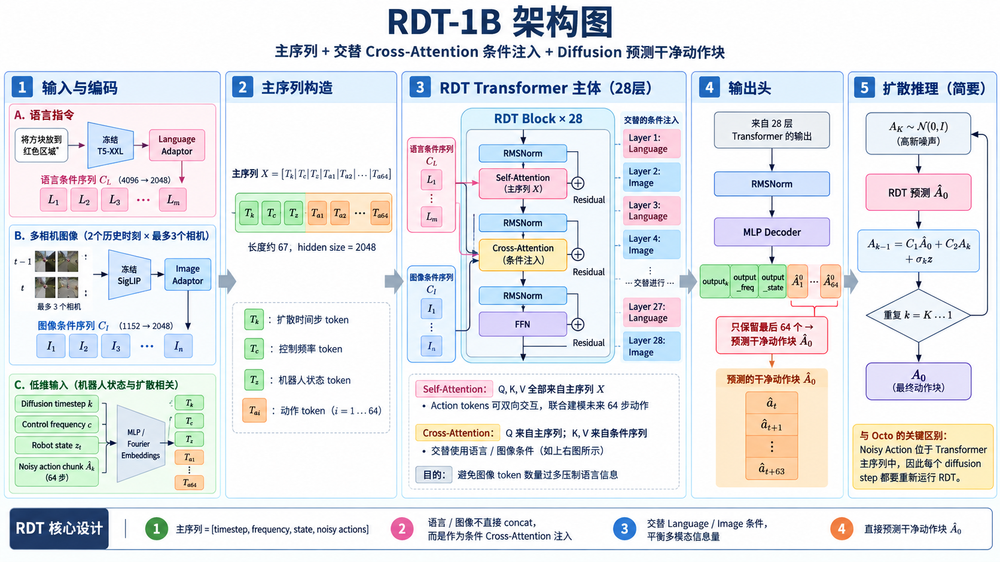

---

title: "RDT-1B: a Diffusion Foundation Model for Bimanual Manipulation"
description: "RDT-1B 面向双臂操作中的动作多模态和多机器人数据异构问题。核心理解：以机器人状态和带噪 Action Chunk 为 Transformer 主序列，将语言和图像作为条件通过交替 Cross-Attention 注入，并直接预测干净动作块。"
date: "2026-09-05"
venue: "arXiv / 2024"
authors: "Songming Liu, Lingxuan Wu, Bangguo Li, Hengkai Tan, Huayu Chen, Zhengyi Wang, Ke Xu, Hang Su, Jun Zhu"
paper: ""
code: ""
---

# RDT-1B



## 1 技术详述：从一条数据完整走一遍 RDT-1B

RDT-1B 的基本学习问题是：

$$
p(A_t\mid \ell,o_t)
$$

其中：

$$
\ell=\text{语言指令}
$$

observation 定义为：

$$
o_t=
\left(
X_{t-T_{\mathrm{img}}+1:t},
z_t,
c
\right)
$$

其中：

$$
X_{t-T_{\mathrm{img}}+1:t}
=
\text{RGB observation history}
$$

$$
z_t
=
\text{robot proprioception}
$$

$$
c
=
\text{control frequency}
$$

论文配置：

$$
T_{\mathrm{img}}=2
$$

即保留最近两个 observation time step。

而 RDT 并不只预测下一步：

$$
a_t
$$

而是一次预测未来一个 Action Chunk：

$$
A_t
=
[a_t,a_{t+1},\ldots,a_{t+T_a-1}]
$$

论文配置：

$$
\boxed{
T_a=64
}
$$

因此真正建模的是：

$$
\boxed{
p(A_t\mid\ell,o_t)
=
p(a_t,\ldots,a_{t+63}\mid\ell,o_t)
}
$$

RDT-1B 与 RDT2 一个非常重要的区别是：

$$
\boxed{
\text{RDT-1B 从预训练到微调始终使用 Diffusion Objective}
}
$$

它没有：

$$
\text{RVQ}
\rightarrow
\text{Autoregressive}
\rightarrow
\text{Flow Matching}
$$

这样的阶段切换。

RDT-1B 的两阶段只是：

$$
\boxed{
\text{Multi-Robot Diffusion Pre-training}
\rightarrow
\text{Target Bimanual Diffusion Fine-tuning}
}
$$

模型结构和训练目标基本不变。

---

### 1.1 第一层解决方案：Physically Interpretable Unified Action Space

RDT 面临的第一个数据问题不是图像，而是：

$$
\boxed{
\text{不同机器人根本没有统一的 State / Action 定义}
}
$$

假设机器人 $r$ 的原始 proprioception：

$$
z_t^{(r)}
\in
\mathbb R^{d_z^{(r)}}
$$

原始 action：

$$
a_t^{(r)}
\in
\mathbb R^{d_a^{(r)}}
$$

对于不同机器人：

$$
d_a^{(r_1)}
\neq
d_a^{(r_2)}
$$

而且即使维度相同：

$$
a_i^{(r_1)}
$$

和：

$$
a_i^{(r_2)}
$$

也可能代表完全不同的物理量。

例如某个机器人：

$$
a_1=\text{joint position}
$$

另一个机器人：

$$
a_1=\text{EEF translation}
$$

如果简单 padding：

$$
[a_1,a_2,\ldots]
\rightarrow
128D
$$

模型看到的是：

*> 相同 position 上出现了完全不同的物理意义。*

这会造成：

$$
\boxed{
\text{Negative Transfer}
}
$$

因此 RDT 定义：

$$
\boxed{
128D\ \text{Physically Interpretable Unified Action Space}
}
$$

这里最关键的不是：

$$
128D
$$

而是：

$$
\boxed{
\text{每一个位置具有固定的物理语义}
}
$$

---

#### 128D 里面放了什么？

统一空间大致划分为：

| Index | Physical Quantity |
|---|---|
| $0\sim9$ | Right arm joint positions |
| $10\sim14$ | Right gripper joint positions |
| $15\sim24$ | Right arm joint velocities |
| $25\sim29$ | Right gripper joint velocities |
| $30\sim32$ | Right EEF position |
| $33\sim38$ | Right EEF 6D pose |
| $39\sim41$ | Right EEF velocity |
| $42\sim44$ | Right EEF angular velocity |
| $45\sim49$ | Reserved |
| $50\sim59$ | Left arm joint positions |
| $60\sim64$ | Left gripper joint positions |
| $65\sim74$ | Left arm joint velocities |
| $75\sim79$ | Left gripper joint velocities |
| $80\sim82$ | Left EEF position |
| $83\sim88$ | Left EEF 6D pose |
| $89\sim91$ | Left EEF velocity |
| $92\sim94$ | Left EEF angular velocity |
| $95\sim99$ | Reserved |
| $100\sim101$ | Base linear velocity |
| $102$ | Base angular velocity |
| $103\sim127$ | Reserved |

对于 single-arm robot：

$$
\boxed{
\text{统一映射到 Right Arm 区域}
}
$$

例如一个只有 $6$ DoF 的机器人，joint position 就填入：

$$
[0,6)
$$

而不是重新定义新的 6 个位置。

因此机器人 $r$ 的原始 state：

$$
z_t^{(r)}
$$

经过物理语义映射：

$$
z_t^{(r)}
\xrightarrow{U_r}
z_t
\in
\mathbb R^{128}
$$

同理：

$$
a_t^{(r)}
\xrightarrow{U_r}
a_t
\in
\mathbb R^{128}
$$

于是 Action Chunk：

$$
A_t
=
[a_t,\ldots,a_{t+63}]
$$

统一变成：

$$
\boxed{
A_t\in\mathbb R^{64\times128}
}
$$

---

#### Padding 还有一个隐藏问题

假设某个机器人没有：

$$
\text{base angular velocity}
$$

那么对应位置必须 padding。

最简单可能填：

$$
0
$$

但是对于机器人：

$$
0\text{ velocity}
$$

本身意味着：

$$
\text{静止}
$$

所以模型无法区分：

$$
\boxed{
0=\text{真实物理量}
}
$$

还是：

$$
\boxed{
0=\text{padding}
}
$$

RDT 因此额外构造一个 availability mask：

$$
m\in\{0,1\}^{128}
$$

例如：

$$
m_i=
\begin{cases}
1,&\text{该机器人存在这个 physical quantity}\\
0,&\text{该位置只是 padding}
\end{cases}
$$

于是实际编码 state 时不是只输入：

$$
z_t\in\mathbb R^{128}
$$

而是：

$$
\boxed{
[z_t;m_z]
\in
\mathbb R^{256}
}
$$

对于每一个 action：

$$
\boxed{
[a_i;m_a]
\in
\mathbb R^{256}
}
$$

所以可以把 Unified Action Space 理解成两层：

$$
\boxed{
\text{128D Physical Value}
+
\text{128D Availability Information}
}
$$

前者告诉模型：

*> 当前物理量是多少？*

后者告诉模型：

*> 这个物理量在当前 embodiment 上是否存在？*

---

### 1.2 一条训练数据最开始长什么样？

从一个机器人数据集取一个时刻 $t$。

原始数据可以抽象成：

$$
\left(
\ell,
X_{t-1:t},
z_t^{(r)},
c,
A_t^{(r)}
\right)
$$

其中图像历史：

$$
X_{t-1:t}
$$

论文配置为：

$$
2\text{ time steps}
\times
3\text{ cameras}
$$

三个 camera 分别是：

$$
\boxed{
\text{Exterior}
+
\text{Right Wrist}
+
\text{Left Wrist}
}
$$

因此最多得到：

$$
2\times3=6
$$

张图像。

原始机器人 state：

$$
z_t^{(r)}
$$

经过 Unified Physical Space：

$$
z_t^{(r)}
\rightarrow
z_t\in\mathbb R^{128}
$$

未来 64 步动作：

$$
A_t^{(r)}
=
[a_t^{(r)},\ldots,a_{t+63}^{(r)}]
$$

经过统一映射：

$$
A_t^{(r)}
\rightarrow
A_0
$$

其中：

$$
\boxed{
A_0
\in
\mathbb R^{64\times128}
}
$$

这里记成 $A_0$，是因为在 diffusion 中：

$$
0
$$

表示：

$$
\boxed{
\text{Clean Action}
}
$$

所以一条标准训练数据现在变成：

$$
\boxed{
(
\ell,
X_{t-1:t},
z_t,
c,
A_0
)
}
$$

---

### 1.3 Diffusion Training：先把真实动作加噪

RDT 不是学习：

$$
(\ell,o_t)\rightarrow A_0
$$

的普通 deterministic regression。

因为对于完全相同的：

$$
(\ell,o_t)
$$

可能存在多个正确 Action Chunk：

$$
A_0^{(1)},
A_0^{(2)},
A_0^{(3)},\ldots
$$

例如双臂任务中：

$$
\text{左手先动}
$$

和：

$$
\text{右手先动}
$$

可能都正确。

如果直接 MSE regression：

$$
f(\ell,o_t)
\approx
\frac{
A^{(1)}+A^{(2)}
}{2}
$$

就可能得到一个：

$$
\boxed{
\text{两个正确 mode 的错误平均}
}
$$

因此 RDT 学习完整条件分布：

$$
\boxed{
p(A_0\mid\ell,o_t)
}
$$

---

#### Step 1：随机采 diffusion timestep

训练使用 DDPM noise schedule。

随机采：

$$
k\sim
\operatorname{Uniform}
\{1,\ldots,K\}
$$

论文训练配置：

$$
\boxed{
K=1000
}
$$

---

#### Step 2：采 Gaussian Noise

$$
\epsilon
\sim
\mathcal N(0,I)
$$

shape 与 Action Chunk 完全相同：

$$
\epsilon
\in
\mathbb R^{64\times128}
$$

---

#### Step 3：构造 Noisy Action Chunk

根据 noise schedule：

$$
\bar\alpha_k
=
\prod_{i=1}^{k}\alpha_i
$$

构造：

$$
\boxed{
\tilde A_k
=
\sqrt{\bar\alpha_k}A_0
+
\sqrt{1-\bar\alpha_k}\epsilon
}
$$

因此：

$$
A_0
\rightarrow
\tilde A_k
$$

shape 不变：

$$
\boxed{
\tilde A_k
\in
\mathbb R^{64\times128}
}
$$

当：

$$
k\approx0
$$

时：

$$
\tilde A_k
\approx
A_0
$$

而当：

$$
k\approx K
$$

时：

$$
\tilde A_k
\approx
\epsilon
$$

所以 RDT 的任务是：

$$
\boxed{
\tilde A_k
\xrightarrow[\ell,o_t,k]{RDT}
\hat A_0
}
$$

这里非常关键：

$$
\boxed{
RDT-1B\ 直接预测 Clean Action
}
$$

不是预测：

$$
\epsilon
$$

也不是预测：

$$
v
$$

而是直接预测：

$$
A_0
$$

即：

$$
x_0\text{-prediction}
$$

---

### 1.4 Low-Dimensional Inputs 怎么进入 Transformer？

目前有：

$$
z_t
\in
\mathbb R^{128}
$$

$$
\tilde A_k
\in
\mathbb R^{64\times128}
$$

$$
c
$$

以及：

$$
k
$$

RDT 不会把这些数值直接送进 Transformer，而是全部编码到统一的：

$$
D=2048
$$

token space。

---

#### Robot State

首先加 availability mask：

$$
[z_t;m_z]
\in
\mathbb R^{256}
$$

然后通过低维输入 MLP：

$$
[z_t;m_z]
\xrightarrow{\text{MLP}}
T_z
$$

得到：

$$
\boxed{
T_z\in\mathbb R^{1\times2048}
}
$$

即：

$$
\boxed{
1\text{ 个 Robot State Token}
}
$$

---

#### Noisy Action Chunk

对于第 $i$ 个 noisy action：

$$
\tilde a_i^k
\in
\mathbb R^{128}
$$

拼 availability mask：

$$
[\tilde a_i^k;m_a]
\in
\mathbb R^{256}
$$

RDT 对 state 和 action 使用 shared MLP，因为：

$$
\boxed{
\text{两者描述的是相似的机器人 physical quantities}
}
$$

因此：

$$
[\tilde a_i^k;m_a]
\xrightarrow{\text{Shared MLP}}
T_{a_i}
$$

其中：

$$
T_{a_i}
\in
\mathbb R^{2048}
$$

64 步一起得到：

$$
\boxed{
T_A
\in
\mathbb R^{64\times2048}
}
$$

与离散 Action Token 不同，这里始终保持：

$$
\boxed{
\text{Continuous Action Encoding}
}
$$

不存在 RVQ / binning quantization。

---

#### Control Frequency

不同机器人可能：

$$
5Hz,\quad10Hz,\quad20Hz,\quad50Hz
$$

如果模型不知道 control frequency，同一个数值：

$$
\Delta q
$$

在不同频率下对应的真实运动速度不同。

因此：

$$
c
\xrightarrow{\text{Fourier Features / MLP}}
T_c
$$

最终：

$$
\boxed{
T_c\in\mathbb R^{1\times2048}
}
$$

Control Frequency 本质上告诉模型：

$$
\boxed{
\text{应该用什么时间尺度解释 Action}
}
$$

---

#### Diffusion Timestep

同理：

$$
k
\xrightarrow{\text{Fourier Features / MLP}}
T_k
$$

得到：

$$
\boxed{
T_k\in\mathbb R^{1\times2048}
}
$$

它告诉 denoiser：

*> 当前动作到底有多 noisy？*

---

### 1.5 Main Sequence 怎么构造？

目前：

$$
T_z
\in
\mathbb R^{1\times2048}
$$

$$
T_A
\in
\mathbb R^{64\times2048}
$$

$$
T_c
\in
\mathbb R^{1\times2048}
$$

$$
T_k
\in
\mathbb R^{1\times2048}
$$

沿 sequence dimension concat：

$$
X^{(0)}
=
\operatorname{Concat}
(
T_z,
T_A,
T_c,
T_k
)
$$

因此 sequence length：

$$
1+64+1+1
=
67
$$

最终：

$$
\boxed{
X^{(0)}
\in
\mathbb R^{67\times2048}
}
$$

论文只要求这四类 low-dimensional token 沿 length dimension 组成长度：

$$
1+T_a+1+1
$$

的序列。

可以概念化理解成：

```text
[Diffusion Step]
[Control Frequency]
[Robot State]
[Noisy Action 1]
[Noisy Action 2]
...
[Noisy Action 64]
```

然后加入 positional embedding：

$$
X^{(0)}
\leftarrow
X^{(0)}+P
$$

其中 position embedding 同时帮助模型区分：

$$
\text{State / Action / Frequency / Diffusion Step}
$$

以及 Action Chunk 内部的 temporal position。

这条：

$$
67\times2048
$$

序列就是：

$$
\boxed{
\text{RDT Transformer 的 Main Sequence}
}
$$

最重要的一点是：

$$
\boxed{
\text{Language 和 Image 不在这里与 Main Sequence 直接 concat}
}
$$

它们属于：

$$
\boxed{
\text{Condition Sequence}
}
$$

---

### 1.6 Language Condition

语言指令：

$$
\ell
$$

首先进入冻结的：

$$
\boxed{
\text{T5-XXL}
}
$$

得到：

$$
H_L
=
\operatorname{T5}(\ell)
$$

论文中的 language token dimension：

$$
\boxed{
4096
}
$$

所以：

$$
H_L
\in
\mathbb R^{N_L\times4096}
$$

T5-XXL 参数：

$$
\boxed{
\text{Frozen}
}
$$

然后经过：

$$
\boxed{
2\text{-layer MLP Adapter}
}
$$

投影到 RDT hidden dimension：

$$
4096
\rightarrow
2048
$$

得到：

$$
\boxed{
C_L
\in
\mathbb R^{N_L\times2048}
}
$$

batch 中为了统一长度可能存在 PAD token，因此 language attention 中使用：

$$
\boxed{
\text{Language Attention Mask}
}
$$

避免读取 padding。

---

### 1.7 Image Condition

RDT 配置：

$$
T_{\mathrm{img}}=2
$$

$$
N_{\mathrm{cam}}=3
$$

所以最多：

$$
6
$$

张 RGB image：

```text
t-1:
    Exterior
    Right Wrist
    Left Wrist

t:
    Exterior
    Right Wrist
    Left Wrist
```

每张图首先经过冻结的：

$$
\boxed{
\text{SigLIP}
}
$$

设每张图产生：

$$
N_P
$$

个 patch token。

SigLIP 的 image token dimension：

$$
\boxed{
1152
}
$$

则所有视觉表示可以写成：

$$
H_I
\in
\mathbb R^{
T_{\mathrm{img}}
\times
N_{\mathrm{cam}}
\times
N_P
\times
1152
}
$$

即：

$$
H_I
\in
\mathbb R^{
2\times3\times N_P\times1152
}
$$

然后通过：

$$
\boxed{
2\text{-layer MLP Adapter}
}
$$

将：

$$
1152
\rightarrow
2048
$$

得到：

$$
C_I
\in
\mathbb R^{
2\times3\times N_P\times2048
}
$$

随后可以 flatten 为 Cross-Attention 所使用的 condition sequence。

---

##### Multi-Dimensional Positional Embedding

单纯 flatten：

$$
6N_P
$$

个 visual token 会丢失：

*> 这个 patch 来自哪个时间？哪个摄像头？图像中的哪个 spatial location？*

所以 RDT 使用 multi-dimensional positional encoding：

$$
\boxed{
(
T_{\mathrm{img}},
N_{\mathrm{cam}},
N_P,
D
)
}
$$

即 position information 同时编码：

$$
\boxed{
\text{Time}
+
\text{Camera View}
+
\text{Patch Position}
}
$$

使模型能够区分：

$$
X_{t-1}^{\text{Exterior}}
$$

和：

$$
X_t^{\text{Right Wrist}}
$$

而不是把所有视觉 token 当作同一种输入。

---

### 1.8 RDT Transformer：28 层内部到底发生什么？

RDT-1B 配置：

$$
\boxed{
28\text{ Transformer Layers}
}
$$

hidden dimension：

$$
\boxed{
D=2048
}
$$

attention heads：

$$
\boxed{
32
}
$$

总参数：

$$
\boxed{
1.2B
}
$$

因此每一个 attention head 的 dimension：

$$
d_h
=
\frac{2048}{32}
=
64
$$

RDT block 可以概念化为：

```text
Main Sequence X

      │
      ▼
   RMSNorm
      │
      ▼
Self-Attention
      │
   Residual
      │
      ▼
   RMSNorm
      │
      ▼
Cross-Attention
      │
   Residual
      │
      ▼
   RMSNorm
      │
      ▼
     FFN
      │
   Residual
      │
      ▼
Next Layer
```

而 RDT 对原始 DiT 做了三个最关键的修改：

$$
\boxed{
\text{QKNorm + RMSNorm}
}
$$

$$
\boxed{
\text{MLP Decoder}
}
$$

$$
\boxed{
\text{Alternating Condition Injection}
}
$$

---

### 1.9 Self-Attention：Action Chunk 内部怎么交互？

当前：

$$
X
\in
\mathbb R^{67\times2048}
$$

先做：

$$
\bar X
=
\operatorname{RMSNorm}(X)
$$

然后：

$$
Q=\bar XW_Q
$$

$$
K=\bar XW_K
$$

$$
V=\bar XW_V
$$

RDT 在 attention 中进一步加入：

$$
\boxed{
\text{QKNorm}
}
$$

也就是在计算 attention score 前对：

$$
Q,\ K
$$

进行 normalization。

概念上：

$$
\hat Q
=
\operatorname{Norm}(Q)
$$

$$
\hat K
=
\operatorname{Norm}(K)
$$

然后：

$$
H_{\mathrm{self}}
=
\operatorname{softmax}
\left(
\frac{
\hat Q\hat K^\top
}{
\sqrt{d_h}
}
\right)V
$$

再 residual：

$$
X'
=
X+H_{\mathrm{self}}
$$

这里 Self-Attention 做的事情非常关键：

$$
\boxed{
a_i
\leftrightarrow
a_j
}
$$

未来 64 个 noisy action token 可以联合建模。

所以 RDT 并不是：

$$
a_t
\rightarrow
a_{t+1}
\rightarrow
a_{t+2}
$$

逐 token autoregressive generation。

而是：

$$
\boxed{
\text{整段 Action Chunk 作为一个 trajectory 共同 denoise}
}
$$

这使模型可以学习：

$$
\text{左手 trajectory}
\leftrightarrow
\text{右手 trajectory}
$$

以及：

$$
a_t
\leftrightarrow
a_{t+40}
$$

这样的长时间 coordination。

---

### 1.10 为什么使用 RMSNorm + QKNorm？

Robot physical quantities 的数值范围可能非常不稳定。

例如：

$$
\text{position}
$$

$$
\text{velocity}
$$

$$
\text{joint angle}
$$

$$
\text{EEF pose}
$$

可能具有完全不同的尺度，而且传感器还可能出现 outlier。

这会造成：

$$
QK^\top
$$

过大，从而导致：

$$
\boxed{
\text{Gradient Instability / Numerical Overflow}
}
$$

因此 RDT 使用：

$$
\boxed{
\text{QKNorm}
}
$$

稳定 attention score。

同时把原始 DiT 中的：

$$
\operatorname{LayerNorm}
$$

替换成：

$$
\boxed{
\operatorname{RMSNorm}
}
$$

RDT 的解释是：

LayerNorm 包含 centering：

$$
x
\rightarrow
x-\mu
$$

而机器人动作本质上是一类 time-series physical quantity。

centering 可能产生：

$$
\text{token shift}
$$

和：

$$
\text{attention shift}
$$

破坏时间序列中的某些对称结构。

RMSNorm 不进行 centering，因此更加适合这种输入。

---

### 1.11 Cross-Attention：Action 怎么读取 Language / Image？

经过 Self-Attention：

$$
X'
\in
\mathbb R^{67\times2048}
$$

Main Sequence 作为 Query：

$$
Q
=
X'W_Q
$$

Condition 作为：

$$
K,V
$$

因此：

$$
\boxed{
Q=\text{Robot / Action Main Sequence}
}
$$

而：

$$
\boxed{
K,V=\text{Language 或 Image Condition}
}
$$

假设当前 layer 注入 Language：

$$
K_L=C_LW_K
$$

$$
V_L=C_LW_V
$$

则：

$$
H_{\mathrm{cross}}
=
\operatorname{softmax}
\left(
\frac{
QK_L^\top
}{
\sqrt{d_h}
}
\right)
V_L
$$

然后：

$$
X''
=
X'
+
H_{\mathrm{cross}}
$$

可以把它理解成：

*> 每一个 state/action token 都在主动询问语言：*

*> “为了决定我这一时刻应该怎么运动，任务指令中哪些信息与我有关？”*

如果当前 layer 注入视觉：

$$
K_I=C_IW_K
$$

$$
V_I=C_IW_V
$$

那么 action token 就是在询问：

*> “为了决定这个动作，我应该关注哪个 camera、哪个时间、哪个 image patch？”*

因此 RDT 的信息方向可以理解成：

$$
\boxed{
\text{Language / Image}
\rightarrow
\text{Action Representation}
}
$$

---

### 1.12 Alternating Condition Injection

一个直接方案可能是：

$$
C
=
[C_L;C_I]
$$

然后每一层：

$$
\operatorname{CrossAttn}(X,C)
$$

但问题是：

$$
N_I
\gg
N_L
$$

视觉 patch token 通常远多于语言 token。

如果直接一起做 attention：

$$
\boxed{
\text{Visual Information 容易压过 Language Information}
}
$$

模型可能更愿意：

*> 看图猜动作。*

而不是：

*> 真正理解语言指定的是左手、右手、哪个物体、什么操作方式。*

所以 RDT 提出：

$$
\boxed{
\text{Alternating Condition Injection}
}
$$

即 consecutive Transformer layers 交替注入：

$$
\text{Language}
$$

和：

$$
\text{Image}
$$

可以概念化成：

```text
Layer i     → Language Cross-Attention
Layer i+1   → Image Cross-Attention
Layer i+2   → Language Cross-Attention
Layer i+3   → Image Cross-Attention
...
```

因此：

$$
\boxed{
C^{(l)}
=
\begin{cases}
C_L,&\text{Language-conditioned layer}\\
C_I,&\text{Image-conditioned layer}
\end{cases}
}
$$

注意：

论文明确的是：

$$
\boxed{
\text{successive layers 交替注入 Language / Image}
}
$$

核心并不是必须记住：

*> 第一层究竟先 Language 还是先 Image。*

真正重要的是：

$$
\boxed{
\text{不要在同一层让大量 Image Token 淹没 Language Token}
}
$$

---

### 1.13 Independent Random Masking

还有一个问题。

Exterior camera 通常能看到：

$$
\boxed{
\text{最多的全局信息}
}
$$

如果模型每次都有 exterior camera，它可能学出 shortcut：

*> 只看 exterior camera 就行，没必要理解 wrist camera / language / other input。*

所以训练期间：

$$
\boxed{
\text{各个 multimodal input 独立以 }10\%\text{ 概率被 mask}
}
$$

即训练时可能出现：

```text
Language        ✓
Exterior Cam    ×
Right Wrist     ✓
Left Wrist      ✓
...
```

下一条数据又可能变成：

```text
Language        ×
Exterior Cam    ✓
Right Wrist     ×
Left Wrist      ✓
...
```

目的不是做 diffusion noise，而是：

$$
\boxed{
\text{Prevent Shortcut Learning}
}
$$

迫使模型利用不同的信息来源。

---

### 1.14 FFN 在做什么？

Cross-Attention 完成以后：

$$
X''
\in
\mathbb R^{67\times2048}
$$

进入：

$$
\bar X''
=
\operatorname{RMSNorm}(X'')
$$

然后：

$$
H_{\mathrm{FFN}}
=
\operatorname{FFN}(\bar X'')
$$

Residual：

$$
X^{\mathrm{next}}
=
X''
+
H_{\mathrm{FFN}}
$$

Attention 负责：

$$
\boxed{
\text{Token 与 Token 之间的信息交换}
}
$$

FFN 负责：

$$
\boxed{
\text{每一个 Token 内部 Feature 的非线性变换}
}
$$

经过：

$$
28
$$

层之后：

$$
X^{(28)}
\in
\mathbb R^{67\times2048}
$$

---

### 1.15 MLP Decoder：为什么不是 Linear Projection？

普通 Transformer 最后经常使用：

$$
h
\xrightarrow{W}
y
$$

即 linear projection。

但机器人 dynamics 往往具有：

$$
\boxed{
\text{strong nonlinearity}
}
$$

例如：

$$
\text{contact}
$$

$$
\text{collision}
$$

$$
\text{friction}
$$

$$
\text{joint constraint}
$$

都会造成非线性变化。

因此 RDT 不使用简单 linear decoder，而使用：

$$
\boxed{
\text{MLP Decoder}
}
$$

经过最后的 normalization：

$$
X^{(28)}
\xrightarrow{\text{Norm}}
\bar X
$$

再取与 Action Chunk 对应的 representation，经过：

$$
\operatorname{MLPDecoder}
$$

得到：

$$
\boxed{
\hat A_0
\in
\mathbb R^{64\times128}
}
$$

也就是：

$$
\boxed{
\text{Predicted Clean Action Chunk}
}
$$

所以整个 denoising network 本质上是：

$$
\boxed{
f_\theta
(
\ell,
o_t,
\tilde A_k,
k
)
=
\hat A_0
}
$$

---

### 1.16 RDT 的 Diffusion Loss 到底在训练什么？

真实动作：

$$
A_0
$$

经过 forward diffusion：

$$
A_0
\rightarrow
\tilde A_k
$$

RDT：

$$
\tilde A_k
\xrightarrow[
\ell,o_t,k
]{f_\theta}
\hat A_0
$$

训练目标：

$$
\boxed{
\mathcal L_{\mathrm{RDT}}
=
\left\|
A_0
-
f_\theta
(
\ell,
o_t,
\tilde A_k,
k
)
\right\|_2^2
}
$$

展开：

$$
\boxed{
\mathcal L_{\mathrm{RDT}}
=
\left\|
A_0
-
f_\theta
\left(
\ell,
o_t,
\sqrt{\bar\alpha_k}A_0
+
\sqrt{1-\bar\alpha_k}\epsilon,
k
\right)
\right\|_2^2
}
$$

其中：

$$
k
\sim
U\{1,\ldots,K\}
$$

$$
\epsilon
\sim
\mathcal N(0,I)
$$

所以监督信号非常直接：

$$
\boxed{
\text{不管输入有多 noisy，都尽量恢复真正的 Clean Action Chunk}
}
$$

更新的是：

* RDT Transformer；
* low-dimensional MLP；
* modality adapters；
* MLP Decoder。

而：

$$
\boxed{
\text{T5-XXL Frozen}
}
$$

$$
\boxed{
\text{SigLIP Frozen}
}
$$

---

### 1.17 一次完整 Training Step

把上面压成一条真正的数据链：

```text
Raw Robot Trajectory
    │
    ├── Language l
    │
    ├── RGB History X[t-1:t]
    │     └── 2 time steps × 3 cameras
    │
    ├── Proprioception z_t^(r)
    │
    ├── Control Frequency c
    │
    └── Future Action Chunk A_t^(r)
          └── 64 steps
    │
    ▼
Physically Interpretable Unified Space
    │
    ├── z_t^(r)
    │      ↓
    │   z_t ∈ R^128
    │      +
    │   availability mask
    │      ↓
    │   [z_t ; m_z] ∈ R^256
    │
    └── A_t^(r)
           ↓
        A_0 ∈ R^(64×128)
           +
        availability mask
    │
    ▼
Sample Diffusion Step
    k ~ Uniform{1,...,1000}
    │
    ▼
Sample Noise
    ε ~ N(0,I)
    shape = [64,128]
    │
    ▼
Forward Diffusion
    A_k =
    sqrt(ᾱ_k) A_0
    +
    sqrt(1-ᾱ_k) ε
    │
    ├────────────────────────────────────────────┐
    │                                            │
    ▼                                            ▼
Low-Dimensional Inputs                    Condition Inputs
                                           
A_k → Shared Action MLP                  l
      → [64,2048]                         ↓
                                         Frozen T5-XXL
z_t → Shared State MLP                    ↓
      → [1,2048]                         [N_L,4096]
                                         ↓
c → Fourier/MLP                          2-layer Adapter
    → [1,2048]                            ↓
                                         C_L [N_L,2048]
k → Fourier/MLP
    → [1,2048]                           RGB Images
                                         ↓
    │                                    Frozen SigLIP
    │                                    ↓
    │                                    Patch Tokens [*,1152]
    │                                    ↓
    │                                    2-layer Adapter
    │                                    ↓
    │                                    C_I [*,2048]
    │
    ▼
Main Sequence
length = 1 + 64 + 1 + 1 = 67

X_0 ∈ R^(67×2048)
    │
    ▼
Position Embedding
    │
    ▼
RDT Transformer ×28
    │
    ├── RMSNorm
    ├── QKNorm Self-Attention
    ├── Residual
    ├── RMSNorm
    ├── Cross-Attention
    │       ↕
    │   Language / Image
    │   Alternating Injection
    ├── Residual
    ├── RMSNorm
    ├── FFN
    └── Residual
    │
    ▼
Final Norm
    │
    ▼
MLP Decoder
    │
    ▼
Predicted Clean Action
Â_0 ∈ R^(64×128)
    │
    ▼
MSE
||A_0 - Â_0||²
    │
    ▼
Backpropagation
```

这一整个过程最重要的一句话是：

$$
\boxed{
A_0
\rightarrow
A_k
\rightarrow
RDT(A_k,\ell,o_t,k)
\rightarrow
\hat A_0
}
$$

---

### 1.18 Pre-Training 到底训练什么？

RDT 首先使用：

$$
\boxed{
46\text{ multi-robot datasets}
}
$$

总规模：

$$
\boxed{
1M+\text{ trajectories}
}
$$

数据量：

$$
\boxed{
21TB
}
$$

其中大量数据来自不同：

$$
\text{robot embodiment}
$$

且很多是：

$$
\text{single-arm data}
$$

统一动作空间使这些不同机器人都能转成：

$$
\boxed{
128D\ Physical Space
}
$$

所以 Pre-training 并不是：

*> 让模型提前学会目标 ALOHA 上所有任务。*

更准确地说是：

$$
\boxed{
\text{从大量机器人数据中学习 transferable physical / visuomotor knowledge}
}
$$

训练仍然使用同一个：

$$
\boxed{
\mathcal L_{\mathrm{RDT}}
=
\|A_0-\hat A_0\|^2
}
$$

论文预训练：

$$
\boxed{
1M\text{ optimization steps}
}
$$

使用：

$$
48\times\text{H100 80GB}
$$

---

### 1.19 Fine-Tuning 和 Pre-Training 有什么区别？

虽然 Pre-training 已经见过很多机器人，但目标机器人：

$$
\text{dual-arm ALOHA}
$$

仍然存在：

$$
\boxed{
\text{Embodiment Gap}
}
$$

因此 RDT 又收集目标双臂机器人数据：

$$
\boxed{
6K+\text{ trajectories}
}
$$

覆盖：

$$
300+\text{ tasks}
$$

$$
100+\text{ objects}
$$

$$
15+\text{ scenes}
$$

然后：

$$
\boxed{
\text{Pretrained RDT}
\rightarrow
\text{Bimanual Fine-Tuning}
}
$$

这里和 RDT2 非常不同。

RDT2 是：

$$
\text{Stage 1 CE}
\rightarrow
\text{Stage 2 Flow}
\rightarrow
\text{Stage 3 Distillation}
$$

训练目标发生改变。

RDT-1B 则始终是：

$$
\boxed{
\text{Diffusion Denoising}
}
$$

Fine-tuning 时仍然：

$$
A_0
\rightarrow
A_k
\rightarrow
RDT
\rightarrow
\hat A_0
$$

并优化：

$$
\boxed{
\|A_0-\hat A_0\|^2
}
$$

只是训练数据从：

$$
\text{large-scale heterogeneous multi-robot data}
$$

变成：

$$
\text{high-quality target bimanual data}
$$

所以可以理解成：

$$
\boxed{
\text{Pre-training 学 transferable knowledge}
}
$$

$$
+
$$

$$
\boxed{
\text{Fine-tuning 对齐 target embodiment}
}
$$

---

### 1.20 Fine-Tuning 中的数据增强

大模型在只有：

$$
6K+
$$

轨迹的数据上容易 overfit。

因此 RDT 使用：

**Image augmentation：**

$$
\text{Color Jittering}
+
\text{Image Corruption}
$$

**Proprioception augmentation：**

给 state 加 Gaussian Noise：

$$
\boxed{
\mathrm{SNR}=40\text{ dB}
}
$$

**Language augmentation：**

人工 instruction 进一步通过 GPT-4-Turbo 产生：

$$
\text{Original}
$$

$$
\text{Expanded}
$$

$$
\text{Simplified}
$$

Fine-tuning 时三类 instruction：

$$
\boxed{
\frac13:\frac13:\frac13
}
$$

进行采样。

此外还会删除 trajectory 开头 operator 尚未开始操作产生的：

$$
\boxed{
\text{Static Segment}
}
$$

论文最终没有使用：

$$
\boxed{
\text{Classifier-Free Guidance}
}
$$

因为实际发现 CFG 没有提高性能，反而会导致机器人行为不稳定。

---

### 1.21 推理：没有 Ground-Truth Action 怎么办？

训练时我们有：

$$
A_0
$$

因此可以：

$$
A_0
\rightarrow
A_k
$$

但部署时未来真实动作当然不存在。

当前只有：

$$
\boxed{
(\ell,X_{t-1:t},z_t,c)
}
$$

所以必须从纯 Gaussian Noise 开始。

初始化：

$$
\boxed{
A_K
\sim
\mathcal N(0,I)
}
$$

其中：

$$
A_K
\in
\mathbb R^{64\times128}
$$

然后：

$$
A_K
\xrightarrow[\ell,o_t,K]{RDT}
\hat A_0^{(K)}
$$

注意这里 RDT 输出的是：

$$
\boxed{
\text{当前 noisy action 对应的 Clean Action Estimate}
}
$$

即：

$$
\hat A_0^{(K)}
$$

而不是直接把这个 estimate 当最终结果。

它会根据 diffusion solver 更新：

$$
A_K
\rightarrow
A_{K-1}
$$

然后重新：

$$
A_{K-1}
\xrightarrow{RDT}
\hat A_0^{(K-1)}
$$

不断迭代。

---

### 1.22 DDPM 视角下的一次 Reverse Update

论文中的基本 diffusion formulation 可以写成：

$$
A_{k-1}
=
\frac{
\sqrt{\bar\alpha_{k-1}}\beta_k
}{
1-\bar\alpha_k
}
\hat A_0^{(k)}
+
\frac{
\sqrt{\alpha_k}
(1-\bar\alpha_{k-1})
}{
1-\bar\alpha_k
}
A_k
+
\sigma_k z
$$

其中：

$$
\beta_k=1-\alpha_k
$$

而：

$$
\hat A_0^{(k)}
=
f_\theta(
\ell,o_t,A_k,k
)
$$

因此整个生成过程是：

$$
A_K
\xrightarrow{RDT}
\hat A_0^{(K)}
\rightarrow
A_{K-1}
$$

$$
A_{K-1}
\xrightarrow{RDT}
\hat A_0^{(K-1)}
\rightarrow
A_{K-2}
$$

$$
\vdots
$$

直到：

$$
A_1
\xrightarrow{RDT}
\hat A_0^{(1)}
\rightarrow
A_0
$$

即：

$$
\boxed{
A_K
\rightarrow
A_{K-1}
\rightarrow
\cdots
\rightarrow
A_0
}
$$

---

### 1.23 实际部署不是跑 1000 次 RDT

训练 noise schedule 使用：

$$
K=1000
$$

但如果推理也跑 1000 次：

$$
\boxed{
\text{完全无法实时控制机器人}
}
$$

因此实际 inference 使用：

$$
\boxed{
\text{DPM-Solver++}
}
$$

论文配置只需要：

$$
\boxed{
5\text{ sampling steps}
}
$$

所以实际更加接近：

$$
A^{(5)}
\rightarrow
A^{(4)}
\rightarrow
A^{(3)}
\rightarrow
A^{(2)}
\rightarrow
A^{(1)}
\rightarrow
A^{(0)}
$$

而不是完整走完训练时的 1000 个 discrete noise levels。

---

### 1.24 一个很重要的效率问题：每次 denoise 都要重新跑 RDT

这里和：

$$
\text{Backbone}
+
\text{Small Diffusion Head}
$$

结构非常不同。

RDT 中：

$$
A_k
$$

本身就是 Transformer Main Sequence 的一部分。

因此：

$$
A_k
\rightarrow
A_{k-1}
$$

之后，Main Sequence 已经发生变化。

所以必须重新计算：

$$
\boxed{
RDT\ Transformer\times28
}
$$

即：

```text
A_K
 │
 ▼
RDT ×28
 │
 ▼
Â_0
 │
 ▼
Solver Update
 │
 ▼
A_next
 │
 ▼
RDT ×28
 │
 ▼
Â_0
 │
 ▼
Solver Update
 │
 ...
```

因此更准确地说：

$$
\boxed{
\text{RDT Transformer 本身就是 Diffusion Denoiser}
}
$$

而不是：

$$
\text{Transformer 只负责产生一次 Condition Feature}
$$

---

### 1.25 最终 Action 怎么变回真实机器人命令？

最终得到：

$$
A_0
\in
\mathbb R^{64\times128}
$$

但机器人本身当然没有：

$$
128
$$

个 control dimensions。

128D 只是：

$$
\boxed{
\text{Unified Physical Representation}
}
$$

因此对于当前机器人 $r$，根据：

$$
m_a
$$

只选择该 embodiment 真正存在的 physical dimensions：

$$
A_0
\xrightarrow{\text{Select Valid Dimensions}}
A_0^{(r)}
$$

再按照机器人原本的 action definition：

$$
\boxed{
A_0^{(r)}
=
[a_t^{(r)},\ldots,a_{t+63}^{(r)}]
}
$$

交给底层 robot controller。

也就是说完整闭环是：

$$
\boxed{
\text{Observe}
\rightarrow
\text{Generate Action Chunk}
\rightarrow
\text{Execute}
\rightarrow
\text{Observe Again}
}
$$

而不是一次生成整条 episode 后完全 open-loop 执行。

---

### 1.26 完整推理流程

```text
Language Instruction l
Current Robot Observation
    │
    ├── RGB History
    │     [t-1,t] × 3 cameras
    │
    ├── Robot State z_t
    │
    └── Frequency c
    │
    ▼

State
native representation
    ↓
128D Unified Physical Space
    ↓
+ Availability Mask
    ↓
Shared MLP
    ↓
State Token [1,2048]

Language
    ↓
Frozen T5-XXL
    ↓
[N_L,4096]
    ↓
2-layer Adapter
    ↓
Language Condition [N_L,2048]

Images
    ↓
Frozen SigLIP
    ↓
Patch Tokens [...,1152]
    ↓
Multi-Dim Positional Encoding
    ↓
2-layer Adapter
    ↓
Image Condition [...,2048]

Frequency
    ↓
Fourier / MLP
    ↓
[1,2048]

Random Action Chunk
A_K ~ N(0,I)
shape = [64,128]
    ↓
+ Availability Mask
    ↓
Shared Action MLP
    ↓
[64,2048]

        │
        ▼
Construct Main Sequence
length = 67
hidden = 2048

        │
        ▼
RDT Transformer ×28
        │
        ├── Self-Attention over
        │   State + 64 Action Tokens
        │
        └── Alternating Cross-Attention
            Language / Image
        │
        ▼
MLP Decoder
        │
        ▼
Predicted Clean Action
Â_0
[64,128]
        │
        ▼
DPM-Solver++ Update
        │
        ▼
Next Noisy Action
        │
        └───────────────↺ 5 sampling steps

        │
        ▼
Final Unified Action Chunk
A_0
[64,128]
        │
        ▼
Select Current Robot Valid Dimensions
        │
        ▼
Native Robot Action Chunk
        │
        ▼
Robot Controller
```

---

### 1.27 RDT-1B 的核心到底是什么？

如果把所有细节压缩掉，RDT-1B 实际上只有下面四个核心设计。

**第一：128D Physically Interpretable Unified Space**

$$
\boxed{
\text{不同 Robot}
\rightarrow
\text{同一套 Physical Semantics}
}
$$

不是简单 padding，而是：

$$
\boxed{
\text{同一个 index 永远代表同一种物理量}
}
$$

使 multi-robot pre-training 成为可能。

---

**第二：Transformer 本身直接处理 Noisy Action Chunk**

$$
\boxed{
A_k
\rightarrow
RDT
\rightarrow
\hat A_0
}
$$

也就是说：

$$
\boxed{
\text{RDT Transformer 本身就是 Diffusion Denoiser}
}
$$

---

**第三：Language / Image 是 Condition，不是 Main Sequence**

Main Sequence：

$$
\boxed{
\text{Diffusion Step}
+
\text{Frequency}
+
\text{State}
+
\text{Noisy Action Chunk}
}
$$

Condition：

$$
\boxed{
\text{Language}
+
\text{Image}
}
$$

通过：

$$
\boxed{
\text{Cross-Attention}
}
$$

注入。

---

**第四：Language / Image 交替注入**

$$
\boxed{
\text{Language}
\rightarrow
\text{Image}
\rightarrow
\text{Language}
\rightarrow
\text{Image}
\rightarrow\cdots
}
$$

避免大量 visual patch tokens：

$$
\boxed{
\text{压过 Language Signal}
}
$$

---

所以最终可以把 RDT-1B 记成一句话：

$$
\boxed{
\begin{aligned}
\text{Multi-Robot Data}
&\rightarrow
\text{128D Unified Physical Space}
\\
&\rightarrow
\text{Noisy 64-Step Action Chunk}
\\
&\rightarrow
\text{28-Layer Diffusion Transformer}
\\
&\xleftarrow{\text{Cross-Attention}}
\text{T5 Language / SigLIP Vision}
\\
&\rightarrow
\text{Predict Clean Action Chunk}
\\
&\rightarrow
\text{Iterative Denoising}
\\
&\rightarrow
\text{Robot Action}
\end{aligned}
}
$$