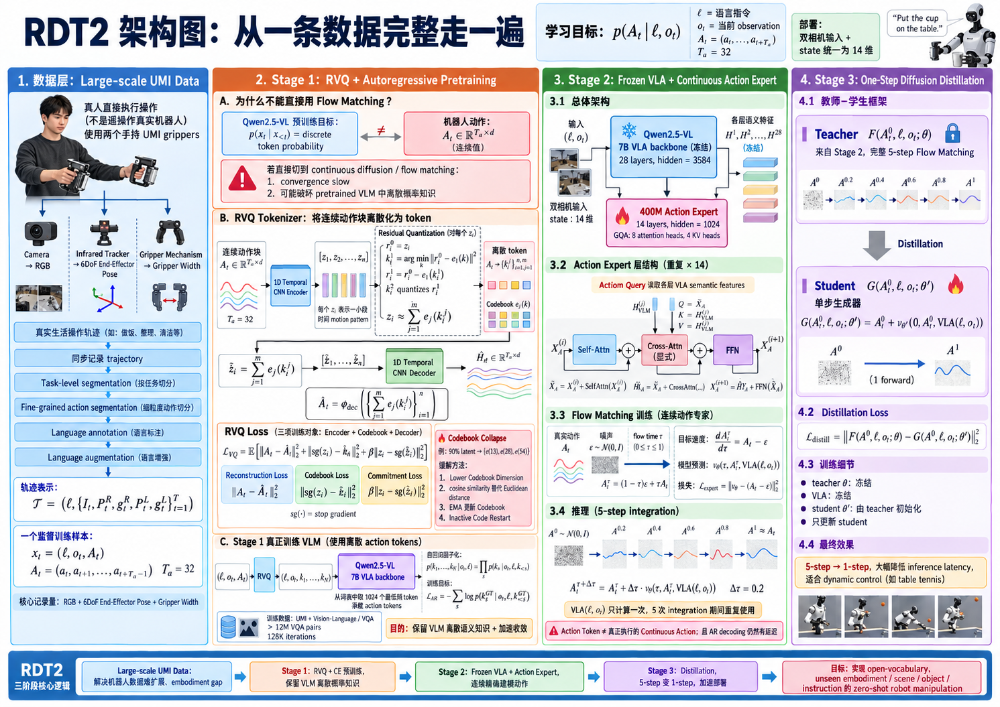

---

title: "RDT2: Exploring the Scaling Limit of UMI Data Towards Zero-Shot Cross-Embodiment Generalization"
description: "RDT2 面向机器人数据难以规模化、跨本体泛化困难以及 VLA 动作生成效率低的问题。核心理解：通过大规模 embodiment-agnostic UMI 数据统一末端感知—动作接口，并采用 RVQ 离散动作预训练 → Frozen VLA + Flow Matching Action Expert → One-Step Distillation 的三阶段训练范式，实现对未见机器人本体、场景、物体和指令的 zero-shot manipulation。"
date: "2026-09-07"
venue: "ICML / 2026"
authors: "Songming Liu, Bangguo Li, Kai Ma, Lingxuan Wu, Hengkai Tan, Xiao Ouyang, Hang Su, Jun Zhu"
paper: ""
code: ""
---


# RDT2



## 1. 论文对应的 Task 是什么？

### 1.1 Task 定义

在真实世界中，让机器人根据自然语言指令完成开放词汇的双臂操作任务，并且在机器人本体、场景、物体和指令均未出现在训练集中的情况下，仍然能够零样本完成任务。

论文在实验中明确要求模型不进行任何 task-specific fine-tuning，直接部署到未见过的机器人平台上，同时使用未见场景、未见物体和未见表达方式的指令。即论文所谓的 4U setting：

$$
\boxed{
\text{Unseen Embodiment}
+
\text{Unseen Scene}
+
\text{Unseen Object}
+
\text{Unseen Instruction}
}
$$

### 1.2 Task 的实际输入

* 人的任务意图：用户通过自然语言告诉机器人的操作任务。
* 当前真实物理环境：机器人面对的真实世界中的随机物体，位置和朝向。
* 当前机器人 embodiment：某一种实际机械平台如 Franka Research 3 或 UR5e。

### 1.3 Task 的目标输出

Task 真正希望得到的是：机器人成功完成自然语言所描述的物理操作。

论文用五个基础 manipulation primitive 来定义这种成功。【D.4.1.ZERO-SHOTTASKS】

| **Task** | **实际目标** | **论文中的具体物理成功标准** |
| :---: | --- | --- |
| **Pick** | 根据自然语言，在杂乱物体中识别正确目标，抓住并抬起 | ① 抓到正确的目标物体；<br>② 将物体抬高至少 10 cm；<br>③ 在不掉落的情况下保持至少 3 s |
| **Pick & Place** | 找到并抓取指定物体，再将其搬运到语言指定的目标容器 / 位置 | ① 抓取正确的物体；<br>② 最终将该物体放入指定容器中，才视为成功 |
| **Wipe** | 抓取毛巾，并按照指令擦拭指定桌面或物体表面 | ① 成功抓起毛巾；<br>② 在指定目标表面上执行清晰可辨的擦拭动作 |
| **Shake** | 抓取指定物体，并执行动态摇晃动作 | ① 成功抓住物体；<br>② 执行清晰可见的摇晃动作 |
| **Press** | 将末端执行器准确移动到键盘并完成按压 | 只要机器人的末端执行器成功按下键盘上的任意一个按键，该 trial 即判定成功 |

### 1.4 Task 的研究意义 / 应用价值

1. 让机器人从“专机专用”走向 generalist robot。
2. 让普通用户通过自然语言控制机器人。
3. 面向的不只是简单 Pick，而是真实复杂操作。

### 1.5 问题及挑战

#### 1.5.1 4U 组合泛化仍然非常困难

一个 manipulation task 可以写成：

$$
\mathcal T =
(\text{object},\text{scene},\text{instruction},\text{embodiment})
$$

训练集只能够覆盖这个巨大组合空间中的极少部分。

论文明确指出，真正可用的 VLA 必须对这些元素的未见组合进行 compositional generalization。

#### 1.5.2 机器人数据很难像语言数据一样扩展

机器人需要：

$$
\text{observation}
+
\text{physical action}
+
\text{correct temporal correspondence}
$$

而传统 teleoperation 依赖昂贵真实机器人。

论文指出两个具体问题：机器人硬件昂贵，使大规模并行采集困难；teleoperation 系统缺乏便携性，数据主要局限于实验室和工厂，导致真实场景多样性不足。

更严重的是 embodiment heterogeneity：

$$
D_{\text{Robot A}} \not\approx D_{\text{Robot B}}
$$

一个平台收的数据不能天然给另一个平台直接使用。

#### 1.5.3 离散动作和连续动作存在根本 trade-off

离散化虽然适配 VLM，却存在量化误差和 autoregressive sampling 效率低的问题。

直接使用连续 diffusion objective 收敛缓慢，并且更新预训练 VLM，还可能损害 VLM 原本通过离散 token probability 学到的知识。

问题在于怎么同时获得：

* VLM 的离散语义能力；
* 连续动作的精度；
* 高训练效率；
* 高推理速度。

---

## 2. 这个任务有哪些数据集以及本文采用了什么数据集？（原始数据集）

### 2.1 机器人学习数据的主要类型

RDT2 论文把机器人学习数据大致分成三类：

$$
\boxed{
\text{Teleoperation Data}
\quad+\quad
\text{Simulation Data}
\quad+\quad
\text{Internet / Human Video}
}
$$

它们的核心 trade-off 是：

| **数据类型** | **优点** | **主要问题** |
| :---: | --- | --- |
| **Teleoperation** | 有真实的 observation-action 对，动作标签最可靠 | 真实机器人昂贵；采集速度慢；场景通常受限于实验室或工厂 |
| **Simulation** | 成本低，数据规模容易扩展 | 存在明显的 Sim-to-Real gap |
| **Internet Video** | 数据规模最大，场景与任务多样性最丰富 | 没有直接可用的机器人 action label |

和 RDT2 最相关的几个真实机器人 / UMI 数据集包括：

```markdown
| **数据集** | **数据采集方式** | **论文给出的规模** | **与 RDT2 的关系** |
| :---: | --- | --- | --- |
| **DROID** | 真实机器人 teleoperation | 76,000 trajectories，来自数百个 indoor scenes | 大规模真实机器人数据的代表 |
| **FastUMI-100K** | UMI-style 人类操作数据 | 100,000+ trajectories，约 50 tasks，数百种 objects | 与 RDT2 最接近的数据扩展路线 |
| **Open X-Embodiment** | 多个真实机器人数据集汇总 | 论文将其作为 multi-embodiment robot dataset 引用 | 依赖已有机器人 embodiment |
| **RDT2 UMI Dataset** | 手持 UMI 人类操作 | 10,000+ hours，100+ environments | 本文核心机器人预训练数据 |
```


RDT2 和这些工作的关键区别在于，它想扩展的不是

$$
\text{Robot Teleoperation Data}
$$

而是

$$
\boxed{
\text{Embodiment-agnostic Human Manipulation Data}
}
$$

也就是让人拿着和机器人末端几何结构一致的 UMI 夹爪采数据，而不是必须真正操控一台机器人。

### 2.2 RDT2 实际使用了哪些训练数据？

1. **UMI manipulation data**：有真实动作，负责教机器人“怎么动”。
2. **VQA / Vision-Language data**：没有机器人 action，负责保持 / 增强 VLM 的视觉语言理解。
3. **下游 real-robot demonstrations**：只在 fine-tuning 实验中使用。

### 2.3 数据源 A：RDT2 自建的 UMI Manipulation Dataset

论文给出的数据规模是：

| **属性** | **规模** |
| :---: | --- |
| **总时长** | 约 10,000+ hours |
| **场景** | 100+ unique home environments |
| **UMI 采集设备** | 约 100 台 |
| **家庭任务种类** | 50+ tasks |
| **家庭场景中实际出现的 unique objects** | 1,000+ |
| **Facility object pool** | 3,000+ objects |
| **采集频率** | 摄像机配置为 30 Hz |

#### 2.3.1 UMI 数据是怎么构造出来的？

```text
真人拿着两个 UMI 夹爪
        │
        ├── Camera → 第一视角 RGB
        ├── Infrared Tracker → 6DoF pose
        └── Gripper mechanism → gripper width
        │
        ▼
连续执行真实生活中的操作
        │
        ▼
同步记录整条 trajectory
        │
        ▼
Task-level segmentation
        │
        ▼
Fine-grained action segmentation
        │
        ▼
Language annotation
        │
        ▼
Language augmentation
```

#### 2.3.2 让人直接执行操作，而不是遥操作机器人

采集者拿着 UMI：

* 看见真实环境；
* 像正常使用手一样移动夹爪；
* 完成实际任务。

UMI 同时记录末端执行器运动。

硬件中通过 HTC VIVE Tracker 3.0 红外定位系统获取每个末端执行器的 6-DoF pose。

#### 2.3.3 在真实家庭里刻意提高数据多样性

主动要求采集者改变任务，制造的数据多样性。

#### 2.3.4 原始 UMI trajectory 中，一条数据到底是什么？

概念上可以写成：

$$
\boxed{
\mathcal T =
\left(
\ell,
\{I_t,P_t^{R},g_t^{R},P_t^{L},g_t^{L}\}_{t=1}^{T}
\right)
}
$$

其中：

* \(\ell\)：当前任务 / 动作对应的语言描述；
* \(I_t\)：相机 RGB observation；
* \(P_t^R\)：右手 UMI 的 6DoF pose；
* \(g_t^R\)：右夹爪宽度；
* \(P_t^L\)：左手 UMI 的 6DoF pose；
* \(g_t^L\)：左夹爪宽度；
* \(t\)：同步时间戳。

论文明确说明 UMI 的核心记录量为：

$$
\text{6-DoF end-effector pose}
+
\text{gripper width}
$$

#### 2.3.5 从整条 trajectory 到一个监督训练样本

对于 trajectory 中某一个时刻 \(t\)，可以形成一个训练样本：

$$
\boxed{
x_t=(\ell,o_t,A_t)
}
$$

其中：

$$
A_t=(a_t,a_{t+1},\ldots,a_{t+T_a-1})
$$

也就是：看到当前环境时，接下来一小段时间人是怎么移动夹爪的。

#### 2.3.6 一条 action 的具体物理内容

当前官方代码把双臂 action 表示成 20 维：

$$
a_t\in\mathbb R^{20}
$$

| **Index** | **物理量** |
| :---: | --- |
| **0:03** | 右末端 $x,y,z$ position |
| **3:09** | 右末端 6D rotation representation |
| **9** | 右 gripper width |
| **10:13** | 左末端 $x,y,z$ position |
| **13:19** | 左末端 6D rotation representation |
| **19** | 左 gripper width |

#### 2.3.7 原始图像是什么？

官方代码中的开源示例把视觉输入组织成左右两个 wrist cameras：

$$
I_t^R,\quad I_t^L
$$

单路：

$$
384\times384\times3
$$

预处理成 WebDataset 时，把两张图横向拼成：

$$
\boxed{
384\times768\times3
}
$$

#### 2.3.8 Language Annotation 是怎么得到的？

先按照 high-level task instruction 切分长录像：

$$
\text{long recording}
\rightarrow
\text{task-level clips}
$$

然后再将 task clip 细分：

$$
\text{task clip}
\rightarrow
\text{fine-grained action segments}
$$

如：

* Pick up yellow corn using right gripper；
* Place down yellow corn using right gripper；
* ...

#### 2.3.9 Language Augmentation

RDT2 又使用 Google Gemini 2.5 Pro 进一步把一条原始 instruction 生成多个语义等价表达。

### 2.4 数据集 B：Vision-Language / VQA 数据

论文还使用了一批额外的视觉语言数据：

$$
\boxed{
>12\text{ million VQA pairs}
}
$$

它们用于强化：

* semantic grounding；
* temporal reasoning；
* spatial understanding；
* language-action alignment。

| **数据集** | **主要提供什么能力** |
| :---: | --- |
| **Ego4D + QaEgo4D** | 第一视角视频理解、episodic memory、temporal localization |
| **HD-EPIC** | 厨房第一视角、fine-grained actions、object motion、3D spatial reasoning |
| **RoboVQA** | robot / tool 视频中的长时序 reasoning、affordance、future prediction |
| **RoboBrain / ShareRobot** | task planning、affordance、trajectory reasoning |
| **PixMo-Cap-QA** | 通用视觉语言知识 |
| **Cambrian-10M** | 通用 multimodal semantic coverage |

---

## 3. 已有工作的情况？

### 3.1 领域现状——现有方法可以怎么分类？

| **技术路线** | **代表工作** | **核心做法** | **主要解决什么** |
| :---: | --- | --- | --- |
| **A. 单任务 / 小规模 Imitation Policy** | Diffusion Policy、ACT、BC 等 | 每个任务收集一批真实机器人 demonstrations，并针对该任务单独训练策略 | 特定机器人、特定任务下的高精度操作 |
| **B. 多机器人数据统一 / Cross-Embodiment Robot Data** | Open X-Embodiment / RT-X、Octo、RDT-1B、OpenVLA、$\pi_0$、$\pi_{0.5}$ | 汇聚多个 robot embodiment 的数据，统一 observation / action representation 后训练 generalist policy | 跨任务、跨机器人知识迁移 |
| **C. Embodiment-Agnostic Human Demonstration** | UMI、FastUMI、DexUMI | 人直接使用与机器人末端类似的设备执行动作，不需要操作真实机器人 | 降低数据采集成本、减少 embodiment gap |
| **D. Discrete Autoregressive VLA** | RT-1、RT-2、OpenVLA、$\pi_0$-FAST | Continuous action → discrete token → next-token prediction | 与 pretrained VLM 的训练范式一致，提高训练稳定性 |
| **E. Continuous Generative VLA** | Diffusion Policy、RDT-1B、$\pi_0$、$\pi_{0.5}$ | 使用 diffusion / flow matching 直接生成 continuous action chunk | 避免动作量化误差，并建模 multimodal action distribution |
| **F. Hybrid / Distillation** | $\pi_{0.5}$、Consistency Policy、One-Step Diffusion Policy | 采用离散预训练 + continuous action expert，或将多步生成器蒸馏为少步 / 单步生成器 | 兼顾训练稳定性与 inference latency |

#### 路线 A：单任务 Imitation Learning

优点是数据和目标任务高度匹配，所以在固定任务上通常很强，却天然缺少跨任务、跨 embodiment generalization 的能力。

#### 路线 B：多机器人数据 + Generalist Robot Policy

这些方法所谓的

$$
\text{cross-embodiment}
$$

很多时候其实是：训练时已经看过多种 embodiment，从中学习 transferable representation。

不等于：

> 完全没见过 Robot X，就直接 zero-shot 部署 Robot X。

#### 路线 C：UMI 类 Embodiment-Agnostic Human Data

原始 UMI 论文范式仍更接近：

$$
\text{针对一个 task 收 UMI demos}
\rightarrow
\text{训练该 task policy}
$$

还没有充分解决：

$$
\text{如何把大量不同任务 UMI 数据训练成一个 open-vocabulary foundation policy}
$$

#### 路线 D：Discrete Autoregressive Action

无论 token 压得多好，只要是：

$$
k_1
\rightarrow
k_2
\rightarrow
k_3
\rightarrow
\cdots
$$

就仍然需要 sequential decoding，存在推理延迟、输出 Token 过多的问题。

#### 路线 E：Continuous Diffusion / Flow Matching

continuous generative model 有两个问题：

1. **Convergence 慢**：相比 pretrained VLM 已经熟悉的 next-token CE，让模型学习连续 velocity field，优化难度明显更高。
2. **Inference 慢**：通常要多次 denoise。

### 3.2 这些已有技术仍有什么共同不足？

#### 3.2.1 Robot Data 仍然和 Embodiment 强绑定

Open X、Octo、OpenVLA、\(\pi_0/\pi_{0.5}\) 的办法基本都是：

> 收很多 Robot A / B / C 的数据来学习 transferable knowledge。

但是如果来了 Robot D，其运动学、相机位置、末端结构与训练集都不同，往往仍需要 adaptation。

RDT2 论文认为这正是已有大规模 VLA 尚未真正解决的部分。

#### 3.2.2 数据规模与 Diversity 不够

有限数据只覆盖：

$$
(\text{object},\text{scene},\text{instruction},\text{embodiment})
$$

组合空间中的极小部分。

所以即使模型本身很大，如果

$$
\text{data diversity}\not\uparrow
$$

也不会自动获得真正的 4U generalization。

#### 3.2.3 离散与连续动作各有硬伤

#### 3.2.4 大模型与机器人实时控制存在天然冲突

对推理频率有严格要求。

### 3.3 RDT2 论文中的 Baseline 属于哪一类？

RDT2 正式 fine-tuning comparison 使用两个外部 baseline：

$$
\boxed{\pi_{0.5}}
\qquad
\boxed{\pi_0\text{-FAST}}
$$

| **Baseline** | **技术类别** | **Action Generation** |
| :---: | --- | --- |
| **$\pi_{0.5}$** | Continuous VLA / Flow Matching + Heterogeneous Co-training | Action Expert 连续生成 action chunk |
| **$\pi_0$-FAST** | Discrete Autoregressive VLA | FAST tokenizer → action tokens → autoregressive decoding |

### 3.4 Baseline 在哪些样例上失败？

论文的 5 个 fine-tuning task：

* Cloth Folding；
* Table Bussing；
* Unzipping；
* Dynamic Button Pressing；
* Table Tennis。

每个任务都使用 200 demonstrations。

对 RDT2、π0.5、π0-FAST 分别训练到稳定收敛。

FR3 / UR5e 都安装了与 UMI 数据采集时相同的 ZhiXing parallel-jaw gripper；使用 Hikrobot MV-CS016-10UC eye-in-hand camera，与 handheld UMI setup 相同；机器人初始 home pose 都被设置成尽量复现 UMI 手持采集时的平均视觉视角。

#### Case 1：换一件训练阶段没见过的衣服

论文的 Cloth Folding 不是普通 pick，而是一套复杂动作。

Unseen Object test 专门准备了：

* 3 种训练 fine-tuning data 中没有出现过的 shirt；
* 改变 color；
* 改变 texture；
* 改变 size。

| **Model** | **普通 Cloth Folding** | **Unseen Shirt** |
| :---: | :---: | :---: |
| **RDT2** | 77% | 51% |
| **$\pi_{0.5}$** | 36% | 15% |
| **$\pi_0$-FAST** | 29% | 10% |

#### Case 2：只换桌面背景和灯光

Table Bussing 的目标是把多个物品放回规定位置。

共五个物品，每个正确放回加 0.2 分。

| **Model** | **普通 Progress** | **Unseen Scene** |
| :---: | :---: | :---: |
| **RDT2** | 0.58 | 0.33 |
| **$\pi_{0.5}$** | 0.39 | 0.17 |
| **$\pi_0$-FAST** | 0.30 | 0.11 |

#### Case 3：非常小的接触目标——拉拉链

| **Model** | **Success** |
| :---: | :---: |
| **RDT2** | 45% |
| **$\pi_{0.5}$** | 13% |
| **$\pi_0$-FAST** | 8% |

#### Case 4：环境突然发生变化，必须马上响应

Dynamic Button Pressing 的数据样例是令机器人等待，随机时间后屏幕变绿，机器人必须按下键盘。

| **Model** | **Extra Delay** |
| :---: | :---: |
| **RDT2** | +97 ms |
| **$\pi_{0.5}$** | +323 ms |
| **$\pi_0$-FAST** | +981 ms |

#### Case 5：乒乓球速度提高

Table Tennis 任务需要机械臂实时拦截不同速度的乒乓球。

| **Speed** | **RDT2** | **$\pi_{0.5}$** | **$\pi_0$-FAST** |
| :---: | :---: | :---: | :---: |
| **1×** | 88 | 78 | N/A |
| **1.2×** | 85 | 74 | N/A |
| **1.5×** | 76 | 58 | N/A |
| **1.7×** | 69 | 57 | N/A |
| **2×** | 68 | 56 | N/A |

---

## 4. 本文工作提出的解决方案及其创新之处？

### 4.1 技术详述：从一条数据完整走一遍 RDT2

RDT2 的基本学习问题是：

$$
p(A_t\mid \ell,o_t)
$$

其中：

$$
\ell=\text{语言指令}
$$

$$
o_t=\text{当前 observation}
$$

$$
A_t=(a_t,\ldots,a_{t+T_a})
$$

是未来的一段 action chunk。

论文正文把 \(o_t\) 简化成 RGB observation；实际部署 appendix 中使用两个相机，并将 state dimension 统一成 14 维。

部署时 action chunk size 设为：

$$
T_a=32
$$

#### 4.1.1 第一层解决方案：Large-scale UMI Data

让人直接拿 UMI 夹爪完成任务，UMI 记录：

$$
\text{RGB}
+
\text{6DoF End-Effector Pose}
+
\text{Gripper Width}
$$

训练数据描述这个末端执行器下一刻应该移动到哪里，并且经过结构化语言标注和增强。

#### 4.1.2 Stage 1：RVQ + Autoregressive Pretraining

##### 为什么不能直接上 Flow Matching？

Qwen2.5-VL 原来的训练目标是：

$$
p(x_t\mid x_{<t})
$$

即：

$$
\boxed{
\text{discrete token probability}
}
$$

而机器人 action 是：

$$
A_t\in\mathbb R^{T_a\times d}
$$

如果直接把 Qwen 从 next-token prediction 改成 continuous diffusion / flow matching，优化目标发生了巨大变化。

有两个问题：

1. convergence slow；
2. 可能破坏 pretrained VLM 中原本通过离散 probability 建立起来的知识。

##### RVQ（Residual Vector Quantization）Tokenizer 做了什么？

输入一个动作块：

$$
A_t\in\mathbb R^{T_a\times d}
$$

首先：

$$
A_t
\rightarrow
\text{1D Temporal CNN}
\rightarrow
[z_1,z_2,\ldots,z_n]
$$

CNN 沿时间轴处理，所以一个 \(z_i\) 表达的不再只是

$$
[x,y,z,\text{rotation},g]
$$

某一个 timestep，而是某一小段时间中的 motion pattern。

论文明确用 1D temporal CNN 将 \(T_a\times d\) 的连续 action chunk 编码为 \(n\) 个 \(C\) 维 latent。

对每一个 latent \(z_i\) 初始化：

$$
r_i^0=z_i
$$

第一层 codebook 找：

$$
k_i^1
=
\arg\min_k
\left\|
r_i^0-e_1(k)
\right\|^2
$$

然后：

$$
r_i^1=r_i^0-e_1(k_i^1)
$$

第二层不再量化原始 \(z_i\)，而是继续量化 \(r_i^1\)，得到 \(k_i^2\)。

如此反复：

$$
z_i
\approx
\sum_{j=1}^{m}e_j(k_i^j)
$$

最终：

$$
A_t
\rightarrow
\left\{
k_i^j
\right\}_{i=1,j=1}^{n,m}
$$

##### Decoder

$$
\boxed{
\hat A_t
=
\phi_{\mathrm{dec}}
\left(
\left\{
\sum_{j=1}^{m}e_j(k_i^j)
\right\}_{i=1}^{n}
\right)
}
$$

对第 \(i\) 个 latent：

$$
(k_i^1,\ldots,k_i^m)
$$

查 codebook：

$$
e_1(k_i^1),
e_2(k_i^2),
\ldots,
e_m(k_i^m)
$$

然后加起来：

$$
\hat z_i
=
\sum_{j=1}^{m}
e_j(k_i^j)
$$

重新得到一个连续向量：

$$
\hat z_i\in\mathbb R^C
$$

现在输入 Decoder：

$$
[\hat z_1,\ldots,\hat z_n]
$$

通过 reverse 1D Temporal CNN：

$$
\hat A_t
=
\phi_{\mathrm{dec}}
([\hat z_1,\ldots,\hat z_n])
$$

得到：

$$
\boxed{
\hat A_t\in\mathbb R^{T_a\times d}
}
$$

##### RVQ Loss 三项分别在训练谁？

RVQ Tokenizer 训练的是：

* Temporal CNN Encoder；
* 多层 RVQ codebook；
* Temporal CNN Decoder。

论文公式：

$$
\boxed{
\mathcal L_{\rm VQ}
=
\mathbb E
\left[
\|A_t-\hat A_t\|_2^2
+
\|\mathrm{sg}(z_i)-\hat z_i\|_2^2
+
\beta
\|z_i-\mathrm{sg}(\hat z_i)\|_2^2
\right]
}
$$

其中：

$$
\hat z_i
=
\sum_{j=1}^{m}
e_j(k_i^j)
$$

而

$$
\operatorname{sg}(\cdot)
$$

代表：

$$
\text{stop gradient}
$$

也就是说 forward 时数值不变，但 backward 时不往里面传梯度。

**Reconstruction Loss**

$$
\boxed{
\mathcal L_{\rm recon}
=
\|A_t-\hat A_t\|_2^2
}
$$

使得整个系统保留真正对机器人控制有用的信息，影响整套流程。

**Codebook Loss**

$$
\boxed{
\mathcal L_{\rm codebook}
=
\|
\operatorname{sg}(z_i)-\hat z_i
\|_2^2
}
$$

让 codebook vector 去追 Encoder 输出的 latent。更新 codebook 表示，使其主动适应数据 latent。

**Commitment Loss**

$$
\boxed{
\mathcal L_{\rm commit}
=
\beta
\|
z_i-\operatorname{sg}(\hat z_i)
\|_2^2
}
$$

让 Encoder 输出不要到处乱跑，而是靠近已有 codebook representation。

##### Codebook Collapse

假设 codebook 有：

$$
K=1024
$$

个向量：

$$
e(1),e(2),\ldots,e(1024)
$$

理想情况是不同动作模式使用不同 codes。

但是训练可能变成：

$$
90\%\text{ latent}
\rightarrow
\{e(13),e(28),e(54)\}
$$

其余 1000+ 个 code 几乎没人使用。

##### RDT2 怎么缓解 Codebook Collapse？

1. **Lower Codebook Dimension**

   如果

   $$
   e_k\in\mathbb R^{C}
   $$

   维度特别高，那么高维空间里 codebook 很难均匀覆盖 latent distribution。

   因此降低用于 quantization 的 codebook dimension，可以让有限的 \(K\) 个 code 更容易覆盖 latent space。

2. **用 cosine similarity 替代 Euclidean distance**

   公式里为了表述方便写的是：

   $$
   \arg\min_k\|r-e(k)\|^2
   $$

   即 Euclidean distance。

   但实际上为 cosine similarity。

3. **EMA 更新 Codebook**

   如果直接用普通 gradient 更新 codebook：

   $$
   e_k
   \leftarrow
   e_k-\eta\nabla e_k
   $$

   可能出现某些 code 更新非常剧烈。

   EMA 的思想类似于：

   $$
   e_k^{(t)}
   =
   \lambda e_k^{(t-1)}
   +
   (1-\lambda)\bar z_k^{(t)}
   $$

   其中 \(\bar z_k^{(t)}\) 是当前被分配到这个 code 的 latent 的统计中心。

4. **Inactive Code Restart**

   某个 code 长时间没有使用，继续放在那里没有意义，可以重新初始化到当前 latent distribution 中。

#### 4.1.3 Stage 1：真正训练 VLM

RVQ tokenizer 训练完以后：

$$
A_t
\rightarrow
(k_1,k_2,\ldots,k_N)
$$

于是原始数据：

$$
(\ell,o_t,A_t)
$$

转换成：

$$
(\ell,o_t,k_1,\ldots,k_N)
$$

现在 Qwen 就可以像生成文本一样生成 action token：

$$
p(k_1,\ldots,k_N\mid o_t,\ell)
=
\prod_s
p(k_s\mid o_t,\ell,k_{<s})
$$

训练目标：

$$
\mathcal L_{\rm AR}
=
-\sum_s
\log
p(k_s^{GT}\mid o_t,\ell,k_{<s}^{GT})
$$

RDT2 从 Qwen vocabulary 中取 1024 个最低频 token entry 来承载 action token。

Stage 1 用：

$$
\text{UMI}
+
\text{vision-language data}
$$

混合训练 128K iterations。

而视觉语言侧的数据不只是普通 caption。

RDT2 还使用超过 12 million VQA pairs。

#### 4.1.4 Stage 2：Frozen VLA + Continuous Action Expert

$$
\text{Action Token}
\neq
\text{真正需要执行的 Continuous Action}
$$

而且：

$$
k_1
\rightarrow
k_2
\rightarrow
k_3
\rightarrow
\cdots
$$

仍然要 autoregressive decoding。

##### 模型结构

Stage 1 得到的 Qwen2.5-VL：

$$
\text{7B VLA backbone}
$$

被冻结。

论文配置为：

$$
28\text{ layers},
\quad
hidden=3584
$$

然后加入：

$$
\text{400M Action Expert}
$$

其结构为：

$$
14\text{ layers},
\quad
hidden=1024
$$

并且使用 GQA：

$$
8\text{ attention heads},
\quad
4\text{ KV heads}
$$

替代标准 MHA，即多组 Query 共用 K/V，以减少推理开销。

关键结构是：

$$
(\ell,o_t)
\xrightarrow{\text{Frozen VLA}}
H^1,H^2,\ldots,H^{28}
$$

Action Expert 每一层通过 cross-attention 获取对应的 VLA latent：

$$
\boxed{
\text{Action Query}
\xrightarrow{\text{Cross Attention}}
\text{VLA semantic features}
}
$$

可以概念化成：

$$
X_A^{(i)}
$$

先做 action 内部建模：

$$
\tilde X_A
=
X_A^{(i)}
+
\operatorname{SelfAttn}(X_A^{(i)})
$$

然后让 action 去读 VLM：

$$
\hat X_A
=
\tilde X_A
+
\operatorname{CrossAttn}
\left(
Q=\tilde X_A,
K=H_{VLM}^{(j)},
V=H_{VLM}^{(j)}
\right)
$$

再经过 FFN：

$$
X_A^{(i+1)}
=
\hat X_A
+
\operatorname{FFN}(\hat X_A)
$$

##### Flow Matching：连续动作到底怎么学？

取真实动作：

$$
A_t
$$

随机采：

$$
\epsilon\sim\mathcal N(0,I)
$$

以及 flow time：

$$
\tau
$$

构造：

$$
\boxed{
A_t^\tau
=
(1-\tau)\epsilon+\tau A_t
}
$$

所以在 action space 中有一条：

$$
\epsilon
\rightarrow
A_t
$$

的路径。

正确的 velocity 是：

$$
\frac{dA_t^\tau}{d\tau}
=
A_t-\epsilon
$$

Action Expert 学：

$$
v_\theta
(
\tau,
A_t^\tau,
VLA(\ell,o_t)
)
$$

并最小化：

$$
\boxed{
\mathcal L_{\rm expert}
=
\left\|
v_\theta-(A_t-\epsilon)
\right\|_2^2
}
$$

也就是说它学习：

> 给当前 noisy action、当前 flow time，以及图像语言语义，应该往哪个方向移动，才能走向真实动作分布。

##### 推理

初始化：

$$
A_t^0\sim\mathcal N(0,I)
$$

然后：

$$
A_t^{\tau+\Delta\tau}
=
A_t^\tau
+
\Delta\tau
v_\theta
(
\tau,
A_t^\tau,
VLA(\ell,o_t)
)
$$

逐步：

$$
A^0
\rightarrow
A^{0.2}
\rightarrow
A^{0.4}
\rightarrow
A^{0.6}
\rightarrow
A^{0.8}
\rightarrow
A^1
$$

最终：

$$
A^1\approx A_t
$$

论文使用：

$$
\Delta\tau=0.2
$$

即 5 integration steps。

而：

$$
VLA(\ell,o_t)
$$

只计算一次，5 次 integration 期间重复使用，因此没必要把 7B Qwen 跑五遍。

#### 4.1.5 Stage 3：One-Step Diffusion Distillation

Stage 2 仍然有：

$$
5\times\text{Action Expert}
$$

对于 table tennis 这类 dynamic control，仍然太慢。

于是定义 Stage 2 teacher：

$$
F(A_t^0,\ell,o_t;\theta)
$$

它代表：

$$
A^0
\rightarrow
A^{0.2}
\rightarrow
\cdots
\rightarrow
A^1
$$

完整 5-step Flow Matching。

Student 则直接：

$$
\boxed{
G(A_t^0,\ell,o_t;\theta')
=
A_t^0
+
v_{\theta'}
(
0,
A_t^0,
VLA(\ell,o_t)
)
}
$$

即：

$$
\boxed{
A^0
\xrightarrow{\text{1 forward}}
A^1
}
$$

训练：

$$
\mathcal L_{\rm distill}
=
\|
F(A^0,\ell,o_t;\theta)
-
G(A^0,\ell,o_t;\theta')
\|_2^2
$$

其中：

* teacher \(\theta\)：冻结；
* VLA：冻结；
* student \(\theta'\)：从 teacher 参数初始化；
* 只更新 student。

---

### 4.2 技术创新与“问题及挑战”的对应关系

#### 4.2.1 机器人数据难以真正 Scale Up

RDT2 的方案：把数据采集和机器人本体解耦。

使用改进后的 UMI 采集了大量数据。把采集设备本身变成廉价、可复制、portable 的接口。

#### 4.2.2 Cross-Embodiment 的根本问题不是“模型不够大”，而是数据不兼容

已有 multi-embodiment 方法虽然试图把不同机器人映射到统一 embedding，但面对从未见过的新机器人，仍然经常需要大量 adaptation / fine-tuning。

RDT2 的方案：统一“末端接口”，而不是统一所有机器人关节。

把任务定义到 End-Effector Space，通过 data / interface design，主动消掉一部分 embodiment difference。

#### 4.2.3 未见物体、场景、指令、动作组合泛化难

RDT2 的方案：采集时扩大“变化轴”，让模型在训练时看到更多：

* 颜色；
* 材质；
* 形状；
* 动作策略；
* 场景布局；
* 接触模式。

#### 4.2.4 离散动作路线与 Continuous Diffusion / Flow Matching 路线各有不足

RDT2 的方案：先在 Stage 1 让机器人训练继续保持 Qwen 熟悉的 next-token prediction 形式。

让 VLM 学习到视觉语言 / 机器人语义 representation，再在 Stage 2 冻结 VLA，使用 400M Action Expert，并通过 cross-attention 接入 VLA 各层 feature，使用 Flow Matching。

#### 4.2.5 离散化表示 Token 输出过多

RDT2 的方案：使用 RVQ，在可接受 quantization error 下，尽可能压缩 action token 数量。

论文实验显示，相同 discretization error 下，RVQ 所需 token 数明显少于 FAST，最多能节省约 2/3 tokens。

#### 4.2.6 机器人还面临“实时性”问题

RDT2 的方案：使用 Student 蒸馏，把：

$$
5\text{-step}
\rightarrow
1\text{-step}
$$

---

### 4.3 与 \(\pi_0\)-FAST Baseline 的具体对应

$$
\pi_0\text{-FAST}
$$

的核心路线：

$$
A
\xrightarrow{\rm FAST}
k_1,k_2,\ldots,k_N
$$

#### 第一层：Token Budget

【Fig.8】在相同 position / rotation discretization error 下：

> RVQ 最多可以省掉约三分之二 token。

#### 第二层：Sequential Decoding

即使 FAST token 再少：

$$
k_1
\rightarrow
k_2
\rightarrow
k_3
$$

依然是 sequential decoding。

RDT2 则最终完全绕过：

$$
\boxed{
\text{action-token autoregressive inference}
}
$$

变成：

$$
\epsilon
\xrightarrow{\text{Action Expert}}
A
$$

甚至：

$$
\epsilon
\xrightarrow{\text{one step}}
A
$$

---

### 4.4 与 \(\pi_{0.5}\) Baseline 的具体对应

| **维度** | **$\pi_{0.5}$** | **RDT2** |
| :---: | --- | --- |
| **离散预训练** | **FAST + CE** | **RVQ + CE** |
| **连续动作** | Flow Matching Action Expert | Flow Matching Action Expert |
| **离散 → 连续两阶段** | **有** | **有** |
| **Stage 2 Backbone** | post-training 中联合训练 | **冻结 VLA backbone** |
| **Action / VLM 融合** | masked joint self-attention | **显式 cross-attention 读取各层 VLA features** |
| **最终 Diffusion Steps** | 约 10-step | 5-step |
| **单步蒸馏** | 无 | **有，1-step** |
| **主要数据** | 多 robot embodiment + web / semantic co-training | **10,000h embodiment-agnostic UMI** |
| **新机器人目标** | generalization，仍以已有 embodiment 数据为基础 | **unseen arm embodiment zero-shot** |

---

### 4.5 最关键的创新技术与其适用性

#### 4.5.1 基于 UMI 的统一感知—动作接口（数据 / 接口层）

RDT2 最关键的思想不是让模型去硬学不同机器人的全部 embodiment 差异，而是先在数据接口层主动消除一部分差异：

$$
\text{不同 Robot Arm}
\rightarrow
\boxed{
\text{统一 Camera + Gripper + EE-space Action}
}
$$

训练数据由 handheld UMI 采集，下游 FR3、UR5e 又尽可能复用相同的 camera、gripper 和近似观察视角，因此模型真正需要跨越的主要是：

$$
\boxed{
\text{Robot Arm 本体差异}
}
$$

所以它不是完全依赖模型学习 embodiment invariance，而是通过 interface engineering 先制造一个更接近 embodiment-invariant 的数据空间。

**适用性：**具有适用性，但是现实工程实现难。

#### 4.5.2 离散预训练 → 连续动作生成：重要训练范式，但不是 RDT2 的原创

RDT2 延续并工程化了已经出现的 discrete-to-continuous training paradigm，并用 RVQ、Frozen VLA 和独立 Action Expert 实现自己的版本。

**适用性：**高。

#### 4.5.3 多步 Flow Matching → 单步蒸馏：明确的算法改进，但方法本身确实比较朴素

方法形式较为直接，创新主要体现在将已有生成模型蒸馏思想针对低维机器人动作生成进行了有效适配，而不是提出全新的蒸馏理论。

**适用性：**依据其生成质量，需要完善。
