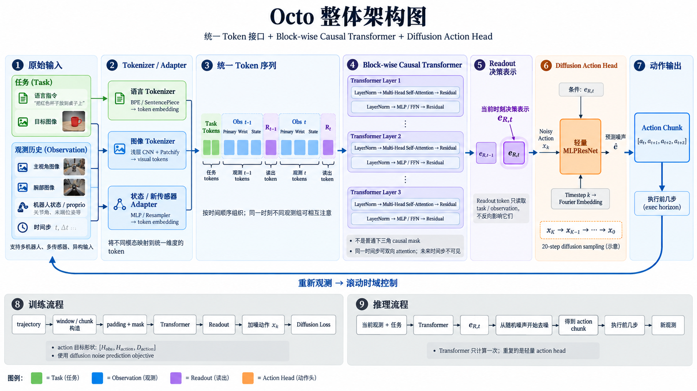

---

title: "Octo: An Open-Source Generalist Robot Policy"
description: "Octo 的核心问题是如何用一个通用机器人策略兼容不同机器人、传感器、任务定义和动作空间。核心理解：将异构输入统一为 Token，通过 Block-wise Causal Transformer 得到 Readout 决策表示，再用轻量 Diffusion Head 生成连续 Action Chunk。"
date: "2026-09-05"
venue: "Robotics: Science and Systems (RSS) 2024"
authors: "Octo Model Team, Dibya Ghosh, Homer Walke, Karl Pertsch, Kevin Black, Oier Mees, et al."
paper: ""
code: ""
--------

# Octo



## 1. 一句话理解

Octo 是一个 **Transformer-based generalist robot policy**：

$$
\boxed{
\text{异构 Observation / Task}
\rightarrow
\text{统一 Tokens}
\rightarrow
\text{Transformer}
\rightarrow
\text{Readout}
\rightarrow
\text{Diffusion Action Head}
\rightarrow
\text{Action Chunk}
}
$$

真正重要的不是“用了 Transformer + Diffusion”，而是：

> **用模块化 Token 接口统一不同机器人输入，用 Readout Token 把通用 Transformer 表示连接到可替换的 Action Head。**

因此到了新机器人上，可以增加新的 Sensor Adapter / Action Head，再用目标机器人的数据进行微调。

---

## 2. 整体架构

脑中首先记住这一条：

```text
Language / Goal Image
        │
        │
Images / Proprio / Sensors
        │
        ▼
Tokenizer / Adapter
        │
        ▼
统一 Token Sequence
        │
        ▼
Block-wise Causal Transformer
        │
        ▼
Readout Token R_t
        │
        ▼
决策表示 e_R,t
        │
        ▼
Diffusion Action Head
        │
        ▼
[a_t, a_t+1, ..., a_t+H-1]
```

核心分工：

* **Tokenizer / Adapter**：解决不同输入模态的数据格式不同。
* **Transformer**：融合任务、视觉、状态以及历史信息。
* **Readout Token**：从 Transformer 中读取当前时刻用于动作生成的决策表示。
* **Diffusion Action Head**：根据决策表示生成连续 Action Chunk。

其中最关键的接口关系是：

$$
\text{Observation / Task}
\rightarrow
\text{Transformer}
\rightarrow
e_{R,t}
\rightarrow
\text{Action Head}
$$

Transformer 本身并不需要与某一种具体机器人的动作维度绑定。

---

## 3. 输入为什么能兼容不同机器人

Octo 不要求不同机器人的原始输入完全一样，而是要求：

$$
\boxed{
\text{不同输入}
\rightarrow
\text{Tokenizer / Adapter}
\rightarrow
\text{统一 hidden dimension 的 Token}
}
$$

例如可以抽象为：

```text
Image
  ↓
Image Tokenizer
  ↓
Visual Tokens


Language
  ↓
Text Tokenizer
  ↓
Task Tokens


Proprio
  ↓
State Adapter
  ↓
State Tokens


New Sensor
  ↓
New Adapter
  ↓
Sensor Tokens
```

假设 Transformer hidden dimension 为：

$$
d
$$

那么无论原始输入是什么形式，进入 Transformer 后都需要变成：

$$
T_i\in\mathbb R^d
$$

因此 Transformer 只处理统一形式的 Token。

不同数据集缺失某个模态时，可以通过：

$$
\boxed{
\text{Padding + Mask}
}
$$

进行处理。

新增传感器时：

$$
\boxed{
\text{New Sensor}
\rightarrow
\text{New Adapter}
\rightarrow
\mathbb R^d
}
$$

因此 Octo 的“通用”并不是：

> 所有机器人必须拥有完全相同的传感器和输入。

而是：

> **不同机器人的输入最终都映射到统一 Token Interface。**

---

## 4. Token Sequence 与 Attention

Octo 将 Task、Observation 和 Readout 组织成一个 Transformer 序列。

抽象表示为：

$$
[
T_{\text{task}},
O_{t-H_{\text{obs}}+1},
R_{t-H_{\text{obs}}+1},
\dots,
O_t,
R_t
]
$$

其中：

* $T_{\text{task}}$：任务 Token。
* $O_t$：时刻 $t$ 的 Observation Tokens。
* $R_t$：时刻 $t$ 对应的 Readout Token。
* $H_{\text{obs}}$：使用的 observation history 长度。

一个 Observation Block 又可以包含多个模态：

$$
O_t=
[
T_t^{\text{primary}},
T_t^{\text{wrist}},
T_t^{\text{state}},
\dots
]
$$

---

### 4.1 Block-wise Causal Attention

Octo 不是直接使用标准 Decoder 中普通的 token-level 下三角 causal mask。

核心是：

$$
\boxed{
\text{同一 timestep 内的 Observation Tokens 可以充分融合}
}
$$

同时：

$$
\boxed{
\text{过去 timestep 不能读取未来 timestep}
}
$$

因此其因果关系更接近：

```text
time t-1:

camera_1 ↔ camera_2 ↔ state
        ↓
      R_t-1


          ↓ 时间


time t:

camera_1 ↔ camera_2 ↔ state
        ↓
       R_t
```

但是：

```text
t-1 observation
      ×
      │
      │ 不允许读取
      ▼
t observation
```

也就是说：

$$
O_i\not\leftarrow O_j,\quad j>i
$$

而当前时刻可以读取历史：

$$
O_t\leftarrow O_{\leq t}
$$

---

### 4.2 Readout 的 Attention 规则

Readout Token 可以读取 Task 和 Observation：

$$
R_t
\leftarrow
T_{\text{task}},O_{\leq t}
$$

但是 Observation 不需要反向读取 Readout：

$$
O_t
\not\leftarrow
R_t
$$

因此可以把 Readout 理解为：

> **放进 Transformer 中专门负责读取决策信息的查询 Token。**

---

## 5. Readout Token：Octo 最关键的接口

每个时间步都有一个 Readout Token：

$$
R_t
$$

经过 Transformer 后：

$$
R_t
\rightarrow
e_{R,t}
$$

其中：

$$
e_{R,t}\in\mathbb R^d
$$

它可以理解为：

$$
\boxed{
e_{R,t}
=
\text{截至时刻 }t\text{，对当前应该如何行动的决策表示}
}
$$

注意：

$$
\boxed{
e_{R,t}\neq a_t
}
$$

Transformer 并没有在这里直接输出机器人动作。

真正关系是：

$$
e_{R,t}
\rightarrow
\text{Action Head}
\rightarrow
A_t
$$

其中：

$$
A_t=
[
a_t,
a_{t+1},
\dots,
a_{t+H_{\text{action}}-1}
]
$$

所以 Readout 的意义是把：

> **通用 Transformer 表示**

与：

> **具体机器人的 Action Decoder**

解耦。

---

## 6. 为什么输出 Action Chunk

普通单步策略可以写成：

$$
o_t\rightarrow a_t
$$

Octo 则预测：

$$
\boxed{
o_{\leq t}
\rightarrow
[
a_t,
a_{t+1},
\dots,
a_{t+H_{\text{action}}-1}
]
}
$$

即一次预测一段未来动作。

Action Chunk 的主要作用：

* 建模局部连续动作轨迹。
* 增强相邻动作之间的时间一致性。
* 减少每个动作独立预测带来的抖动。
* 可以与 Receding Horizon Control 配合形成闭环控制。

记：

$$
H_{\text{action}}
=
\text{Action Chunk 长度}
$$

对于一个动作维度为 $D_a$ 的机器人：

$$
a_t\in\mathbb R^{D_a}
$$

整个 Action Chunk 为：

$$
A_t
\in
\mathbb R^{H_{\text{action}}\times D_a}
$$

---

## 7. Diffusion Action Head

Transformer 不直接回归 Action。

Transformer 首先得到：

$$
e_{R,t}
$$

Diffusion Head 再接收：

$$
\boxed{
e_{R,t},\;X_k,\;k
}
$$

其中：

* $e_{R,t}$：Transformer 提供的 condition。
* $X_k$：当前 noisy action chunk。
* $k$：diffusion timestep。

结构可以概括成：

```text
e_R,t ───────────────────┐
                         │
X_k ─────────────────────┼──→ MLPResNet ──→ ε_hat
                         │
k → Fourier Embedding ───┘
```

---

### 7.1 Action Chunk 作为 Diffusion Sample

真实 Action Chunk 记为：

$$
X_0=A_t
$$

其形状为：

$$
X_0
\in
\mathbb R^{H_{\text{action}}\times D_a}
$$

训练时随机采样：

$$
\epsilon
\sim
\mathcal N(0,I)
$$

并选择 diffusion timestep：

$$
k
$$

构造 noisy action：

$$
X_k
=
\sqrt{\bar\alpha_k}X_0
+
\sqrt{1-\bar\alpha_k}\epsilon
$$

模型预测：

$$
\hat\epsilon
=
\epsilon_\theta
(
X_k,
k,
e_{R,t}
)
$$

目标是：

$$
\boxed{
\hat\epsilon\approx\epsilon
}
$$

Loss 为：

$$
\boxed{
L_{\text{diff}}
=
\|
\epsilon-\hat\epsilon
\|_2^2
}
$$

---

### 7.2 为什么不用普通 L2 Action Regression

如果直接：

$$
e_{R,t}
\rightarrow
\hat A_t
$$

并优化：

$$
\|
A_t-\hat A_t
\|^2
$$

模型倾向于学习条件分布的均值。

而机器人动作经常存在：

$$
p(A_t\mid O_{\leq t},T)
$$

的多模态性。

也就是说，同一个状态下可能存在多个合理动作轨迹。

Diffusion Head 的目标不是只预测一个均值，而是建模：

$$
\boxed{
p(A_t\mid e_{R,t})
}
$$

因此更适合复杂连续控制。

---

## 8. 训练数据流

整体数据 pipeline 可以记为：

```text
Raw Trajectory
      ↓
统一数据格式
      ↓
Action Normalization
      ↓
Observation Window
      ↓
Action Chunk
      ↓
Goal Relabeling / Task Processing
      ↓
Padding + Mask
      ↓
多数据集 Mixing
      ↓
Shuffle
      ↓
Image Augmentation
      ↓
Batch
      ↓
Tokenizer / Adapter
      ↓
Token Sequence
      ↓
Transformer
      ↓
Readout Representation
      ↓
Diffusion Action Head
      ↓
Diffusion Loss
```

其中最重要的数据格式是：

$$
\text{Observation}
:
[B,H_{\text{obs}},\dots]
$$

和：

$$
\text{Action}
:
[B,H_{\text{obs}},H_{\text{action}},D_a]
$$

这里有一个非常重要的点：

> **Observation Window 中的每一个 timestep 都有自己的 Action Chunk supervision。**

也就是说：

$$
O_i
\rightarrow
A_i
$$

其中：

$$
A_i
=
[
a_i,
a_{i+1},
\dots,
a_{i+H_{\text{action}}-1}
]
$$

因此训练 batch 中 Action 的形式不是：

$$
[B,H_{\text{action}},D_a]
$$

而是：

$$
\boxed{
[B,H_{\text{obs}},H_{\text{action}},D_a]
}
$$

这也是为什么每个 timestep 都需要一个 Readout Token。

---

## 9. 用数据符号完整过一遍训练、推理与微调

这一节专门从“数据到底长什么样”出发，把 Octo 的整个过程完整走一遍。

先统一符号。

---

### 9.1 符号与数据维度

设：

| 符号                  | 含义                                  |
| ------------------- | ----------------------------------- |
| $B$                 | Batch Size                          |
| $H_{\text{obs}}$    | Observation History 长度              |
| $H_{\text{action}}$ | Action Chunk 长度                     |
| $D_a$               | Action dimension                    |
| $D_s$               | Robot state dimension               |
| $d$                 | Transformer hidden dimension        |
| $N_v$               | 单个图像经过 tokenizer 后的 visual token 数量 |
| $N_l$               | Language task token 数量              |
| $N_o$               | 单个 timestep 中 Observation Token 总数  |
| $N_{\text{seq}}$    | Transformer 总 Token 数               |
| $K$                 | Diffusion denoising steps           |
| $M$                 | Camera / image modality 数量          |

---

### 9.2 原始机器人轨迹的数据形式

首先有一条机器人轨迹：

$$
\tau
=
\{
(o_0,a_0),
(o_1,a_1),
\dots,
(o_{T-1},a_{T-1})
\}
$$

其中每个 observation 可以写成：

$$
o_t
=
\{
I_t^{(1)},
I_t^{(2)},
\dots,
I_t^{(M)},
s_t
\}
$$

其中：

$$
I_t^{(m)}
\in
\mathbb R^{H\times W\times C}
$$

表示第 $m$ 个 camera image。

机器人低维状态：

$$
s_t
\in
\mathbb R^{D_s}
$$

机器人动作：

$$
a_t
\in
\mathbb R^{D_a}
$$

一条 trajectory 还具有对应任务：

$$
\mathcal T
$$

例如它可以来自语言或者 goal image。

抽象表示：

$$
\tau=
(
\mathcal T,
O,
A
)
$$

其中：

$$
O=
[o_0,\dots,o_{T-1}]
$$

$$
A=
[a_0,\dots,a_{T-1}]
$$

---

### 9.3 第一步：从完整轨迹切出 Observation Window

训练时不会把整条 trajectory 全部输入 Transformer。

选择一个局部时间区间：

$$
t-H_{\text{obs}}+1
,\dots,
t
$$

得到：

$$
O_t^{\text{window}}
=
[
o_{t-H_{\text{obs}}+1},
\dots,
o_t
]
$$

对于一个 batch：

$$
O
\in
[B,H_{\text{obs}},\dots]
$$

例如图像模态：

$$
I^{(m)}
\in
\mathbb R^{
B
\times
H_{\text{obs}}
\times
H
\times
W
\times
C
}
$$

机器人状态：

$$
S
\in
\mathbb R^{
B
\times
H_{\text{obs}}
\times
D_s
}
$$

---

### 9.4 第二步：为每一个 Observation 构造 Action Chunk

对于 observation window 中第 $i$ 个时间点：

$$
o_i
$$

对应的监督目标不是只有：

$$
a_i
$$

而是：

$$
A_i
=
[
a_i,
a_{i+1},
\dots,
a_{i+H_{\text{action}}-1}
]
$$

因此：

$$
A_i
\in
\mathbb R^{
H_{\text{action}}
\times
D_a
}
$$

整个 observation window 对应：

$$
[
A_{t-H_{\text{obs}}+1},
\dots,
A_t
]
$$

因此单个 sample 的 Action Tensor 为：

$$
A
\in
\mathbb R^{
H_{\text{obs}}
\times
H_{\text{action}}
\times
D_a
}
$$

Batch 后：

$$
\boxed{
A
\in
\mathbb R^{
B
\times
H_{\text{obs}}
\times
H_{\text{action}}
\times
D_a
}
}
$$

---

### 9.5 第三步：Padding 与 Mask

trajectory 边界处可能没有足够的：

$$
H_{\text{obs}}
$$

个历史 observation，或者没有完整：

$$
H_{\text{action}}
$$

个未来动作。

因此进行 padding。

对应 mask 可以记为：

$$
M_{\text{obs}}
\in
\{0,1\}^{
B\times H_{\text{obs}}
}
$$

以及：

$$
M_{\text{action}}
\in
\{0,1\}^{
B
\times
H_{\text{obs}}
\times
H_{\text{action}}
}
$$

其中：

$$
1=\text{valid}
$$

$$
0=\text{padding}
$$

Loss 只在 valid action 上计算。

---

### 9.6 第四步：Action Normalization

不同机器人动作的物理范围不同。

原始动作：

$$
a_t^{\text{raw}}
$$

经过 normalization：

$$
a_t^{\text{raw}}
\rightarrow
a_t^{\text{norm}}
$$

因此进入模型训练的 Action Tensor 是：

$$
A^{\text{norm}}
\in
\mathbb R^{
B
\times
H_{\text{obs}}
\times
H_{\text{action}}
\times
D_a
}
$$

Diffusion 实际建模的是 normalized action space。

---

### 9.7 第五步：图像与状态变成 Token

假设第 $m$ 个 camera：

$$
I^{(m)}
\in
\mathbb R^{
B
\times
H_{\text{obs}}
\times
H
\times
W
\times
C
}
$$

经过 Image Tokenizer：

$$
I^{(m)}
\rightarrow
V^{(m)}
$$

得到：

$$
V^{(m)}
\in
\mathbb R^{
B
\times
H_{\text{obs}}
\times
N_v
\times
d
}
$$

状态输入：

$$
S
\in
\mathbb R^{
B
\times
H_{\text{obs}}
\times
D_s
}
$$

经过 State Adapter：

$$
S
\rightarrow
Z^s
$$

得到：

$$
Z^s
\in
\mathbb R^{
B
\times
H_{\text{obs}}
\times
N_s
\times
d
}
$$

所有 observation token 拼在一起：

$$
Z^o
\in
\mathbb R^{
B
\times
H_{\text{obs}}
\times
N_o
\times
d
}
$$

---

### 9.8 第六步：Task 变成 Token

任务信息记为：

$$
\mathcal T
$$

经过 Task Tokenizer：

$$
\mathcal T
\rightarrow
Z^{\text{task}}
$$

得到：

$$
Z^{\text{task}}
\in
\mathbb R^{
B
\times
N_l
\times
d
}
$$

---

### 9.9 第七步：加入 Readout Token

每一个 observation timestep 加入一个 Readout Token：

$$
R_i\in\mathbb R^d
$$

因此：

$$
R
\in
\mathbb R^{
B
\times
H_{\text{obs}}
\times
d
}
$$

最终组织成：

$$
Z=
[
Z^{\text{task}},
Z^o_1,
R_1,
\dots,
Z^o_{H_{\text{obs}}},
R_{H_{\text{obs}}}
]
$$

其整体格式为：

$$
\boxed{
Z
\in
\mathbb R^{
B
\times
N_{\text{seq}}
\times
d
}
}
$$

---

### 9.10 第八步：构造 Block-wise Causal Attention Mask

Attention Mask 可以抽象为：

$$
M_{\text{attn}}
\in
\mathbb R^{
B
\times
N_{\text{seq}}
\times
N_{\text{seq}}
}
$$

它控制：

$$
\text{Query Token}
\rightarrow
\text{可以读取哪些 Key / Value Token}
$$

对于 $R_i$：

$$
R_i
\rightarrow
\{
T_{\text{task}},
O_{\leq i}
\}
$$

不能读取：

$$
O_{>i}
$$

Observation 同样不能读取未来：

$$
O_i
\not\rightarrow
O_{>i}
$$

同时 Observation 不需要读取 Readout：

$$
O_i
\not\rightarrow
R_j
$$

---

### 9.11 第九步：Transformer Forward

输入：

$$
Z
\in
\mathbb R^{
B
\times
N_{\text{seq}}
\times
d
}
$$

经过 Transformer：

$$
H
=
f_{\theta_{\text{tr}}}
(
Z,
M_{\text{attn}}
)
$$

输出：

$$
H
\in
\mathbb R^{
B
\times
N_{\text{seq}}
\times
d
}
$$

然后只取 Readout 对应位置：

$$
E_R
=
[
e_{R,1},
\dots,
e_{R,H_{\text{obs}}}
]
$$

得到：

$$
\boxed{
E_R
\in
\mathbb R^{
B
\times
H_{\text{obs}}
\times
d
}
}
$$

也就是说：

```text
Transformer 输出很多 Token
          ↓
只取 Readout Token 对应的 hidden state
          ↓
E_R
```

---

### 9.12 第十步：把真实 Action Chunk 当作 Diffusion 的 $X_0$

真实 normalized action：

$$
A
\in
\mathbb R^{
B
\times
H_{\text{obs}}
\times
H_{\text{action}}
\times
D_a
}
$$

令：

$$
X_0=A
$$

然后采样噪声：

$$
\epsilon
\sim
\mathcal N(0,I)
$$

其维度完全相同：

$$
\epsilon
\in
\mathbb R^{
B
\times
H_{\text{obs}}
\times
H_{\text{action}}
\times
D_a
}
$$

再采样 diffusion timestep：

$$
k
$$

构造：

$$
X_k
=
\sqrt{\bar\alpha_k}X_0
+
\sqrt{1-\bar\alpha_k}\epsilon
$$

因此：

$$
X_k
\in
\mathbb R^{
B
\times
H_{\text{obs}}
\times
H_{\text{action}}
\times
D_a
}
$$

---

### 9.13 第十一步：Diffusion Head 预测噪声

对于每个 timestep 的 Readout：

$$
e_{R,i}
\in
\mathbb R^d
$$

以及对应 noisy action chunk：

$$
X_{k,i}
\in
\mathbb R^{
H_{\text{action}}
\times
D_a
}
$$

输入 Action Head：

$$
\hat\epsilon_i
=
g_{\theta_{\text{action}}}
(
X_{k,i},
k,
e_{R,i}
)
$$

输出：

$$
\hat\epsilon_i
\in
\mathbb R^{
H_{\text{action}}
\times
D_a
}
$$

Batch 后：

$$
\boxed{
\hat\epsilon
\in
\mathbb R^{
B
\times
H_{\text{obs}}
\times
H_{\text{action}}
\times
D_a
}
}
$$

---

### 9.14 第十二步：计算训练 Loss

目标噪声：

$$
\epsilon
$$

预测噪声：

$$
\hat\epsilon
$$

计算：

$$
L
=
\|
\epsilon-\hat\epsilon
\|_2^2
$$

考虑 padding mask 后：

$$
\boxed{
L
=
\frac{
\sum
M_{\text{action}}
\odot
(
\epsilon-\hat\epsilon
)^2
}{
\sum M_{\text{action}}
}
}
$$

然后反向传播：

$$
L
\rightarrow
\nabla_\theta L
$$

更新模型参数。

训练过程可以压缩成：

```text
Trajectory
    ↓
Observation Window + Action Chunk
    ↓
Normalization / Padding / Mask
    ↓
Tokenizer
    ↓
[B, N_seq, d]
    ↓
Transformer
    ↓
[B, H_obs, d]
    ↓
真实 Action Chunk A = X_0
    ↓
随机加噪得到 X_k
    ↓
(E_R, X_k, k)
    ↓
Diffusion Head
    ↓
ε_hat
    ↓
与真实 ε 计算 Loss
    ↓
Backpropagation
```

---

## 10. 推理时数据完整过一遍

训练时模型拥有：

$$
\boxed{
\text{Observation + Task + Ground Truth Action}
}
$$

推理时没有 Ground Truth Action。

模型只有：

$$
\boxed{
\text{Observation + Task}
}
$$

Action 必须从随机噪声中生成。

---

### 10.1 第一步：获得当前 Observation History

机器人当前拥有：

$$
O_t
=
[
o_{t-H_{\text{obs}}+1},
\dots,
o_t
]
$$

单机器人推理时 Batch Size 为 $1$：

$$
I^{(m)}
\in
\mathbb R^{
1
\times
H_{\text{obs}}
\times
H
\times
W
\times
C
}
$$

$$
S
\in
\mathbb R^{
1
\times
H_{\text{obs}}
\times
D_s
}
$$

同时有任务条件：

$$
\mathcal T
$$

---

### 10.2 第二步：Tokenizer

与训练完全相同：

$$
O_t,\mathcal T
\rightarrow
Z
$$

得到：

$$
Z
\in
\mathbb R^{
1
\times
N_{\text{seq}}
\times
d
}
$$

---

### 10.3 第三步：Transformer Forward

运行一次 Transformer：

$$
H
=
f_{\theta_{\text{tr}}}
(
Z
)
$$

得到当前时刻 Readout：

$$
e_{R,t}
\in
\mathbb R^{1\times d}
$$

对于当前控制只关心最新 timestep 对应的：

$$
\boxed{
e_{R,t}
}
$$

---

### 10.4 第四步：初始化随机 Action Chunk

训练时：

$$
X_0=A
$$

来自真实动作。

推理时没有 $X_0$。

因此直接从：

$$
\boxed{
X_K
\sim
\mathcal N(0,I)
}
$$

开始。

其格式：

$$
X_K
\in
\mathbb R^{
1
\times
H_{\text{action}}
\times
D_a
}
$$

---

### 10.5 第五步：反复运行 Diffusion Head

第一个 denoising step：

$$
\hat\epsilon_K
=
g_\theta
(
X_K,
K,
e_{R,t}
)
$$

然后：

$$
X_K
\rightarrow
X_{K-1}
$$

下一步：

$$
\hat\epsilon_{K-1}
=
g_\theta
(
X_{K-1},
K-1,
e_{R,t}
)
$$

不断进行：

$$
X_K
\rightarrow
X_{K-1}
\rightarrow
\dots
\rightarrow
X_1
\rightarrow
X_0
$$

最终：

$$
X_0
\in
\mathbb R^{
1
\times
H_{\text{action}}
\times
D_a
}
$$

即：

$$
\boxed{
X_0
=
[
a_t,
a_{t+1},
\dots,
a_{t+H_{\text{action}}-1}
]
}
$$

---

### 10.6 Transformer 为什么不用重复运行

这里非常重要。

在整个 diffusion denoising 过程中：

$$
e_{R,t}
$$

是不变的。

因此：

```text
Observation + Task
        ↓
Transformer
        ↓
e_R,t
```

只需要计算一次。

之后：

```text
X_K
 ↓
Diffusion Head(e_R,t)
 ↓
X_K-1
 ↓
Diffusion Head(e_R,t)
 ↓
...
 ↓
X_0
```

所以：

$$
\boxed{
K\text{ 次 denoising}
\neq
K\text{ 次 Transformer forward}
}
$$

而是：

$$
\boxed{
1\text{ 次 Transformer}
+
K\text{ 次轻量 Action Head}
}
$$

---

### 10.7 第六步：Action De-normalization

Diffusion Head 输出的：

$$
X_0
$$

仍位于 normalized action space。

因此执行前需要：

$$
A^{\text{norm}}
\rightarrow
A^{\text{robot}}
$$

得到实际机器人控制量：

$$
A^{\text{robot}}
\in
\mathbb R^{
H_{\text{action}}
\times
D_a
}
$$

---

### 10.8 第七步：执行 Action

预测得到：

$$
A_t
=
[
a_t,
\dots,
a_{t+H_{\text{action}}-1}
]
$$

可以执行其中前：

$$
H_{\text{exec}}
$$

步，其中：

$$
H_{\text{exec}}
\leq
H_{\text{action}}
$$

然后重新获取机器人观测。

---

### 10.9 第八步：更新 Observation History

获得新 observation：

$$
o_{t+1}
$$

原来的 history：

$$
[
o_{t-H_{\text{obs}}+1},
\dots,
o_t
]
$$

向前滑动：

$$
[
o_{t-H_{\text{obs}}+2},
\dots,
o_t,
o_{t+1}
]
$$

然后重新：

$$
\text{Tokenizer}
\rightarrow
\text{Transformer}
\rightarrow
\text{Diffusion}
$$

形成闭环：

$$
\boxed{
\text{Observe}
\rightarrow
\text{Predict Chunk}
\rightarrow
\text{Execute}
\rightarrow
\text{Observe Again}
}
$$

---

## 11. 微调时数据完整过一遍

微调本质上仍然是：

$$
\boxed{
\text{Diffusion Training}
}
$$

与推理不同，微调阶段仍然拥有 Ground Truth Action。

因此：

> **微调的数据流程基本与预训练相同，区别主要在于数据来自目标机器人，以及可能存在新的输入 / 动作空间。**

---

### 11.1 目标机器人数据

设目标机器人数据集：

$$
D_{\text{new}}
=
\{
\tau_1,
\tau_2,
\dots,
\tau_N
\}
$$

其中：

$$
\tau_i
=
\{
\mathcal T,
(o_0,a_0),
\dots,
(o_T,a_T)
\}
$$

新机器人的状态维度可能是：

$$
D_s^{\text{new}}
$$

动作维度可能是：

$$
D_a^{\text{new}}
$$

因此：

$$
s_t^{\text{new}}
\in
\mathbb R^{D_s^{\text{new}}}
$$

$$
a_t^{\text{new}}
\in
\mathbb R^{D_a^{\text{new}}}
$$

---

### 11.2 如果输入接口已经兼容

如果已有 tokenizer 能处理新机器人输入：

```text
New Robot Observation
        ↓
Existing Tokenizer / Adapter
        ↓
Tokens
```

则直接复用。

得到：

$$
Z
\in
\mathbb R^{
B
\times
N_{\text{seq}}
\times
d
}
$$

---

### 11.3 如果出现新的传感器

假设增加新的传感器：

$$
x_t^{\text{new}}
\in
\mathbb R^{D_{\text{new}}}
$$

则增加：

$$
f_{\text{adapter}}^{\text{new}}
$$

把它映射到：

$$
Z_t^{\text{new}}
=
f_{\text{adapter}}^{\text{new}}
(
x_t^{\text{new}}
)
$$

满足：

$$
Z_t^{\text{new}}
\in
\mathbb R^{N_{\text{new}}\times d}
$$

然后加入统一 Token Sequence：

$$
[
Z^{\text{old}},
Z^{\text{new}}
]
$$

Transformer 本身仍然只看到：

$$
d
$$

维 Token。

---

### 11.4 如果 Action Space 改变

如果目标机器人动作空间变成：

$$
D_a^{\text{new}}
$$

则 Action Chunk 为：

$$
A^{\text{new}}
\in
\mathbb R^{
B
\times
H_{\text{obs}}
\times
H_{\text{action}}
\times
D_a^{\text{new}}
}
$$

可以使用与新 action dimension 匹配的 Action Head：

```text
Transformer
    ↓
Readout
    ↓
e_R
    ↓
New Action Head
    ↓
New Robot Action
```

关键是：

$$
e_R\in\mathbb R^d
$$

不需要与具体机器人动作维度一致。

因此形成：

$$
\boxed{
\mathbb R^d
\rightarrow
\text{Robot-specific Action Head}
\rightarrow
\mathbb R^{D_a^{\text{new}}}
}
$$

---

### 11.5 微调 Batch 构造

与预训练一样：

$$
O^{\text{new}}
\in
[B,H_{\text{obs}},\dots]
$$

$$
A^{\text{new}}
\in
\mathbb R^{
B
\times
H_{\text{obs}}
\times
H_{\text{action}}
\times
D_a^{\text{new}}
}
$$

然后：

$$
O^{\text{new}}
\rightarrow
Z^{\text{new}}
$$

$$
Z^{\text{new}}
\rightarrow
E_R^{\text{new}}
$$

其中：

$$
E_R^{\text{new}}
\in
\mathbb R^{
B
\times
H_{\text{obs}}
\times
d
}
$$

---

### 11.6 微调仍然对 Ground Truth Action 加噪

令：

$$
X_0
=
A^{\text{new}}
$$

随机采样：

$$
\epsilon\sim\mathcal N(0,I)
$$

构造：

$$
X_k
=
\sqrt{\bar\alpha_k}X_0
+
\sqrt{1-\bar\alpha_k}\epsilon
$$

新 Action Head 预测：

$$
\hat\epsilon
=
g_{\theta}
(
X_k,
k,
E_R^{\text{new}}
)
$$

Loss 仍然是：

$$
\boxed{
L_{\text{finetune}}
=
\|
\epsilon-\hat\epsilon
\|^2
}
$$

因此：

$$
\boxed{
\text{Pretraining Objective}
=
\text{Finetuning Objective}
=
\text{Diffusion Noise Prediction}
}
$$

---

### 11.7 参数如何更新

微调时数据流：

```text
Target Robot Data
        ↓
Tokenizer / Adapter
        ↓
Transformer
        ↓
Readout
        ↓
Action Head
        ↓
Diffusion Loss
        ↓
Backpropagation
```

当前笔记采用的 Octo 微调理解是：

$$
\boxed{
\text{Full-model Finetuning}
}
$$

也就是说梯度可以继续更新：

$$
\theta_{\text{tokenizer}},
\theta_{\text{transformer}},
\theta_{\text{readout}},
\theta_{\text{action}}
$$

如果加入新的 Adapter / Action Head，则其参数同样参与训练。

---

### 11.8 训练、推理、微调最关键的区别

| 阶段  | Observation | Ground Truth Action | Action 输入 Diffusion 的方式 | Transformer | Action Head |
| --- | ----------- | ------------------- | ----------------------- | ----------- | ----------- |
| 预训练 | 有           | 有                   | 对真实 Action 加噪           | 训练          | 训练          |
| 微调  | 有           | 有                   | 对目标机器人真实 Action 加噪      | 继续训练        | 继续训练        |
| 推理  | 有           | 无                   | 从纯随机噪声开始                | Forward     | 反复去噪        |

真正应该记住的是：

$$
\boxed{
\text{训练 / 微调：真实 Action}\rightarrow\text{加噪}\rightarrow\text{学会去噪}
}
$$

而：

$$
\boxed{
\text{推理：纯噪声}\rightarrow\text{反复去噪}\rightarrow\text{Action Chunk}
}
$$

---

### 11.9 三个阶段的数据流放在一起

#### 训练

```text
(O, Task, A)

O:
[B, H_obs, ...]

A:
[B, H_obs, H_action, D_a]

        ↓

Tokenizer

        ↓

Z:
[B, N_seq, d]

        ↓

Transformer

        ↓

E_R:
[B, H_obs, d]

        ↓

A = X_0
+
ε
+
diffusion timestep k

        ↓

X_k

        ↓

Diffusion Head
(E_R, X_k, k)

        ↓

ε_hat

        ↓

Loss(ε_hat, ε)

        ↓

Backpropagation
```

#### 推理

```text
(O, Task)

O:
[1, H_obs, ...]

        ↓

Tokenizer

        ↓

Z:
[1, N_seq, d]

        ↓

Transformer

        ↓

e_R,t:
[1, d]

        ↓

X_K ~ N(0, I)

X_K:
[1, H_action, D_a]

        ↓

Repeated Diffusion Head

        ↓

X_0:
[1, H_action, D_a]

        ↓

De-normalization

        ↓

Robot Action Chunk

        ↓

Execute

        ↓

New Observation

        └──────────────↺
```

#### 微调

```text
Target Robot Trajectory
        ↓
New Observation Window
        +
New Action Chunk
        ↓

O_new:
[B, H_obs, ...]

A_new:
[B, H_obs, H_action, D_a_new]

        ↓

Existing / New Adapter

        ↓

Transformer

        ↓

E_R

        ↓

A_new = X_0
        ↓
Add Noise
        ↓
X_k
        ↓

Existing / New Action Head

        ↓

ε_hat

        ↓

Diffusion Loss

        ↓

Update Target Policy
```

---

## 12. Goal Image

Goal Image 不只是简单作为另一个独立 Token 放进 Transformer。

Octo 中一个重要设计是 **early-goal fusion**。

当前图像：

$$
I_t^{\text{current}}
$$

Goal Image：

$$
I^{\text{goal}}
$$

沿 channel dimension 进行拼接：

$$
I_t^{\text{fused}}
=
\operatorname{Concat}
(
I_t^{\text{current}},
I^{\text{goal}}
)
$$

如果两个图像原始维度都是：

$$
H\times W\times C
$$

则融合之后：

$$
H\times W\times 2C
$$

再一起经过：

$$
\text{CNN Stem}
\rightarrow
\text{Patchify}
\rightarrow
\text{Visual Tokens}
$$

因此 current observation 和 goal image 的比较可以从视觉编码阶段就开始。

核心记成：

$$
\boxed{
\text{Current Image + Goal Image}
\rightarrow
\text{Early Visual Fusion}
}
$$

---

## 13. 推理流程

推理阶段整体可以压缩成：

```text
Current Observation History
        +
Task
        ↓
Tokenizer
        ↓
Transformer
        ↓
e_R,t
        ↓
Random Action Noise X_K
        ↓
Diffusion Head
        ↓
X_K-1
        ↓
Diffusion Head
        ↓
...
        ↓
X_0
        ↓
Action Chunk
```

即：

$$
X_K
\rightarrow
X_{K-1}
\rightarrow
\dots
\rightarrow
X_0
$$

最终：

$$
X_0
=
[
a_t,
a_{t+1},
\dots,
a_{t+H_{\text{action}}-1}
]
$$

最重要的效率点：

$$
\boxed{
\text{Transformer 只运行一次}
}
$$

然后：

$$
\boxed{
\text{Diffusion Head 重复运行}
}
$$

所以即使 diffusion 需要多个 denoising steps，也不意味着完整 Octo Transformer 需要运行同样多次。

---

## 14. 执行：Receding Horizon Control

模型预测：

$$
A_t=
[
a_t,
a_{t+1},
\dots,
a_{t+H_{\text{action}}-1}
]
$$

但控制器不一定一次把整个 chunk 全部执行完。

可以只执行前：

$$
H_{\text{exec}}
$$

步：

$$
[
a_t,
\dots,
a_{t+H_{\text{exec}}-1}
]
$$

然后：

```text
Execute Action
      ↓
Environment Changes
      ↓
Get New Observation
      ↓
Update Observation History
      ↓
Run Octo Again
      ↓
Generate New Action Chunk
```

形成：

$$
\boxed{
\text{观察}
\rightarrow
\text{预测一段}
\rightarrow
\text{执行前几步}
\rightarrow
\text{重新观察}
\rightarrow
\text{重新规划}
}
$$

这就是：

$$
\boxed{
\text{Receding Horizon Control}
}
$$

它解决了一个非常重要的问题：

> 虽然 Action Chunk 内部是一段未来动作，但机器人整体仍然可以不断利用新的环境观测形成闭环控制。

---

## 15. 新机器人如何适配

Octo 的模块化设计最终服务于跨机器人迁移。

---

### 15.1 新传感器

如果新机器人增加传感器：

```text
New Sensor
    ↓
New Adapter
    ↓
Token
    ↓
Unified Token Sequence
    ↓
Transformer
```

核心要求只是：

$$
\boxed{
\text{Adapter Output Dimension}=d
}
$$

---

### 15.2 新 Action Space

如果新机器人的动作维度发生变化：

```text
Transformer
    ↓
Readout
    ↓
e_R
    ↓
New Action Head
    ↓
New Robot Action
```

也就是说：

$$
\boxed{
\text{Transformer Representation}
\neq
\text{Robot Action Space}
}
$$

中间由 Readout + Action Head 完成解耦。

---

### 15.3 使用目标机器人数据微调

最终：

$$
\boxed{
\text{Pretrained Octo}
+
\text{Target Robot Dataset}
\rightarrow
\text{Finetuned Robot Policy}
}
$$

微调仍然使用相同的 Diffusion Objective：

$$
L
=
\|
\epsilon-
\epsilon_\theta
(
X_k,k,e_R
)
\|^2
$$

因此从训练机制上看：

> **换机器人并没有改变 Octo 的核心学习问题，只是改变了输入 Adapter、数据分布以及最终 Action Space。**

---

## 16. 最后只记这 6 个关键词

如果几个月以后重新看 Octo，只需要看到下面六个词，就应该能把整个架构重新想起来。

### 16.1 Modular Token Interface

不同机器人：

$$
\text{Sensor}
\rightarrow
\text{Tokenizer / Adapter}
\rightarrow
\text{Token}
$$

解决：

> **异构输入。**

---

### 16.2 Block-wise Causal Attention

同 timestep：

$$
\text{允许充分融合}
$$

不同 timestep：

$$
\text{不能读取未来}
$$

解决：

> **多模态融合 + 时间因果性。**

---

### 16.3 Readout Token

$$
R_t
\rightarrow
e_{R,t}
$$

Readout：

> **读取 Task + Observation，但不反过来影响 Observation。**

解决：

> **Transformer 与 Action Decoder 的接口问题。**

---

### 16.4 Diffusion Action Head

$$
(
e_R,
X_k,
k
)
\rightarrow
\hat\epsilon
$$

解决：

> **连续、多模态 Action Distribution。**

---

### 16.5 Action Chunk

$$
o_{\leq t}
\rightarrow
[
a_t,
\dots,
a_{t+H_{\text{action}}-1}
]
$$

解决：

> **局部动作连续性与长一点的运动规划。**

---

### 16.6 Receding Horizon

$$
\text{预测 Chunk}
\rightarrow
\text{执行前几步}
\rightarrow
\text{重新观测}
\rightarrow
\text{重新预测}
$$

解决：

> **Action Chunk 与闭环控制之间的矛盾。**

---

## 17. 脑内最终模型

最终只需要在脑中形成下面这一条链：

```text
异构机器人数据
      ↓
Tokenizer / Adapter
      ↓
统一 Token Interface
      ↓
Block-wise Causal Transformer
      ↓
Readout R_t
      ↓
决策表示 e_R,t
      ↓
Diffusion Action Head
      ↓
Action Chunk
      ↓
执行前几步
      ↓
重新观测
      │
      └────────────────↺
```

从训练角度：

```text
真实 Observation
      +
真实 Action Chunk
      ↓
Transformer 得到 e_R
      ↓
真实 Action 加噪
      ↓
Diffusion Head 学习预测噪声
```

从推理角度：

```text
真实 Observation
      ↓
Transformer 得到 e_R
      ↓
随机 Action Noise
      ↓
Diffusion Head 反复去噪
      ↓
Action Chunk
```

从微调角度：

```text
目标机器人数据
      ↓
新 / 原有 Adapter
      ↓
Pretrained Transformer
      ↓
Readout
      ↓
新 / 原有 Action Head
      ↓
同样的 Diffusion Loss
      ↓
Target Robot Policy
```

最终一句话：

> **Octo = 用 Token 化解决异构机器人输入，用 Block-wise Causal Transformer 学习跨机器人共享表示，用 Readout Token 提取动作条件，用 Diffusion Head 生成连续 Action Chunk，再通过 Receding Horizon 把 Action Chunk 变成闭环机器人控制。**
