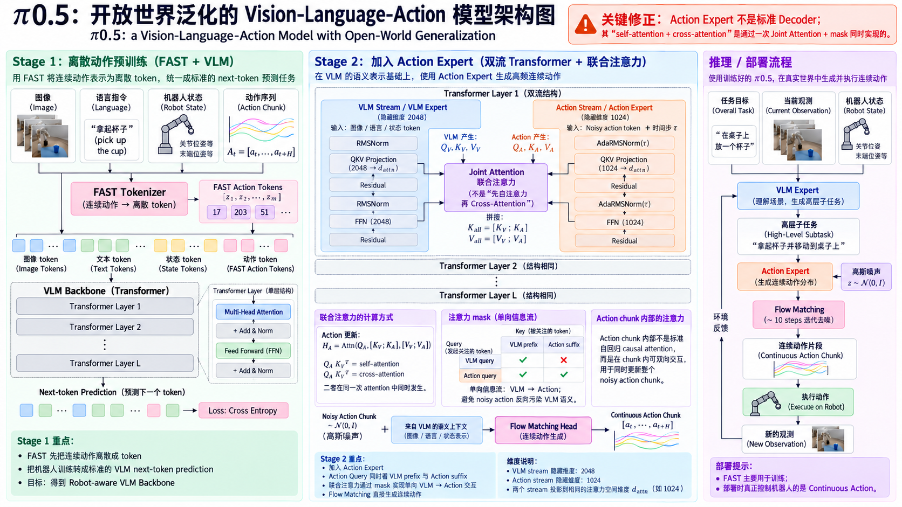

---

title: "π0.5: a Vision-Language-Action Model with Open-World Generalization"
description: "π0.5 解决机器人在全新真实环境中的开放世界泛化问题。核心理解：先用 FAST 将连续动作离散成 token，把机器人控制纳入标准 VLM next-token 预训练；再加入连续 Action Expert，以 Flow Matching 生成高频动作，从而同时保留 VLM 的语义能力和连续控制能力。"
date: "2026-09-05"
venue: "arXiv / 2025"
authors: "Physical Intelligence, Kevin Black, Noah Brown, James Darpinian, Karan Dhabalia, Danny Driess, et al."
paper: ""
code: ""
--------

# π0.5



## 1. 一句话理解

π0.5 最值得记住的不是单纯：

$$
\text{VLM}+\text{Flow Matching}
$$

而是它的 **两阶段训练逻辑**：

$$
\boxed{
\text{FAST 离散动作预训练 VLM}
\rightarrow
\text{加入连续 Action Expert}
\rightarrow
\text{Flow Matching 生成连续动作}
}
$$

也就是：

> **先让 VLM 学会“把动作当成语言 token 来理解和预测”，再把这种机器人语义表示交给连续动作专家，实现真正的高频控制。**

---

## 2. 为什么先 FAST，再 Flow Matching

这是整篇最重要的点。

连续机器人动作本来是：

$$
A_t=[a_t,a_{t+1},...,a_{t+H}]
$$

直接从一开始训练 Flow Matching 虽然能表达连续动作，但不如标准 VLM 的 next-token objective：

* 训练成熟
* 易于大规模扩展
* 能和 Web / VQA / Language 数据直接混合
* 更容易保留预训练 VLM 的离散概率知识

因此 π0.5 首先：

$$
A_t
\xrightarrow{\text{FAST}}
[z_1,z_2,\ldots,z_m]
$$

把整个连续 Action Chunk 压缩成一串离散 Action Tokens。

然后统一成：

```text
Image
Language
Robot State
FAST Action Tokens
        ↓
VLM Transformer
        ↓
Next-token Prediction
```

用标准：

$$
\boxed{\text{Cross Entropy}}
$$

进行训练。

---

## 3. FAST 在这里到底负责什么

FAST 不是最终执行机器人的动作模型。

它真正承担的是：

$$
\boxed{
\text{Continuous Action Chunk}
\rightarrow
\text{Compact Discrete Tokens}
}
$$

于是机器人数据可以被改造成类似语言模型训练的数据：

```text
[Image]
[Task Prompt]
[Robot State]
    ↓
"pick up the cup"
    ↓
FAST_17 FAST_203 FAST_51 ...
```

VLM 因此第一次可以直接通过：

$$
\boxed{\text{Next Token Prediction}}
$$

学习机器人动作。

FAST 的核心价值是：

> **让机器人动作训练暂时变成 VLM 最擅长的离散 token prediction 问题。**

FAST 本身就是一种针对高频机器人动作设计的压缩式 action tokenizer。

---

## 4. Stage 1：离散动作预训练

第一阶段脑中记：

```text
Image
Language
Robot State
True Action Chunk
      │
      └→ FAST Tokenizer
             ↓
       FAST Action Tokens
             │
             ▼
     ┌──────────────────┐
     │   VLM Backbone   │
     │                  │
     │ Transformer      │
     └────────┬─────────┘
              ↓
        Text Tokens
              +
      FAST Action Tokens
              ↓
      Cross-Entropy Loss
```

也就是说第一阶段：

$$
\boxed{
\text{VLM 同时学语言和机器人动作 Token}
}
$$

此时还不需要连续 Action Expert。

官方论文把这一阶段描述为：所有任务，包括机器人动作，都首先通过离散 token 表示，从而进行简单、可扩展的预训练。

---

## 5. Stage 1 真正学到了什么

它不是为了让 FAST Token 在部署时直接控制机器人。

它主要是让 VLM Backbone 学到：

$$
\boxed{
\text{视觉}
+
\text{语言}
+
\text{机器人状态}
\rightarrow
\text{机器人行为语义}
}
$$

例如看到：

```text
任务：
"put away the dishes"

图像：
盘子在桌上

机器人状态：
机械臂在桌子旁
```

VLM 已经应该知道：

> 下一步机器人应该接近盘子、抓盘子，而不是去打开冰箱。

因此 Stage 1 解决的是：

$$
\boxed{\text{让 VLM 真正变成 VLA Backbone}}
$$

---

## 6. 为什么不能部署时一直用 FAST

因为 FAST Action Tokens 需要：

$$
z_1\rightarrow z_2\rightarrow z_3\rightarrow...
$$

**Autoregressive Decoding**。

如果 Action Chunk 被表示成很多离散 Token，就需要不断进行：

$$
\text{Transformer Forward}
\rightarrow
\text{生成下一个 Token}
$$

对于实时机器人控制来说比较慢。

所以 π0.5 的设计是：

$$
\boxed{
\text{FAST 负责训练效率}
}
$$

而：

$$
\boxed{
\text{Flow Matching 负责推理时连续动作生成}
}
$$

这就是为什么需要第二阶段。官方论文也明确指出，离散 Action Token 更适合训练，而连续 Action Expert 更适合实时推理。

---

## 7. Stage 2：加入 Action Expert

第二阶段加入新的：

$$
\boxed{\text{Action Expert}}
$$

整体变成：

```text
             VLM Expert
        Image / Language / State
                  │
                  │
        semantic representation
                  │
                  ▼
             Action Expert
                  │
        Noisy Continuous Action
                  │
                  ▼
           Flow Matching
                  │
                  ▼
       Continuous Action Chunk
```

此时真正要生成的是：

$$
\boxed{
[a_t,a_{t+1},...,a_{t+H}]
}
$$

不再是 FAST Tokens。

---

## 8. VLM Expert + Action Expert 双流结构

这是 π0 / π0.5 架构最值得记的部分。

可以把每层理解成两条 Expert Stream：

```text
================================================

             Transformer Layer l

       VLM Expert             Action Expert
      θ_VLM,l                 θ_A,l

 Image / Language / State     Noisy Actions
          │                       │
          │      Attention        │
          └───────────────────────┘
                  │
           VLM → Action

================================================
```

二者不是两个完全独立的模型。

Action Expert 可以利用：

$$
\boxed{
\text{VLM 已经形成的视觉—语言语义表示}
}
$$

来决定如何生成动作。

但信息流被设计成：

$$
\boxed{
VLM\rightarrow Action
}
$$

而不是让连续 noisy action 反过来污染 VLM 的语义表示。

因此可以理解成：

> **VLM Expert 负责“看懂现在应该做什么”，Action Expert 负责“具体怎么动”。**

---

## 9. Stage 2 中 FAST 还在不在

一个容易混淆的地方：

π0.5 不是：

```text
Stage 1:
FAST

Stage 2:
彻底删除 FAST
```

更准确地说，最终模型能够同时表示：

$$
\boxed{
\text{Discrete Outputs}
+
\text{Continuous Action Outputs}
}
$$

训练目标可以同时包含：

$$
\boxed{
L=
L_{\text{CE}}
+
\alpha L_{\text{Flow}}
}
$$

其中：

### 离散路径

负责：

* 普通文本
* VQA
* 高层 Subtask
* FAST Action Tokens

使用：

$$
L_{\text{CE}}
$$

### 连续路径

Action Expert：

$$
\text{Noisy Action}
\rightarrow
\text{Continuous Action}
$$

使用：

$$
L_{\text{Flow}}
$$

第一阶段相当于：

$$
\alpha=0
$$

只训练离散路径；

第二阶段再加入连续 Action Expert。

---

## 10. Flow Matching 到底做什么

真实 Action Chunk：

$$
A
$$

随机噪声：

$$
\epsilon\sim\mathcal N(0,I)
$$

构造中间 noisy action：

$$
A^\tau
$$

Action Expert 接收：

$$
\boxed{
A^\tau
+
\tau
+
\text{VLM Context}
}
$$

然后预测：

$$
\boxed{
v_\theta(A^\tau,\text{context},\tau)
}
$$

即：

> 当前 noisy action 应该朝哪个方向移动，才能逐渐变成真实动作。

所以训练学的是一个：

$$
\boxed{\text{Vector Field}}
$$

推理时：

```text
Gaussian Noise
     ↓
Action Expert
     ↓
稍微更像动作
     ↓
Action Expert
     ↓
更加像动作
     ↓
...
     ↓
Continuous Action Chunk
```

---

## 11. 为什么 Action Expert 比 FAST 更适合推理

FAST：

```text
token 1
  ↓
token 2
  ↓
token 3
  ↓
...
```

是 Autoregressive。

而 Action Expert 一次处理整个：

$$
\boxed{\text{Action Chunk}}
$$

并通过少量 Flow Matching steps 进行连续生成。

π0.5 推理时使用约 **10 个 denoising / integration steps** 生成连续动作。

因此：

$$
\boxed{
\text{FAST：训练快}
}
$$

$$
\boxed{
\text{Flow Matching：控制快且精细}
}
$$

---

## 12. π0.5 不只输出 Action

这是 π0.5 相较普通 VLA 很重要的一点。

模型联合表示：

$$
\boxed{
\pi_\theta(A_t,\hat l\mid o_t,l)
}
$$

其中：

* \(l\)：用户的总体任务
* \(\hat l\)：模型预测的高层 Subtask
* \(A_t\)：低层 Action Chunk

官方将它分解为：

$$
\boxed{
\pi_\theta(A_t,\hat l\mid o_t,l)
=
\pi_\theta(A_t\mid o_t,\hat l)
\pi_\theta(\hat l\mid o_t,l)
}
$$

这意味着它天然形成两层：

```text
Overall Task
    ↓
High-Level Policy
    ↓
Subtask
    ↓
Low-Level Policy
    ↓
Action Chunk
```

---

## 13. Hierarchical Inference

例如用户给：

```text
"Clean the kitchen"
```

模型不是要求一个 Action Chunk 直接完成十分钟任务。

首先 VLM 预测：

```text
pick up the plate
```

然后：

$$
\hat l=
\text{"pick up the plate"}
$$

作为低层 Action Expert 的条件：

```text
Current Images
Robot State
"pick up the plate"
        ↓
Action Expert
        ↓
Action Chunk
```

完成以后重新观察。

下一次可能预测：

```text
put the plate in the sink
```

于是形成：

```text
Clean the kitchen
       │
       ▼
 Pick up plate
       │
       ▼
  Actions ...
       │
       ▼
 Put plate in sink
       │
       ▼
  Actions ...
       │
       ▼
 Open dishwasher
       │
       ▼
  Actions ...
```

---

## 14. 高层和低层分别负责什么

### VLM Expert

主要负责：

$$
\boxed{
\text{What should I do?}
}
$$

利用：

* Language
* Images
* Web knowledge
* Object semantics
* High-level task data

预测：

$$
\hat l
$$

例如：

> pick up the plate

---

### Action Expert

主要负责：

$$
\boxed{
\text{How should the robot move?}
}
$$

输入：

* Current Observation
* Robot State
* High-Level Subtask
* Noisy Action

输出：

$$
[a_t,\ldots,a_{t+H}]
$$

因此一句话：

$$
\boxed{
\text{VLM = semantic planning}
\qquad
\text{Action Expert = motor generation}
}
$$

---

## 15. Co-training 为什么重要

π0.5 的目标不是只让机械臂学会几个 manipulation skill。

它想解决：

$$
\boxed{\text{Open-World Generalization}}
$$

所以训练数据不仅有：

```text
Robot Action Data
```

还有：

```text
Web VLM Data
Object Detection
Visual Question Answering
High-Level Subtask Prediction
Language Instructions
Multiple Robot Embodiments
```

所有这些数据共同训练同一个 VLM Backbone。

这样：

$$
\boxed{
\text{Web / Semantic Knowledge}
\rightarrow
\text{High-Level Decisions}
\rightarrow
\text{Robot Actions}
}
$$

这也是 π0.5 能在未见过的家庭环境中完成长时程任务的核心训练思想。

---

## 16. 整个训练流程

看到 π0.5 时最好脑中过这条：

```text
══════════════════════════════════════
 Stage 1：Discrete Pre-training
══════════════════════════════════════

Image / Language / State
              +
      Robot Action Chunk
              │
              ▼
        FAST Tokenizer
              │
              ▼
     Discrete Action Tokens
              │
              ▼
         VLM Backbone
              │
              ▼
      Next-token Prediction
              │
              ▼
        Cross-Entropy Loss


              ↓
      获得 Robot-aware VLM


══════════════════════════════════════
 Stage 2：Continuous Post-training
══════════════════════════════════════

        VLM Expert
Image / Language / State
              │
              │ semantic context
              ▼
        Action Expert
              ▲
              │
       Noisy Action Chunk
              │
              ▼
        Flow Matching
              │
              ▼
   Continuous Action Chunk
```

---

## 17. 整个推理流程

部署时才是最应该记住的部分：

```text
Overall Task l
       +
Current Observation o_t
       │
       ▼
    VLM Expert
       │
       ▼
Autoregressive Text
       │
       ▼
High-Level Subtask l_hat
       │
       ▼
  Action Expert
       ▲
       │
 Gaussian Noise
       │
       ▼
Flow Matching × ~10
       │
       ▼
Continuous Action Chunk
       │
       ▼
Execute Actions
       │
       ▼
New Observation
       │
       └──────────────↺
```

注意：

$$
\boxed{
\text{推理真正控制机器人的是 Continuous Action}
}
$$

不是 FAST Action Token。

FAST 最重要的作用发生在：

$$
\boxed{\text{Pre-training}}
$$

---

## 18. π0.5 和 π0 最值得记的区别

π0 的核心：

$$
\boxed{
VLM
+
Flow Matching Action Expert
}
$$

π0.5 在此基础上增加了非常重要的：

$$
\boxed{
FAST Discrete Action Pre-training
}
$$

以及更强的：

$$
\boxed{
\text{High-Level Semantic Co-training}
}
$$

因此可以粗略记：

```text
π0
VLM → Flow Matching Action

π0.5
FAST 离散机器人预训练
          ↓
Robot-aware VLM
          ↓
High-Level Subtask
          ↓
Flow Matching Action Expert
```

---

## 19. 最后只记这 6 个点

### ① FAST First

$$
\boxed{
Action Chunk
\rightarrow
FAST Tokens
\rightarrow
Cross Entropy
}
$$

先把机器人控制变成 VLM 擅长的 token prediction。

---

### ② Continuous Later

第二阶段加入：

$$
\boxed{\text{Action Expert + Flow Matching}}
$$

最终生成真正连续动作。

---

### ③ VLM Expert + Action Expert

$$
\boxed{
\text{VLM 负责理解}
\rightarrow
\text{Action Expert 负责行动}
}
$$

---

### ④ 两种输出

π0.5 可以同时输出：

$$
\boxed{\text{Text}}
$$

和：

$$
\boxed{\text{Continuous Action}}
$$

---

### ⑤ Hierarchical Inference

$$
\boxed{
\text{Overall Task}
\rightarrow
\text{Subtask}
\rightarrow
\text{Action Chunk}
}
$$

例如：

```text
clean kitchen
      ↓
pick up plate
      ↓
continuous actions
```

---

### ⑥ FAST 用于训练，Flow Matching 用于控制

这是最值得记的一句话：

$$
\boxed{
\textbf{FAST 解决“怎么高效学动作”，
Flow Matching 解决“怎么高效生成连续动作”。}
}
$$

---

## 20. 脑内最终模型

```text
                 π0.5
                  │
        ┌─────────┴─────────┐
        │                   │
        ▼                   ▼
   Stage 1              Stage 2
 FAST Discrete      Continuous Action
   Pretrain            Post-train
        │                   │
        ▼                   ▼
Action → FAST       VLM Expert
        │                   │
        ▼                   │ semantic
Action Tokens               ▼
        │             Action Expert
        ▼                   ▲
VLM Transformer             │
        │              Noisy Action
        ▼                   │
Cross Entropy               ▼
        │              Flow Matching
        ▼                   │
Robot-aware VLM             ▼
        └──────────► Continuous Action


Inference:

Overall Task
     ↓
VLM Expert
     ↓
High-Level Subtask
     ↓
Action Expert
     ↓
Flow Matching
     ↓
Continuous Action Chunk
     ↓
Robot
     ↓
New Observation
     └────────────↺
```

> **π0.5 = 先用 FAST 把连续机器人动作转成离散 token，通过标准 next-token prediction 把 VLM 训练成真正理解机器人行为的 VLA Backbone；再加入连续 Action Expert，用 Flow Matching 将这种语义理解转化为高频连续 Action Chunk。推理时 VLM 先决定“下一步做什么”，Action Expert 再决定“具体怎么动”。**
